A **Cheggio** (1490m), splendido alpeggio costituito da belle e ben rifinite case per le vacanze e da un paio di piccole ma accoglienti strutture alberghiere, lasciamo la macchina alla fine della strada in un comodo parcheggio sterrato dove potremo notare la partenza della teleferica che collega Cheggio al Rifugio Andolla.

Di fronte a noi cattura subito lo sguardo il muraglione gradonato della diga del **Lago di Cheggio** o **Lago dell'Alpe dei Cavalli** che noi andiamo ad attraversare per portarci sul lato opposto del lago.

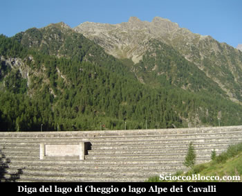

Il lago artificiale di Cheggio, che chiude il bacino dell'alta valle Loranco, era già in precedenza un piccolo lago naturale dove era posta l'alpe Cavalli ora sommersa dalle acque della diga. Diga realizzata tra il 1922 e il 1926 dalla società Edison, come scritto al centro della murata. Il bacino ha una superficie di 5 ettari e una capacità di 6,9 milioni di metri cubi. L'ampia e bella mulattiera si snoda pressoche pianeggiante, sul lato sinistro del lago rispetto al nostro arrivo, una decina di metri sopra il livello dell'acqua. Dopo pochi minuti, ignoriamo la deviazione sulla sinistra per l'alpe Forcola nei pressi di una bella baita, e poco dopo arriviamo nei pressi di una **fontana in legno** (10 min). Ai lati di essa si diramano due tracce, non crucciatevi scegliete quella che più vi aggrada tanto si riuniranno solo pochi metri più avanti. Da qui il percorso diventa a saliscendi sempre costeggiando il lago una ventina di metri sopra di esso. Subito dopo eccoci a un bel **ponticello che supera una cascata** (15min) .

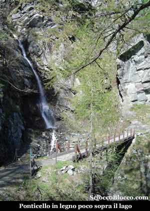

In pochi minuti raggiungiamo un **crocefisso in legno**, posto in fantastica posizione panoramica (20min).

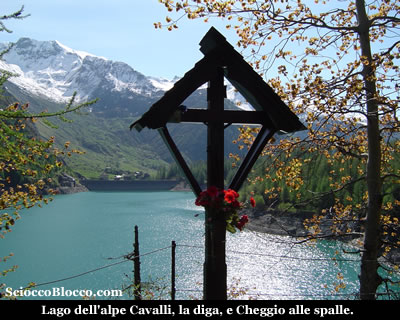

Il sole del primo mattina fa brillare le acque del bacino dell'**Alpe Cavalli**, mentre **Cheggio** se ne sta adagiata la nel verde, oltre il muro della diga. Proseguiamo con questa bella immagine stampata in mente. Passiamo la deviazione che in breve porta all'**Alpe Gabbio** (1505m)(30min). Possiamo notare la scarsità di acqua presente nel lago dalle lunghe lingue di sabbia lasciate scoperte nella sua parte terminale. Purtroppo la siccità di questo periodo sta lasciando gravi tracce. Il sentiero prosegue tagliato nella parete montuosa a raggiungere un recente ponte sul **torrente Loranco** (35min).

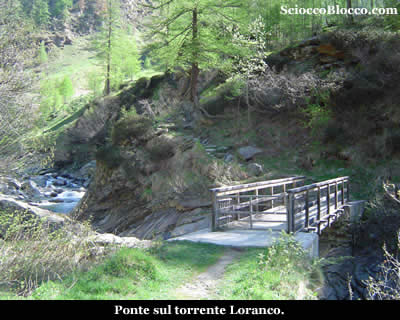

Il sentiero sale ora ripido nel bosco e dopo pochi tornanti ci porta su un belvedere naturale che ci permette di gustare uno splendido panorama e vedere il sottostante **Alpe Gabbio** e di salutare il **lago di Cheggio** prima di innoltrarci nell'alta **Val Loranco** (35/40min).

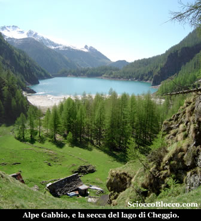

Bellissimo scorcio, dove possiamo vedere sulla destra il percorso sin qui fatto e di fronte a noi le lingue di sabbia che la siccità a fatto affiorare dalle acque del lago. Da qui lo scenario cambia, non più il blu dell'acqua a farla da padrone, ma il verde dei prati, il nero delle rocce scoscese e il bianco della neve che lassù ancora resiste all'avanzare della primavere. In questo periodo, si attraversano ancora alcune lingue di vecchie slavine, bisogna prestare attenzione, oltre alle classiche scivolate anche alla consistenza della neve che all'apparenza compatta nasconde sotto pochi centimetri di manto buchi di qualche metro che ci farebbero cadere rovinosamente nei riali laterali del **Loranco**. Quindi anche se al mattino la compattezza ci permette di attraversarli per linea retta è d'obbligo prima trovare un passaggio alternativo, magari più a valle vicino al torrente, che ci permetta il rientro al pomeriggio con temperature più calde e neve molle. Il sentiero torna ad essere pressoche pianeggiante e con un traverso aereo costeggia il torrente, siamo saliti fin ora solo di poche decine di metri, in leggera ascesa ci addentriamo nella **Val Loranco**, la nostra meta appare in lontananza ancora tra le nevi.

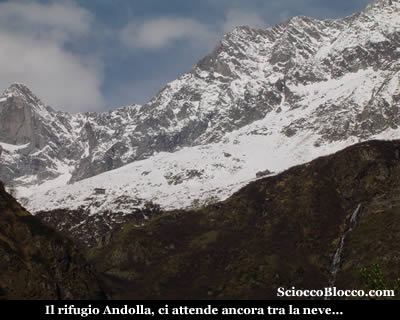

Dopo essere saliti un poco, si scende brevemente per raggiungere l'**Alpe Piana Ronchelli** (1578m)(50/55min).

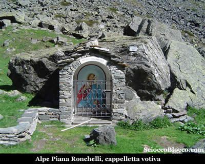

Qui troviamo i resti di poche baite, una fontana con targa in memoria di un giovane alpinista e una cappelletta dedicata allaVergine, e su la porta di una minuscola costruzione in sasso l'invito per la festa dell'alpeggio la prima domenica di luglio. Se fin qui siamo saliti di poco dalla partenza, d'ora in poi sarà salita impegnativa sino al rifugio... Il sentiero si inerpica sempre ben marcato, sul lato destro di una stretta gola scavata dal torrente Loranco, tra pareti scoscese di rocce scure. Giunti alla sommità della bastionata, la traccia spiana per poco aprendo la vista sui gorghi e le lanche del torrente che scorre in un tratto più calmo, a precipizio sotto i nostri piedi. In pochi metri raggiungiamo il bivio che a sinistra porta all'**Alpe Campolamana** e ad altri alpeggi (1.10/1.15h). Noi saliamo a destra, chiare indicazioni per il rifugio, il sentiero si fa verticale e la fatica inizia a bussare alle gambe. Ma abbastanza rapidamente superiamo anche questa bastionata e sbuchiamo in una conca nota come gli **Alpi di Andolla** per i pochi resti di baite (1.30/1.40h).

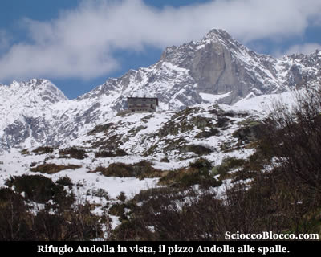

Siamo poco sopra quota 1900m e la neve ritardataria della scorsa settimana inizia a occhieggiare qua e la ai lati del sentiero. Il rifugio ormai è in vista, iniziamo un traverso tra sfasciumi sempre segnalato dai colori bianco-rossi e giallo-rossi del CAI. La neve si fa sempre più abbondante e padrona della scena e complica un poco l'avvanzamento. Aggiriamo da nord, sempre sulla giavina, la bastionata che sostiene il rifugio, e ormai tra la neve alta 40/50cm superiamo su micro ponte un ruscello e finalmente eccoci al **Rifugio Andolla** (2061m)(1.45/2.00h).

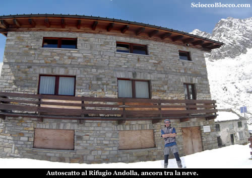

Il **Rifugio Andolla** è di recente costruzione in sasso e legno dispone di 55 posti letto + 15 nel locale invernale, servizi interni ed esterni, docce, acqua corrente, corrente elettrica a mezzo di impianto idraulico, illuminazione, riscaldamento e teleferica di servizio - Tel 0324/575980. E’ gestito continuativamente nei mesi di Giugno, Luglio, Agosto, Settembre. Il Sabato e la Domenica nei mesi di Maggio e Ottobre o su richiesta. Maggiori informazioni presso la sede *CAI di Villadossola*, via Boccaccia 2, Tel 0324/575245. E' uno dei rifugi più grossi e rinomati della provincia del Vco, intorno ci sono ancora le strutture del vecchio rifugio costruito negli anni '20 dalla Edison costruttrice anche della diga di fondo valle, distrutto nella seconda guerra mondiale, venne ricostruito dagli albori della sezione CAI di Villadossola e definitivamente abbandonato per la costruzione dell'attuale edificio negli anni '80. Al fianco vi è l'arrivo della teleferica della quale abbiamo visto la stazione di partenza al nostro arrivo a Cheggio nel piazzale della diga. Alle spalle un'altra grossa struttura in passato adibita a stalla. A dominare tutto dall'alto l'inconfondibile sagoma del **Pizzo Andolla**. Verso nord la neve è ancora abbondantissima, il piazzale del rifugio e tutto intorno è ancora sotto un abbondante manto di neve, e ci sono tracce di predecessori........

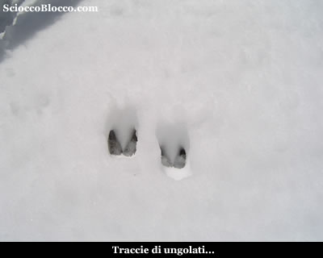

Rifocillato e appagato dallo spettacolo dei monti bisogna tornare. Ma prima un ultimo sguardo alla valle appena percorsa.

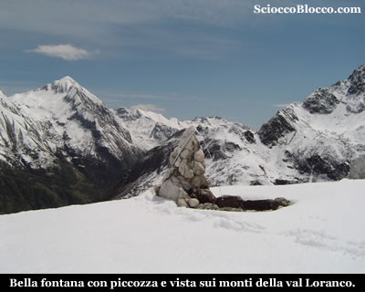

Presa dell'acqua alla bella fontana a forma di piccozza, si riparte. Il ritorno avviene per lo stesso percorso dell'andata, prestando attenzione nei primi 100m di dislivello a non scivolare sulla neve abbondante tra le rocce della giavina. Per tornare a **Cheggio **(1490m) dopo circa (3.30/4.00h). Escursione abbordabile per il dislivello contenuto, ma che può diventare insidiosa nei periodi dell' anno in cui la neve è ancora presente sul terreno.

**Grazie all'escursionista di giornata Dario. **
