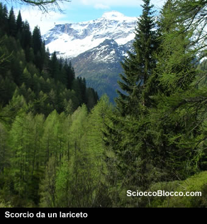
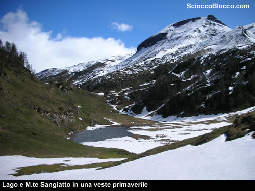

In breve si giunge all’alpe Corte d’Ardui, dove il sentiero abbandona le rive del torrente Devero per iniziare a salire verso Sud-Est nel bosco di Larici. Nel caso in cui vi sia neve che rende difficoltoso seguire il sentiero ci si può aiutare seguendo il corso del rio Sangiatto. Sfortunatamente in questa stagione la neve è scarsa e le ciaspole continuano a restare attaccate dietro lo zaino, quindi senza problemi ci si dirige verso il primo dei primi tre laghi del Sangiatto, che si raggiunge dopo poco più di un’ora di cammino. La traccia da seguire è sempre evidente a causa della poca neve presente, comunque il percorso è piuttosto intuitivo sempre in direzione sud-Est. In breve si giunge al secondo lago del Sangiatto sovrastato dall’alpe Sangiatto. Raggiungendo la sommità dell’alpeggio si può ammirare un altro piccolo laghetto (presente solo durante la stagione invernale-primaverile). La varietà cromatica del paesaggio è davvero impressionante ed incantevole.  Il lago è sovrastato dalla massa del M.Sangiatto ancora innevato mentre la neve sulle rive del lago comincia a cedere il posto all’erba.

Camminando in direzione della ormai evidente e vicina Bocchetta della Scarpia (a nord del M.Sangiatto) si raggiunge l’ultimo lago del Sangiatto. Qui, a quota 2034 m, si indossanoo finalmente le racchette da neve e ci si dirige verso la meta. Poiché il paesaggio è coperto dalla neve le tracce del sentiero giacciono sotto il suo manto, tuttavia la via d’ascesa è sempre intuitiva e mai pericolosa, in breve si raggiunge la bocchetta della Scarpia. Il panorama è superbo, davanti ai nostri occhi si stende l’alpe Pojala circondata dalle sue montagne, verso nord si può vedere la vetta del M. Cobernas ancora bianca. Salendo ancora il versante verso Sud, si raggiunge in breve la sommità della cresta che fa da sponda alla bocchetta, gli sforzi vengono ampiamente ripagati dal panorama.

Sotto di me si stende in tutta la sua lunghezza il lago d’Agaro.

Di fronte la corona Troggi è sovrastata dall’imponente M. Cistella.

Immaginando il panorama dalla vetta del M.Sangiatto cerco una via d’ascesa alla vetta. Sfortunatamente l’unica via praticabile sale lentamente lungo la costa Nord della montagna, la neve presente è ancora tanta ed il pendio piuttosto scosceso. A malincuore devo rinunciare alla ascesa a causa di una slavina presente sulla traccia di sentiero.  Consiglio a chi tenta di effettuare questa ultima ascesa di prestare la massima attenzione, soprattutto nella stagione invernale/primaverile.   Dopo un breve pranzo al cospetto di questa meravigliosa vista, davvero fantastica a 360°, si rientra all’alpe Sangiatto e poi Devero, dove si avvista finalmente un capriolo.

**Grazie
all'escursionista di giornata Vittorio.**

