In poco meno di un quarto d'ora eccoci comodamente depositati
alla **Piana di Vigezzo**
(1712m).

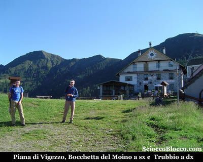

Finalmente
una giornata di sole in questa primavera e inizio estate
piovose.

Scesi dalla cabinovia, ci troviamo di fronte allo storico
rifugio "Ratagin" (rododendro), e proprio dietro
di esso vediamo gli impianti da sci che risalgono la Cima
**Trubbio** mentre sulla sinistra vediamo la **Bocchetta del Moino**
nostra prima meta.

Sulla destra del rifugio percorriamo il vicolo e imbocchiamo
la larga mulattiera che in inverno è pista da sci
e risale le prime pendici del **Trubbio**.

La traccia si trasforma in largo sentiero e piegando a sinistra
passa sotto gli impianti sciistici, iniziando un traverso
su buona pendenza.

Usciti dal rado bosco, verso ovest il panorama è
già notevole.

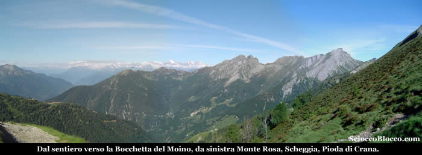

Il
**Monte Rosa**
è avvolto da leggere nuvole, qui vicino a noi si
stagliano nella loro bellezza **La
Scheggia** e la **Pioda
di Crana**.

Ora all'aperto proseguiamo su comodo sentiero per raggiungere
la **Bocchetta del Moino**
(1977m)(40/50min).

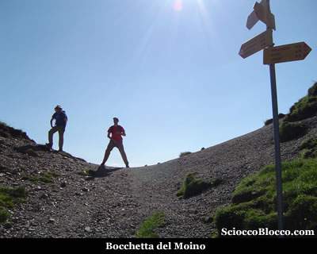

Superata
la bocchetta, si lascia anche il bacino **Vigezzino**
e si entra in quello della **Valle
Onsernone**, ovvero se politicamente
siamo ancora abbondantemente in Italia geograficamente entriamo
in Svizzera.

Si apre una bella vista su vari alpeggi, alla nostra destra
sul versante nord del **Trubbio** i contrappesi della stazione
della seggiovia.

Iniziamo a scendere sempre su evidente traccia e in breve
arriviamo al **primo**
**laghetto del moino**
(1890m) nei pressi del **Rifugio
Greppi** (1915m) (55min /1.05h).

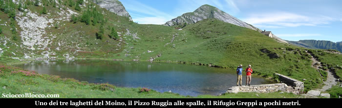

Piccolo
laghetto di origine glaciale, chiuso allo sbocco da un piccolo
muretto per aumentarne un poco la portata al fine dell'utilizzo
agro-pastorizio.

Scenario da favola tra cespugli di rododendri, prati verdi,
il rifugio poco sopra e il **Pizzo Ruggia** ad attenderci.

Il **Rifugio E. Greppi**
affittato nel 1987 dal figlio di Emilio Greppi costruttore
della baita su terreo comunale al C.A.I. Vigezzo, è
di recente ristrutturazione è piccolo ma accogliente
può ospitare massimo 6 persone è dotato di
stufa a gas e nel sottotetto ci sono materassi e coperte
in abbondanza, ideale per un paio di notti in tranquillità
con pochi amici (chiedere le chiavi a **Santa
Maria Maggiore** per potervi accedere).

Dopo il rifugio scendiamo per pochi metri e in breve eccoci
all'**Alpe Ruggia**
(1890m)(1.00h/1.10h).

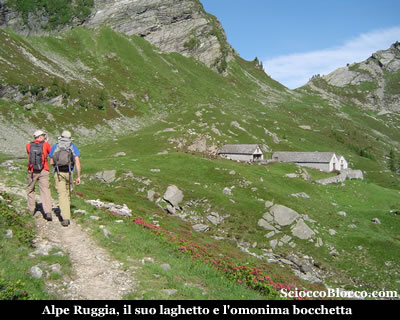

Qui
si trova il secondo laghetto caratterizzato nella parte
centrale da vegetazione acquatica, le baite dell'alpe sono
in ottime condizioni perchè ospitano una nutrita
colonia di capre e i suoi custodi.

In quota poco più elevata tra i due laghetti ve ne
è un terzo che noi oggi non visitiamo.

Poco sopra l'alpeggio raggiungiamo con sentiero che passa
alle spalle delle baite la **Bocchetta
di Ruggia** (1990m) (1.05h/1.15h).

Da qui scendendo possiamo raggiungere gli alpeggi sopra
Arvogno e il Lago
Panelatte e quello di Larecchio da noi già descritti.

Noi oggi abbiamo un altro obbiettivo e saliamo alla destra
del nostro arrivo su esili tracce per il filo di cresta.

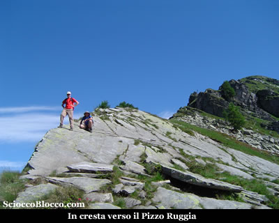

La
salita si fa impegnativa, sempre sul lato che guarda l'alpe
sottostante saliamo superando nei primi tratti lisci affioramenti
di roccia del tutto simili alla vicina **Pioda di Crana**.

Nell'ultimo tratto la traccia piega un poco sulla sinistra
della cresta e perviene alla vetta del **Pizzo
Ruggia** (2289m)(1.45h/2.00h).

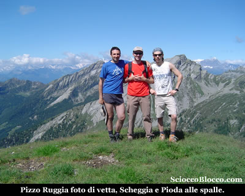

Il
**Pizzo Ruggia**
è una bella cima dal profilo aguzzo ed elegante e
la sua buona elevazione permette una visuale a 36o°
su la  **Val Vigezzo**
la **Val Loana**,
**Val Onsernone**,
la Valle che si apre da Arvogno e le cime della **Val'Agarina**.

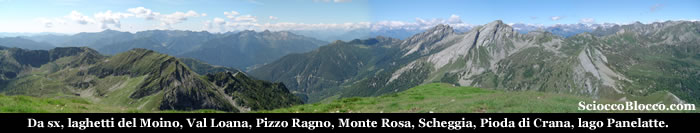

Scattata
la classica foto di vetta e qualche panoramica, studiamo
un po la cartina e decidiamo di non tornare esattamente
dalla stessa strada.

Ripetiamo a ritroso nostri passi, prestando attenzione alle
scivolose lastre di gneiss che affiorano sulla cresta, quindi
superato l'**Alpe Ruggia** torniamo al **primo** laghetto (2.35h/2.50h).

Mentre pranziamo osserviamo il percorso deciso per il ritorno.

Decidiamo
di tornare dalla **Bocchetta del Rosario o della Cima**.

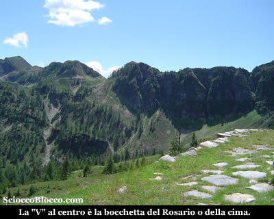

Scendiamo
seguendo il ruscello che esce dal lago senza una traccia
evidente, quindi attenzione, per poi incontrare il sentiero
che ci conduce all'Alpe Canva
(1807m) (2.50h/3.10h) già visto dal
laghetto.

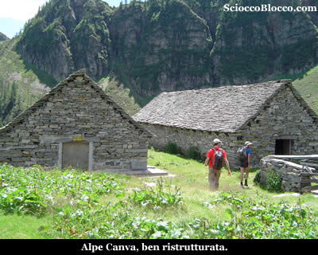

Dietro
le baite scendiamo ad attraversare il ruscello su traccia
abbastanza evidente, per poi salire su pendenze impegnative
un traverso che sotto le rocce spioventi delle ultime propaggini
di Cima **Trubbio** ci fa pervenire alla **Bocchetta
del Rosario o della Cima** (1995m) (3.25h/3.45h).

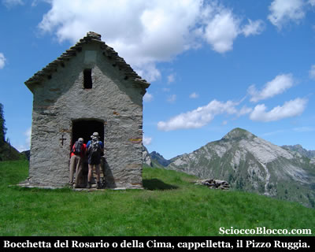

Bocchetta
che è segnalata a seconda delle carte con due nomi,
del Rosario in riferimento alla cappelletta pochi metri
sotto il passo dedicata alla Madonna del Rosario o della
Cima in riferimento alla Cima Sassone che si eleva sulla
sinistra del nostro arrivo.

Bello scenario nel verde smeraldo dei prati con la vetta
appena raggiunta che ci osserva ancora la in fondo.

Appena superata la bocchetta riappare la **Val
Vigezzo** e gli alpeggi della **Colma
di Craveggia** sotto di noi mentre alla nostra
destra il **Trubbio**.

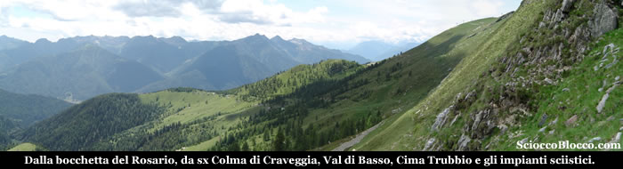

Sul
lato opposto si apre la Val di Basso.

Iniziamo a camminare su sentierino alla nostra destra che
con lungo traverso porta verso la **Colma di Craveggia**, noi
prima che inizi la discesa lo abbandoniamo e su prati sempre
traversando orizzontalmente raggiungiamo la pista che scende
da cima **Trubbio**, innestandoci sui prati che d'inverno sono
le piste da sci.

Da qui in breve riprendiamo la mulattiera fatta all'andata
e torniamo alla **Piana di Vigezzo**
(1712m)(4.30h/5.00h).

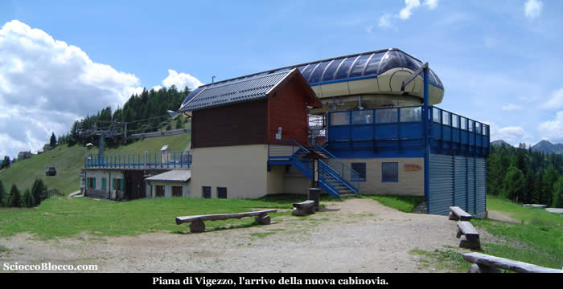

Dove
possiamo rifocillarci in uno dei rifugi e tornare a valle
con la cabinovia.

Escursione medio difficile per lunghezza e per alcuni tratti
poco segnati, ma che in condizioni di buona visibilità
permette un orientamento pressoche a vista.

Bella la meta ma soprattutto l'ambiente circostante ricco
di laghetti, ruscelli, alpeggi e panorami su vette a perdita
d'occhio.

**Grazie
agli escursionisti di giornata Flavio, Fabrizio e Dario.**

