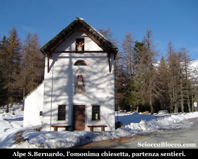
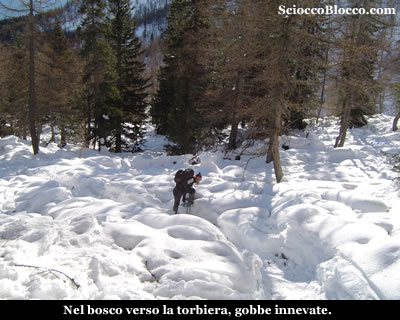
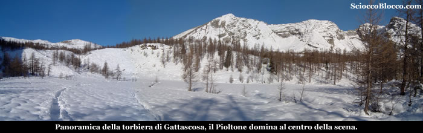
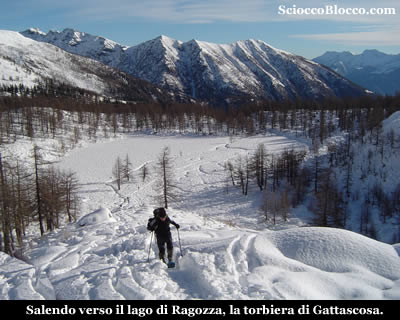
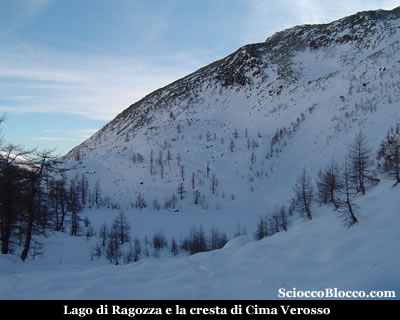
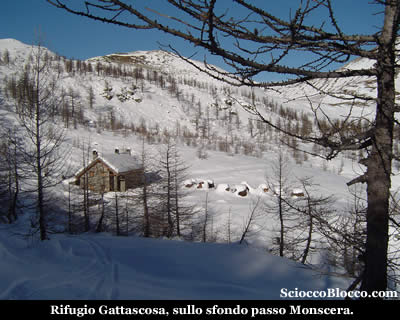
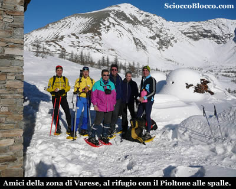
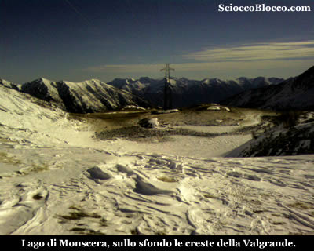
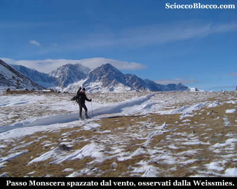

Qui
all'Alpe San Bernardo (1628m),
parcheggiamo la macchina nel piazzale ripulito dalla neve
alla destra della bella cappelletta dedicata appunto a San
Bernardo, perchè il parcheggio estivo che si trova
a pochi metri sulla sterrata non è raggiungibile.

La
giornata è bellissima, non c'è una nuvola,
la neve è abbondante, prepariamo gli zaini e senza
indossare le ciaspole imbocchiamo la strada di fronte a
noi ricoperta di neve ghiacciata.

Al bivio dopo pochi metri andiamo a sinistra e poco dopo
nei pressi del parcheggio estivo, seguiamo le traccie di
predecessori che si inoltrano nel bosco dove vi sono anche
cartelli indicatori codice
(D0) dai colori bianco-rosso del CAI, per il Lago di Ragozza
e il Rifugio Gattascosa.

Certo in queste condizioni difficile trovare tutti i segnali,
ma le traccie degli sci alpinisti sono inconfondibili..

All'interno
di un bosco sale
dolcemente quella
che d'estate è un ampia mulattiera , dopo circa 10min
arriviamo ad un bivio, anche se in questa stagione è
praticamente invisibile, noi seguiamo le traccie che salgono
ora un poco più ripide sulla destra, perchè
quella sulla sinistra ci porterebbe in pochi minuti al piccolo
Lago d'Arza
(1742m).

Deviazione che comunque ci farebbe perdere poco tempo.

Saliamo ora un poco più decisamente sempre all'interno
di un bosco dominato dai larici, al margine di un solco
tra la neve che nasconde un piccolo ruscello.

Indossiamo le ciaspole, che seppur su traccia ben battuta
ci aiuteranno nell'avanzamento ormai in salita.

Il sole inizia a filtrare tra i rami e i giochi con la neve
catturano la fantasia.

La
salita si fa in qualche tratto più impegnativa, quando
il sentiero spiana, sbuchiamo dalla vegetazione in una larga
radura.

E' questa
la Torbiera
di Gattascosa (1831m)
(40/45min).

La
Torbiera è solcata da numerosi rigagnoli e dal ruscello
che abbiamo già costeggiato più in basso,
che ad un osservazione attenta possono essere ben notati
anche in queste condizioni di innevamento.

La vista è notevole le cime della Val
Bognanco
ci circondano, il Pizzo Pioltone
domina il centro della scena.

Difficile ripartire da qui, lo scenario è fiabesco
tra larici e vette innevate.

Attraversiamo il pianoro, la traccia sempre molto evidente
si impenna, in fondo alla radura sulla sinistra, tra un
rado bosco di larici.

La fatica inizia a farsi sentire la pendenza è notevole,
ma per fortuna non troppo prolungata, e approdiamo al Lago
di Ragozza (1958m)
(1.00h/1.10h).

Sopra
di noi la Cima di Verosso,
le cui pareti franose hanno occluso l'uscita del lago, trasformando
il bacino sottostante in torbiera.

Se in primavera questo posto è fantastico per i suoi
colori vivaci in
autunno regala scorci dalle tinte tenui ma ugualmente emozionanti,
ed ora in inverno la pace regna sotto una coltre di neve.

Seguiamo la traccia che sale al margine del lago e ci apparirà
il Rifugio Gattascosa
(1993m)
(1.10h/1.20h) che raggiungiamo in pochi minuti.

Il
Rifugio Gattascosa
dispone di 25 posti letto è gestito e può
essere un ottimo punto d'appoggio sia per mangiare nelle
gite di un giorno, sia per pernottare qualche giorno usandolo
come punto di partenza per il trekking dei laghi della Val
Bognanco.

Caratteristico il modo di accatastare la legna tagliata
in piccoli pezzi a forma di panettone che ricorda le vecchie
carbonaie, ora ricoperte di neve.

Oggi il rifugio è chiuso, lo
scenario tutto attorno è superbo.

Ci raggiungono poco dopo, un gruppo
di amici della provincia di Varese, che gentilmente ci offrono
un bicchiere di thè caldo.

Scambiate quattro chiacchiere, scatto una foto ricordo al
gruppo con l'intento di pubblicarla nella nostra recensione...

Ma qui inizia il "dramma", anche se non me ne
accorgo subito...

Le batterie della mia fedele digitale, dopo 4 anni di onorato
servizio su e giù per i monti del VCO, mi abbandonano
all'improvviso....

Per fortuna una foto fatta con la loro macchina e gentilmente
speditami, salva la situazione....

GRAZIE !!!

Le
foto che seguono, sono state effettuate in emergenza con
il telefonino, per cui mi scuso per la scarsa qualità
!

Ammiriamo ancora il profilo del Pizzo
Pioltone che ci sovrasta, e dopo esserci
rifocillati ripartiamo con la traccia che esce in piano
proprio dietro il rifugio.

Siamo ora su quella che in estate è la gippabile
che dall'Alpe San Bernardo sale sul versante opposto
della valle, e che passando per l'Alpe Monscera
giunge al rifugio.

Dopo pochi minuti incontriamo una deviazione sulla sinistra,
chiari cartelli indicatori, imbocchiamola, qui non vi è
più traccia, a quanto pare nessuno è salito
al passo, almeno da questo lato della valle.

La neve sfiora il metro d'altezza, si affonda non poco anche
con le ciaspole, la fatica è notevole, orientandoci
a vista, per fortuna in breve raggiungiamo il Lago
di Monscera (2072m)(1.40/1.55h).

Proprio
sotto la sella del Passo è posto il Lago
di Monscera,
collocato nel più
alto dei terrazzi naturali della valle glaciale del Rio
Rasiga.

Salendo pochi metri, tra il prato e la poca neve risparmiata
dal vento raggiungiamo
il Passo Monscera (2103m)(1.45h/2.00h)
dove corre il confine Italo-Svizzero
suggellato da un cippo di marmo.

Di
fronte a noi si apre la vista sulle vette del Vallese
dominate da sinistra verso destra da Weissmies(4023m),
Lagginhorn(4010m) e Fletchhorn(3996m), ricoperte dai
ghiacci.

Abbiamo raggiunto il punto più alto dell'escursione
odierna, la vista sulle vette svizzere grazie alla giornata
serena è grandiosa.

Torniamo ora stando sul lato opposto del lago rispetto al
nostro arrivo, infatti andiamo a chiudere l'anello della
nostra gita percorrendo il lato opposto della valle.

Superato un piccolo dosso procediamo tra traccie di sci
alpinisti a vista verso i tetti dell'Alpe
Monscera (1971m) (2.15h/2.30h) che raggiungiamo
aggirandola sulla sinistra.

Continuiamo
a scendere seguendo tracce molto evidenti, rientriamo tra
i larici fino a raggiungere quello che d'estate è
un guado su un torrente che scende dal lago di Agro (2.45h/3.00h).

Ora sempre nel bosco più fitto, scendiamo su quella
che in estate è una larga mulattiera, qua e la sfioriamo
baite di varie dimensioni.

La traccia, che segue ormai un evidente strada tra il bosco,
scende ripida in tornanti sino al ponte sul Rio
Rasiga (3.20h/3.40h).

Superato
il ponte seguiamo la strada innevata che in costante salita
ci riconduce all'Alpe San
Bernardo e alla macchina dopo (4.00h/4.30h).

Escursione
fantastica, grazie alla giornata tersa, consigliata a chi
ha un minimo di allenamento e che conosce i sentieri durante
la stagione estiva, perchè la neve rende tutto molto
diverso e più difficile l'orientamento.

Grazie
agli escursionisti di giornata Dario e Francesco.

