A
Patqueso
(1108m), dove noterete sulla sinistra la
nuova strada per l'Alpe Cortino, poco più avanti
sempre a sinistra troverete uno spiazzo con una piccola
tettoia e panchina recentemente pitturata di celeste, dove
lasciare l'auto.

Oggi 1 aprile, anzichè lo scherzo tradizionale ci
concediamo un escursione, dopo lungo tempo di impegni più
impellenti ma meno divertenti.

Decidiamo di percorrere la strada che in occasione dell'ultima
nostra gita non era ancora terminata, e quindi torniamo
sui nostri passi per un centinaio di metri e la imbocchiamo
superando la sbarra.

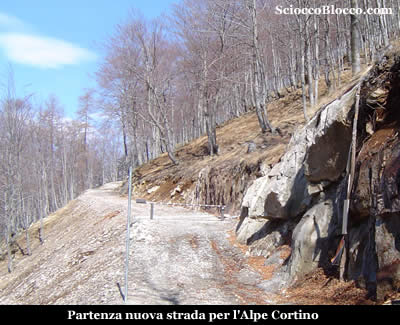

La
strada subito in salita, ma abbordabile, si inoltra nel
bosco che ormai dato l'inizio di primavera è secco.

Dopo qualche minuto, compare un insidioso strato di neve-ghiaccio,
che persiste sul piano della strada favorito dalla poca
pendenza, mentre tutt' attorno è secco e pulito.

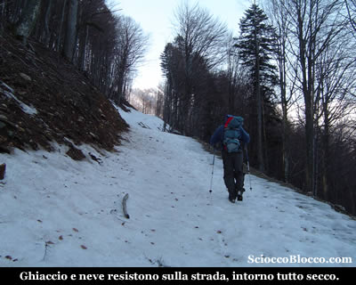

Procediamo
con circospezione, per evitare dolorose e fantoziane cadute,
poco dopo, circa 25 minuti dalla partenza incrociamo il
vecchio sentiero che decidiamo di seguire.

Certamente più ripido, ma pulito e diretto, guadagna
velocemente quota nel bosco, per sbucare nella radura dell'Alpe
Cortino(1477m) (45/55min).

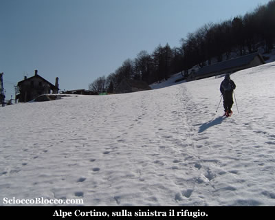

Qui
all'Alpe
Cortino vi è
il rifugio NIGRITELLA
di Melini Giordano tel. 0324 92456 6 posti letto .

Verso nord si apre uno scenario fantastico, da sinistra
:

- La Scheggia,
La Pioda,
La Piana
di Vigezzo, la Bocchetta
di Sant'Antonio, da dove
si entra abitualmente in Vall'
Onsernone alla quale abbiamo dedicato una
recensione (Vall'
Onsernone).

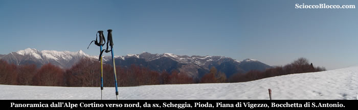

Dopo
una breve pausa calziamo le ciaspole, qui la neve torna
improvvisamente padrona, e ripartiamo dopo aver scambiato
due chiacchiere con signore proprietario di una piccola
ma ben ristrutturata baita.

Subito dietro l'alpeggio parte il sentiero, teniamo la mulattiera
che sulla destra raggiunge in breve una piccola costruzione,
probabilmente un pozzetto per l'acqua e quindi svoltiamo
a sinistra inoltrandoci nel bosco.

La salita si fa un po più impegnativa, prestiamo
attenzione ai tronchi dove noterete i segni BIANCO-ROSSO
del C.A.I. che ci guidano verso la nostra meta.

La neve è crostosa e si procede senza sprofondare.

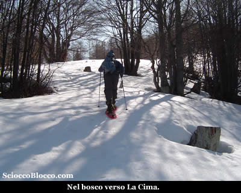

Approssimandoci
alla vetta, la pendenza si fa sempre più impegnativa,
e la fatica si fa sentire, la giornata calda primaverile
non da certo una mano.

L'ultimo tratto per uscire dal bosco, mette a dura prova
le gambe poco allenate di questa stagione scarsa di escursioni.

Ma una volta all'aperto, seguendo la brevissima cresta raggiungiamo
la croce de
La Cima (1810m)
(1.45/2.00h).

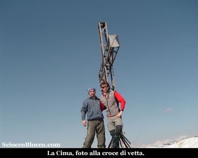

La
giornata è magnifica, il panorama che si apre a 360°
è superbo.

Verso nord tutta la Val Vigezzo
si stende sotto di noi, con i suoi monti che la separano
dalla Vall'Agarina
e dalla Vall'Onsernone,
sulla destra l'inizio delle Centovalli
con la maestosa cupola del Santuario
della Madonna di Re e il Gridone
o Limidario
che la separa dalla Val Cannobina.

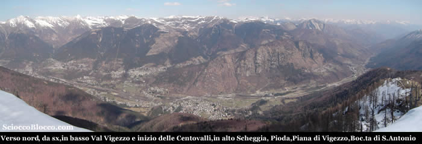

Verso
sud alla nostra sinistra la
Zeda e quindi li a un passo la
Testa del Mater, quindi la Val
Loana con il Cimone
di Cortechiuso e
Laurasca, la Val
di Basso con il Pizzo
Ragno.

Qui la neve è ancora abbondante soprattutto nella
conca che ospita Scaredi.

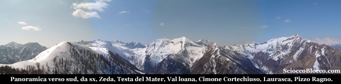

Rifocillati
e appagati dal panorama, diamo un occhiata alla vicinissima
Testa del Mater....

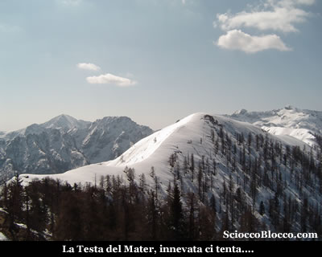

La
tentazione è forte e ha la meglio, lasciati gli zaini
decidiamo di raggiungerla.

Superiamo una piccola chiazza erbosa e rinforcate le ciaspole,
superiamo il breve sali scendi che ci porta all'attacco
della cresta.

Un vero muro, ma riposati e senza zaini in breve siamo in
vetta alla Testa del Mater(1846m)
(2.10/2.20h).

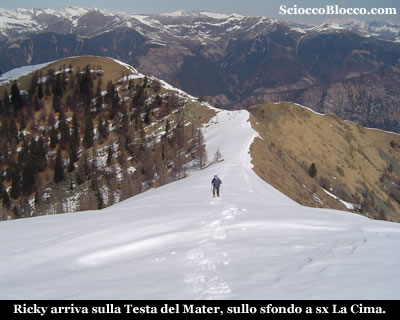

Da
dove possiamo ben vedere La
Cima appena lasciata.

Sotto di noi alla sinistra verso est si apre la Val
Cannobina, con Finero,
una miriade di alpeggi sparsi sui due lati della valle e
la traccia della carrozzabile che scende verso il lago
Maggiore.

Mentre sulla destra di nuovo la Val
di Basso, e quasi di fronte, seguendo
la dorsale percorsa, ancora la Val
Loana, con il loro alpeggi e il fiume
che scorre giù in fondo.

Da qui il ritorno avviene per lo stesso percorso dell'andata,
recuperati gli zaini a La
Cima, torniamo quindi all'Alpe
Cortino dove ci fermiamo ancora per una
pausa a rimirare ciò che ci circonda e a gustarci
il caldo sole di primavera.

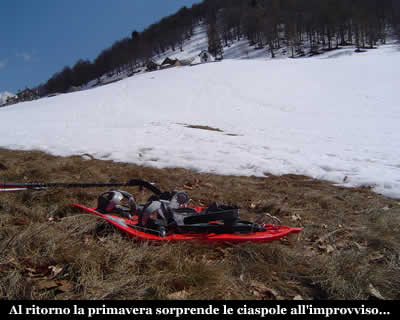

Quindi
tornati nel bosco seguiamo il sentiero, per evitare le insidiose
placche di ghiaccio sulla strada agricola percorsa all'andata
e tornare a Patqueso(1108m)
e all'auto (3.40h/4.00h).

Escursione abbastanza facile per orientamento e che richiede
un minimo di allenamento, almeno nel periodo primaverile-estivo,
ma in presenza di neve abbondante da non sottovalutare.

Grazie
agli escursionisti di giornata Riccardo e Dario.

