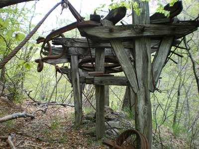
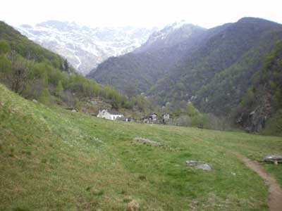
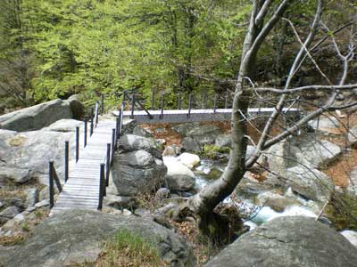
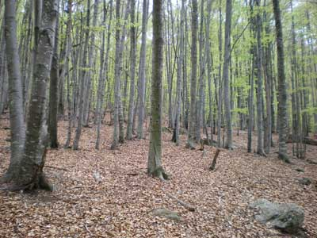
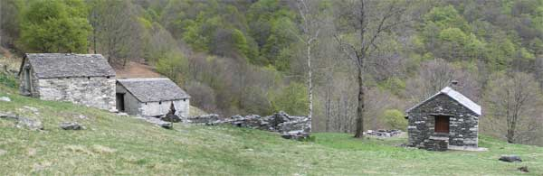
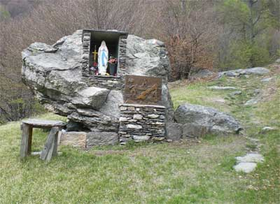
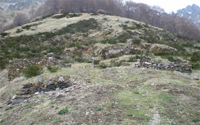

Il sentiero si trova in corrispondenza dell'ultimo tornante
prima di arrivare a "Cicogna centro" e comunque
è facilmente individuabile.

Entrati nel bosco percorriamo un bel sentiero, a tratti
lastricato con grosse pietre, costruito quando in questa
zona era sfruttata per la produzione di legname, se fate
attenzione potrete vedere le testimonianze di quei tempi
ormai andati, sotto l'immagine di una stazione di un fil
a sbalz.

Proseguiamo
tenendo sempre il torrente Pogallo alla nostra destra e
dopo circa 1 ora arriviamo a Pogallo. Il luogo è
davvero suggestivo, soprattutto pensando alle numerose genti
che lavoravo e vivevano in Val Grande meno di un secolo
fa.

Proseguiamo
il cammino e prendiamo il sentiero che piega a destra poco
prima di entrare nell'abitato di Pogallo, si scende quasi
a sfiorare il torrente Pianezzoli.

Il sentiero comincia a diventare più impegnativo
ma nulla di preoccupante...pensate che siete , grosso modo,
a metà strada.

Dopo circa una mezz'ora si arriva ad un bivio, in corrispondenza
di un ponticello che attraversa il torrente, nella stagione
secca potete attraversare il ponte e proseguire sul lato
destro del corso d'acqua anche se il mio consiglio è
quello di andare dritti.

Si arriva all'Alpe Preda di Qua dove c'è un secondo
bivio, sulla cartina, almeno sulla mia è segnato
così, si notano due sentieri che partono da qui e
arrivano a Pian di Boit, lasciate perdere quello che prosegue
dritto....è un sentiero morto...attraversate il ponte
rifatto (veramente un fantastico lavoro!!!) e arriverete...tenetevi
forte.... all'Alpe Preda di Là, inutile dire che
dovete proseguire.

Attraversiamo
un'altro ponte ad angolo e ci inoltriamo in un maestoso
bosco di faggi e, pensando alla guerra partigiana, immagini
di veder sbucare dal fitto della vegetazione i fantasmi
di quei soldati ancora intenti a darsi battaglia.

Dopo
circa 3 ore di cammino arriviamo a Pian di Boit, uno spettacolo
nonostante la brutta giornata.

Queste
baite furono ricostruite nel dopoguerra dal Togn Podico
di Cicogna dopo che, nel 1944, furono tutte distrutte e
date alla fiamme dai soldati tedeschi durante uno dei numerosi
e tragici rastrellamenti di cui fu testimone la Val Grande.

Ancora un piccolo sforzo, dobbiamo "arrampicarci",
non ho usato un termine a caso, fino all'alpe Terza.

Il sentiero lo troviamo vicino al piccolo altare dedicato
alla Madonna che si trova nelle immediate vicinanze delle
baite.

Proseguiamo
lungo un piccolo sentiero sommerso dalle foglie e attraversiamo
un piccolo torrente....ora si arrampica!!!!

Dobbiamo risalire un crinale di notevole pendenza, il cui
sentiero è letteralmente sommerso dalle foglie di
faggio, questa è senz'altro la parte più dura
dell'intera escursione, tenete duro ancora 20 minuti.

Complimenti
siete arrivati, non so cosa vi aspettavate da questo alpeggio
ma ora sono certo che vi godrete il panino più buono
che abbiate mai mangiato!!!!!

Che
dire...non resta che tornarsene a casa seguendo esattamente
la via dell'andata, non credo che vi servano anche le indicazioni
per il ritorno, in fondo avete lasciato le briciole di pane
lungo la via, vero?????

**Escursionista
di giornata: Fabrizio.**

