Innanzitutto dobbiamo trovare il punto di partenza; poco prima di arrivare nel "centro" di Croveo dobbiamo svoltare a destra in corrispondenza della casa con l'edicola della Madonna e seguire la strada fino al piccolo parcheggio.
In questo tratto il sentiero è ben segnato e tutto in mezzo alla vegetazione, al primo bivio è possibile scegliere se fare il giro così come l'ho recensito o se farlo nell'altro senso....cosa ovvia è un'escursione ad anello....
Salendo a Cima Chioso si notano immediatamente le notevoli opere del secolo scorso, il bosco è pieno di muri a secco e baite in rovina ma tra di esse si può trovare qualche sorpresa.

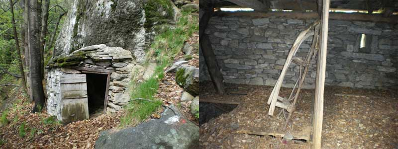

Arrivati
a Cima Chioso,alpeggio davvero bello e molto curato, inizia
una scalinata in pietra, che poi diverrà un semplice
sentiero, che ci porterà proprio sopra Baceno, da
qui il panorama è davvero impagabile ma nulla rispetto
a ciò che troveremo al ritorno.

Al centro della foto Baceno, in basso a sinistra l'alpe
Cima Chioso

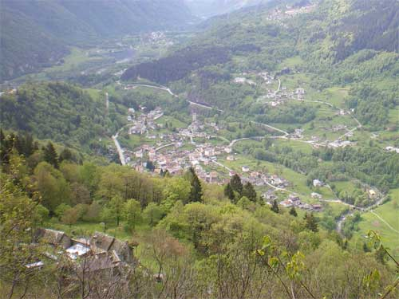

Ora
si comincia ad andare incontro ai problemi.....purtroppo
il sentiero si fa burlone ed è difficile da seguire,
anche i segni bianchi e rossi sin qui seguiti diventano
rari, presa la cartina in mano si capisce che dobbiamo semplicemente
proseguire in piano senza alzarci di quota....scovato un
sentiero lo seguo, forte di due o tre ometti di pietra intravisti
e delle molte baite diroccate.

Dopo circa un' ora e mezza arrivo a Pioda Calva e devo dire
che resto affascinato dal luogo, certo le baite sono diroccate
ma questo pianoro ed il panorama sono impagabili.

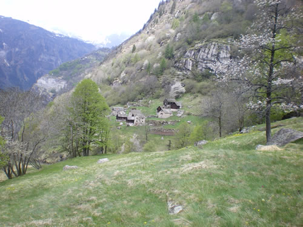

Ora
comincia la salita verso la diga di Agaro e la faccenda
si complica leggermente.......infatti perdo il sentiero
o meglio scompaiono i segnali bianchi e rossi seguiti fino
ad ora ma questo non deve certo scoraggiare, in fin dei
conti basta seguire il corso del "ruscello" che
scende da Agaro ed il gioco è fatto...più
o meno...

Ripreso
il cammino si passa su una bellissima e scivolosa scala
intagliata nella roccia, che potete vedere qui sotto, e
poi si sale lungo una scalinata piuttosto dura.

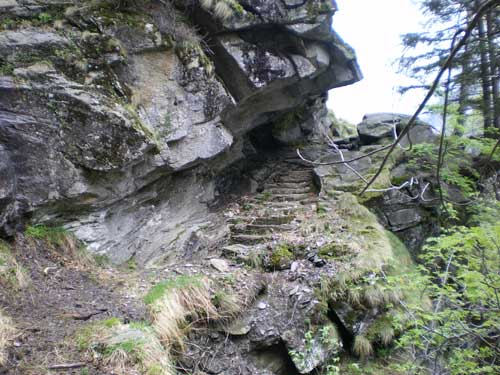

A
questo punto noto dall'altra parte del ruscello un segnavia
e decido di attraversare...forse ho fatto male perchè
da ora in poi non trovo più alcun segnale del sentiero
ma piuttosto che ammettere la sconfitta e tornare sui miei
passi proseguo lungo il corso d'acqua!!!! Forse è
meglio non seguire il mio esempio anche perchè dovrete
passare di qui:

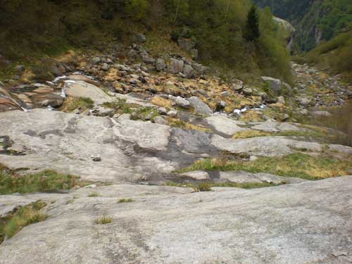

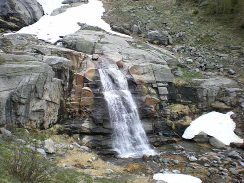

Comunque
alla fine vedo la luce e lassù spunta il muraglione
della diga di Agaro....ma quanta fatica!!!!

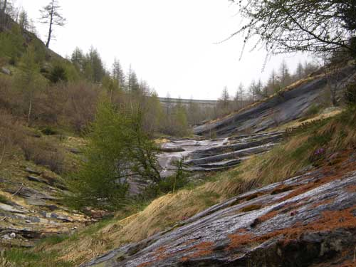

Direi
che il grosso del lavoro è fatto, arrivati in cima
ci possiamo finalmente prendere un pochino di riposo e rifocillarci;
siamo in marcia ormai da 3 ore.

Dopo
pranzo si devono smaltire i chili di porcherie che avrete
ingurgitato per cui si riparte con una bella salita, il
sentiero lo trovate sul fianco destro della diga, dalla
parte opposta della casa del guardiano; da qui fino a Croveo
troverete sempre i segnavia bianchi e rossi.

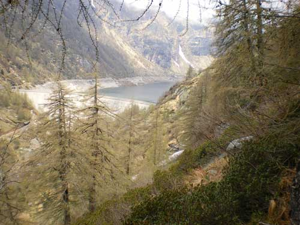

In
una buona mezz'ora di cammino si arriva a Suzzo alto e anche
qui il paesaggio è assolutamente da cartolina, complice
un timido sole che si degna di farsi vedere.

Non
c'è molto da vedere, qualche pecora al pascolo, delle
baite semi diroccate, qualche bella veduta....insomma il
solito.....

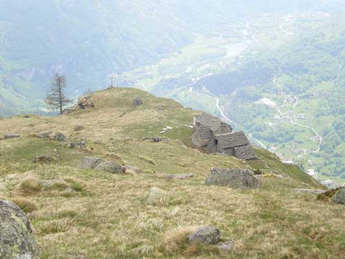

......però
fa parecchio effetto.

Riprendiamo
la discesa lungo cui incappiamo in moltissime baite segno
dell'intensa attività che si svolgeva fino a qualche
decennio addietro e che purtroppo è finita....bando
ai ricordi ecco per voi un'altra cartolina.

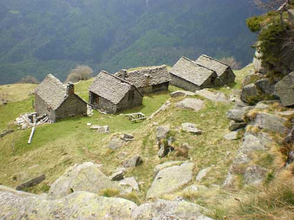

E
poi ancora questa meraviglia della natura, un ciliegio così
non l'ho davvero mai visto!!!!!

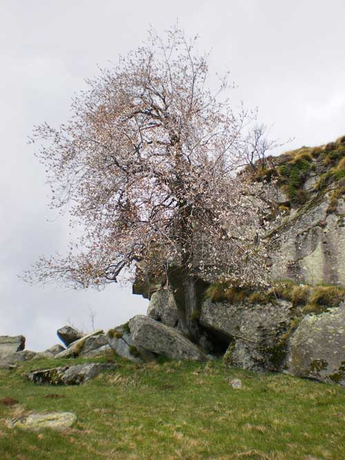

Arriviamo
a Mollio alto e, purtroppo per voi, devo farvi vedere un'altra
foto, questo posto è davvero una miniera di bellezza.

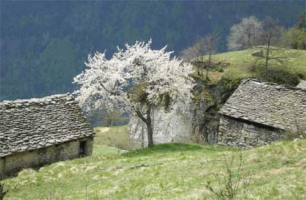

Adesso
basta con le foto anche perchè fra poco vi ricongiungerete
col sentiero fatto al mattino e scenderete fino a Cima Chioso
e poi Croveo.

In totale abbiamo impiegato 5 ore per questo giretto...niente
male,un saluto e alla prossima escursione.

**Escursionista
di giornata: Fabrizio.**

