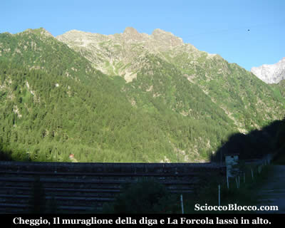
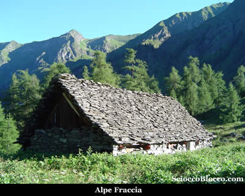
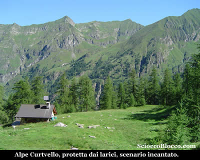
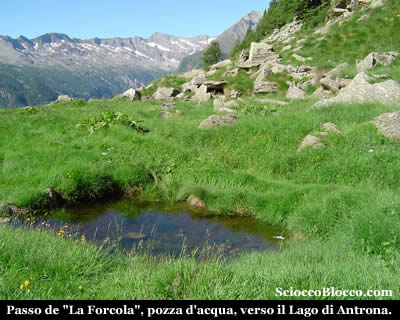
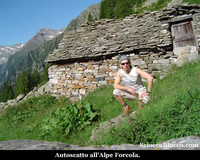
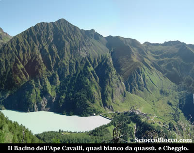
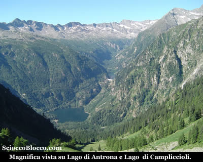
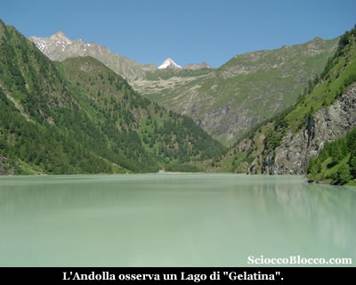

A **Cheggio** (1497m), splendido alpeggio costituito da belle e ben rifinite case per le vacanze e da un paio di piccole ma accoglienti strutture alberghiere, lascio la macchina alla fine della strada in un comodo parcheggio sterrato dove potrete notare la partenza della teleferica che collega Cheggio al Rifugio Andolla. Oggi pur essendo il 15 di luglio la temperatura alle 7.00 di mattino è di circa 9°C, quest'estate non vuole proprio iniziare... Meglio coprirsi bene e partire.

Di fronte a me cattura subito lo sguardo il muraglione gradonato della diga del **Lago di Cheggio** o **Lago dell'Alpe dei Cavalli** che vado ad attraversare per portarmi sul lato opposto del lago. Sopra, già illuminata dal sole, vedo la meta che si nasconde alla sinistra delle Cime di Pozzuoli. Camminando sul lato sinistro della diga sull'ampio sentiero che la contorna, in pochi minuti trovo il cartello in legno che indica il sentiero per La Forcola. Il sentiero sale a sinistra nel bosco e velocemente, al di la di un dosso, approda all'**Alpe Fraccia **(1524m)(10min).

Piccolo pianoro invaso dalle felci e dalle ortiche, conserva un paio di baite in precarie condizioni. Sceso oltre la baite, seguo la traccia, sempre segnalata con i colori Bianco-Rosso del CAI, che sale a sinistra per raggiungere alcune costruzioni, poco sopra e che costituiscono la parte alta dell'alpeggio. Mi spingo fino all'orlo del dosso poco dopo le baite e ne vale la pena, un bello strapiombo si apre sul letto d'uscita della diga, su **Cheggio** e la carrozzabile che risale la valle. Ritornato sui miei passi, riprendo la traccia, che prima delle fatiscenti casere piega a destra in direzione del bosco. Entrato nel bosco, il sentiero in leggera ascesa, costeggia la montagna, per poi piegare a sinistra ed entrare in una piccola valletta, che attraverso per poi lasciare seguendo la traccia che si rituffa nel bosco sulla destra. I segni del CAI sono sempre presenti, ma in questo tratto può essere necessario soffermarsi a trovarli d'innanzi a noi per scegliere la miglior traiettoria. A questo punto il sentiero sale quasi verticale per qualche metro, e poi riprende in leggera ascesa costeggiando la parete montuosa. Sotto di noi si può godere di bei scorci sullo specchio d'acqua del Lago di Cheggio. Il sentiero entra in una vasta conca, solcata da rigagnoli, e inizia a risalire un poco più faticosamente sul lato sinistro. Lo scenario ora si fa da sogno, una distesa di rododendri ci avvolge, anche se un po in ritardo di fioritura causa il freddo di quest'estate, e il bosco si fa un po più rado e dominato da maestosi larici. Seguo la traccia che piegando a sinistra supera un piccolo dosso e sbuca nella radura dell'**Alpe Curtvello**(1756m)(45/50 min).

Luogo incantevole, le due baite di cui una ben ristrutturata al centro della radura, sembrano protette dai larici in cerchio come da mute guardie fedeli. Complice la giornata tersa, la vista sulla cresta nord che divide la **Vall'Antrona** dalla **Val Bognanco** è mirabile. Riprendo il cammino, risalendo la traccia che costeggia un torrentello, da cui è stata ricavata una piccola presa d'acqua, il solco della montagna si fa stretto e la salita più impegnativa. Dapprima giungo in una piccola conca invasa da sfasciumi, caduti dalle assai vicine pareti delle Cime di Pozzuoli. Quindi con ultimo sforzo il sentiero tenendo la sinistra del solco, approda al **Passo della Forcola** (1914m)(1.10h/1.20h).

Pochissimi metri sotto, sul versante del **Lago di Antrona**, raggiungo l'**Alpe Forcola superiore**.

Finalmente mi concedo un meritato spuntino, guardando le cime che mi circondano. Questo passo collega il **lago di Cheggio** con quello di **Antrona**, ed era in passato una comoda via per gli alpigiani della valle che salivano a caricare i vari alpeggi sui due lati del passo. Riposato e rifocillato, decido che sarebbe la naturale conclusione di questa escursione scendere al Lago di Antrona, ma che purtroppo essendo solo sarei costretto a risalire tutta la lunga strada asfaltata sino a Cheggio per recuperare la macchina...Amici dove siete....??? Devo rinunciare, scelgo come alternativa di risalire il cocuzzolo erboso che chiude il passo sulla sinistra del nostro arrivo, qualcosa mi ispira ! Risalgo senza traccie evidenti i prati verticali, prestando molta attenzione perchè uno scivolone sarebbe veramente rovinoso, e tenendo nel mirino la cima, dopo circa 10 minuti di faticaccia da capre eccomi in cima a questo sperone del quale ignoro l'eventuale esistenza di un nome e che il mio altimetro quota a 1960m circa. Appena mi affaccio resto a bocca aperta !

La parete da questo lato precipita quasi verticale, e sotto di me appare il **Lago di Cheggio** di un colore verde chiarissimo come lattiginoso che rapisce lo sguardo. Forse dovuto alle recenti e abbondanti piogge che hanno portato le piene dei torrenti sino al lago, questo colore mi affascina e non smette di attirare la mia attenzione. Sulla destra **Cheggio** e la **Valle Antrona**, sulla sinistra la **Val Loranco** e l'**Andolla**. Girandomi dalla parte opposta, lo scenario non è certo da meno.

Dal passo de **LaForcola** la valle si apre sul **Lago di Antrona** e sopra di esso il **Lago Campliccioli**, chiusi dalle creste, con qualche nevaio, che dividono a sud, sinistra nella foto, dalla Valle Anzasca, e a ovest, destra nella foto, dal Vallese. Non c'è che dire questa breve ma faticosa arrampicata, è valsa la pena. Tornato in pochi minuti di nuovo al passo, prestando attenzione nella discesa alquanto ripida, posso iniziare il ritorno. Ritorno che avviene per il percorso di andata e che riconduce a **Cheggio**(1497m) e all'auto dopo circa (2.30h/2.45h) dalla partenza. Arrivato nuovamente sul muraglione della diga non posso resistere all'istinto di scattare ancora una foto al **Lago di Cheggio** o** Lago dell'Alpe Cavalli** con l'acqua ora illuminata dal sole di questo colore straordinario.

Escursione abbastanza facile, sia per dislivello che per orientamento, alla portata di tutti, che tuttavia regala begli scorci sull'alta Valle Antrona.

**Grazie all'escursionista di giornata Dario.**
