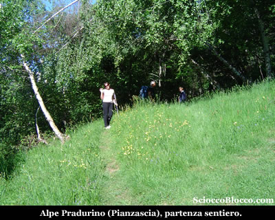
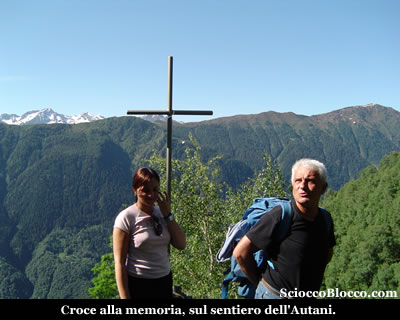
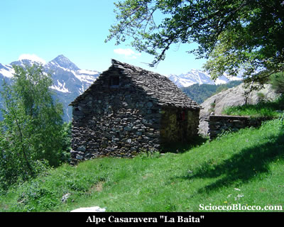
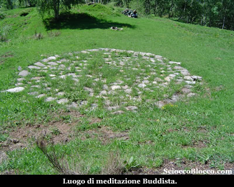
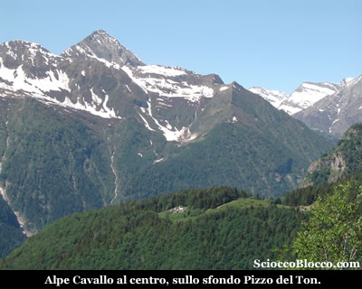
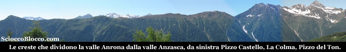
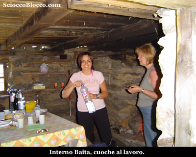

Giunti a **Montescheno** (710m) grazie alla presenza di una "guida locale" imbocchiamo la gippabile usufruibile solo da chi è in possesso di uno speciale permesso e delle chiavi per la sbarra d'accesso. Ovviamente per chi non ne è in possesso l'escursione inizierà obbligatoriamente da qui.
Noi percorriamo la strada (silvo-agro-pastorale) per circa 4 km prestando attenzione verso metà percorso a non imboccare la deviazione sulla destra che porterebbe agli alpeggi verso la Val Bognanco.
La gippabile (in pessime condizioni) finisce in una radura all'**Alpe Pradurino** (1351m) o come la chiamano i locali *La Pianzascia* dove finalmente lasciamo la macchina e iniziamo la nostra escursione.
Oggi 02 giugno festa della Repubblica, la nostra guida ci porta a festeggiare nella sua baita dove da generazioni la sua famiglia ha allevato bestiame, coltivato la terra e sfalciato i prati.
La cosa più bella di oggi è vedere la gioia negli occhi di questa persona nel ripestare quei sentieri che l'hanno visto bambino.

Mettiamo gli zaini in spalla e partiamo, il sentiero si immerge subito nel bosco lasciando alcune baite dell'Alpe Pradurino sulla destra, la gita odierna è abbastanza semplice e si svolge più che altro in lunghezza che in dislivello.
Il sentiero avanza in leggera ascesa e sulla costa della
montagna, in qualche squarcio del bosco possiamo vedere
dall'altra parte della valle le creste che dividono la
**Valle Antrona**
dalle **Valle Anzasca**.

Dopo circa 10 min/15 min arriviamo ad un
piccolo belvedere caratterizzato da una croce in ferro,
che si dice sia stata posata in memoria di un escursionista
caduto durante lo svolgimento dell'**Autani**,
processione
annuale che percorre tutto il periplo
della **Valle Antrona**
e che pare affondare le sue radici in credenze pagane
che si perdono nella notte dei tempi.

Il sentiero prosegue sempre all'interno di un fitto bosco
dominato dalle betulle, superando alcuni semplici guadi
di ruscelli che scendono dai fianchi della **Testa
dei Rossi**.

Superato un tratto di sentiero leggermente più
impegnativo approdiamo all'**Alpe
Ortighe** (1419m) (35/40
min) dove vi sono alcune baite ben ristrutturate e dove
sostiamo per alcuni minuti in compagnia dei proprietari
di una di queste baite che ci offrono gentilmente il caffè.

Da questo bell'alpeggio in giornate serene si vede distintamente
la sagoma del Mont'Orfano e il lago Maggiore nella parte
terminale del golfo Borromeo.

Riprendiamo il cammino, il sentiero sempre in traverso
effettua un paio di sali e scendi nel bosco che ormai
si fa più rado ed in breve raggiungiamo l'**Alpe
Casaravera** (1425m) (50/60
min).

La nostra guida si affretta ad aprire "casa"
ed accendere il fuoco mentre noi facciamo un po' di pulizia
e togliamo il pranzo di festa dagli zaini.

In attesa del pranzo girovaghiamo nei dintorni, purtroppo,
a pochi metri saltano agli occhi i resti di una baita
bruciata dolosamente poco tempo fa, dove viveva tutto
l'anno una signora di origini tedesche che si era impegnata
nelle opere di ristrutturazione. Chissà perchè
fanno queste cose??

Scendendo nella radura sottostante attira immediatamente
l'attenzione una sorta di piattaforma circolare creata
con sassi del posto.

Per la spiegazione ci viene in soccorso il padrone di
casa, che ci racconta essere il punto dove la comunità
buddista residente all'*Alpe
Bordo*, che noi abbiamo visitato, monta una
particolare tenda per raccogliersi in meditazione una
volta all'anno.

Dal centro di questa radura possiamo spaziare con lo sguardo,
alle nostre spalle la **Testa
dei Rossi** (2026m) su quali
pendici Casaravera è costruita.

Verso ovest in direzione dell'alta Valle Antrona vediamo
sul lato opposto del **Vallone
di Balmel** che scende
dal **Pizzo Ciapè**
(2186m) proprio di fronte a noi l'**Alpe
Cavallo**.

Dal lato opposto oltre il torrente Ovesca che scorre impetuoso
a fondo valle vediamo tutta la linea di cresta che corre
dal **Pizzo Castello**
sino al **Pizzo del Ton**
e oltre, dividendo la **Valle Antrona** dalla **Valle Anzasca**.

Finalmente il pranzo è pronto, diamo fondo a tutte
le leccornie di festa, quindi ci godiamo un po' di sole
e relax.

Facciamo ritorno per lo stesso tragitto dell'andata all'**Alpe
Pradurino** (1351m) (1.30/2.00 h).

Gita alla portata di tutti anche con pochissimo allenamento
che richiede un minimo di attenzione nell'orientamento
perchè svolta quasi interamente all'interno del
bosco.

Grazie
agli escursionisti di giornata Remo, Angela, Barbara e
Dario.

