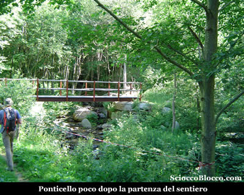
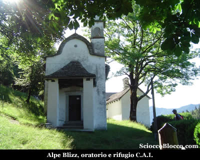
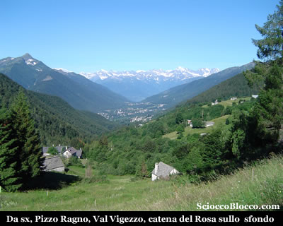
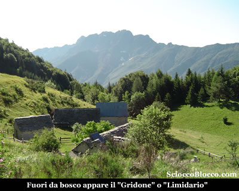
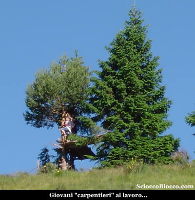
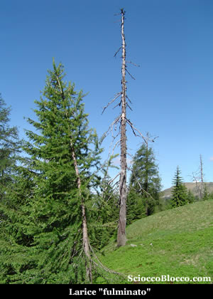
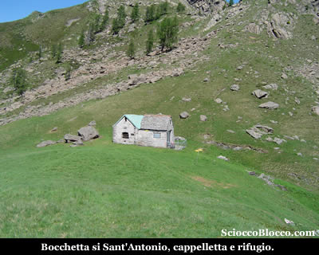
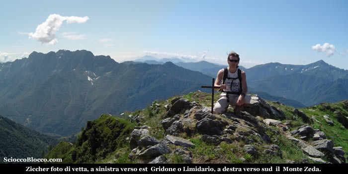
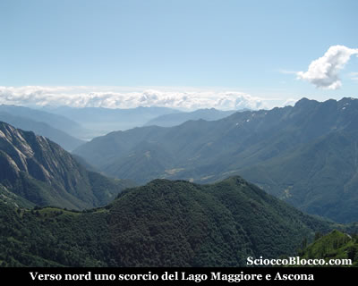
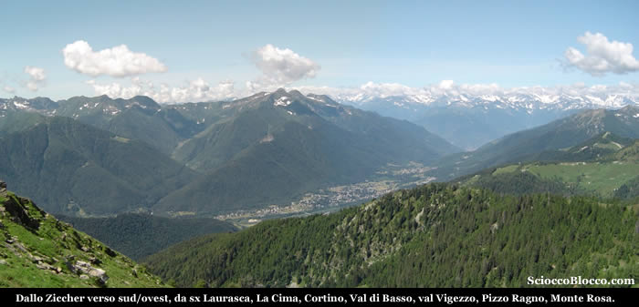

Il sentiero parte proprio dove sono infissi i cartelli indicatori,
infilandosi subito nel bosco, portandoci ad attraversare
un recente ponticello dopo 5 minuti.

Dopo
il ponte, il sentiero prende a salire immediatamente su pendenze
impegnative, all'interno del bosco che si fa fitto e scuro,
piegando dapprima a sinistra e poi a destra.

Bisogna rompere subito il fiato, e Nazareno sempre in forma,
detta il passo.

In breve raggiungiamo l'**Alpe
Blizz** (1282m)(15/20 min).

Posto
che per la sua facile raggiungibiltà permette a chiunque
di gustarsi panorami e relax, all'ombra del rigoglioso bosco.

Qui proprio all'entrata dell'alpe ci accoglie il bell'oratorio,
e dietro il Rifugio Blizz (per info: +39.0347.9237754 ) con
adiacente l'agriturismo "La Bricola" di recente
ristrutturazione.

Sulla balconata del Rifugio, guardando verso ovest, nella
direzione del nostro arrivo, si apre già un panorama
notevole sulla **Val Vigezzo**,
con i suoi centri e le sue cime, mentre sullo sfondo la catena
del **Monte Rosa**.

Ripartiamo,
salendo nel bosco alla sinistra dell'**Alpe Blizz**, usciamo subito
in una radura, disseminata di baite vecchie e qualcuna ben
riattata, sulla destra verso est, a farla da padrone li a
un passo è l'imponente parete del **Gridone**
o **Limidario**.

Il
sentiero sale ora allo scoperto, su pendenze abbastanza impegnative,
tra le casere disseminate sui prati aperti, in breve raggiungiamo
un nucleo più cospicuo è questo **Pragrande**
(1380m)(25/35min).

Dove scorgiamo dei giovani "carpentieri" intenti
alla costruzione di una casa sull'albero, che ci indicano
la direzione giusta per la nostra meta.

Sulla
destra dell'alpe si stacca il sentiero, che si infila in piano
all'interno di un bosco nuovamente fitto.

Dopo alcune decine di metri la traccia piega a sinistra e
prende a salire in modo deciso, sempre all'interno del bosco.

Dapprima passiamo alcune vecchie baite dove il bosco in parte
si dirada, quindi riprendiamo a salire nella vegetazione abbondante.

Il sentiero si fa più marcato, e per qualche tratto
spiana ormai nel bosco meno fitto di larici, dove attira la
nostra attenzione il fantasma di un larice fulminato (45/55min).

Difficile
dare dei punti di riferimento, non vi sono ne costruzioni
ne cartelli in questo tratto, tuttavia il sentiero è
sempre molto evidente e segnato dai classici colori Bianco-Rosso
del C.A.I.

La visuale è più aperta e si possono trovare
punti di riferimento nelle vette circostanti.

Dopo alcuni minuti, il bosco torna più denso, e il
sottobosco lussureggiante, il sentiero ad un tratto piega
decisamente a sinistra su pendenze accentuate, e si riinmerge
tra l'ombra dei larici.

La traccia scavalca in breve il costolone che scende dallo
Ziccher, e sull'altro versante in salita costante e in traverso
raggiunge la **Bocchetta di Sant'Antonio**
(1930m)(1.50/2.10 h).

Proprio
sul passo si trovano la cappelletta e il rifugio, sul quale
è posta una targa in memoria di tre finanzieri caduti
durante il periodo bellico nel 1941.

Di fronte a noi si apre la **Val
Onsernone**, da noi percorsa e recensita,
sulla sinistra i contrafforti di **Cima
Sassone**, di fronte sulla destra la doppia
cuspide di **Cima di Caneto**
e il sottostante omonimo **Alpe
Caneto**.

Tutto alla nostra destra, vediamo la cresta con traccia abbastanza
visibile, che sale al **Monte Ziccher**.

Iniziamo a salire passando una piccola croce in ferro all'inizio
della cresta, e seguiamo il sentiero che piega verso sinistra.

Approdiamo ad un passaggio breve ma delicato, un canalino
franoso precipita verso la bocchetta, mentre dall'altro lato
si apre un precipizio.

Il passaggio è solo di un paio di metri, ma sottilie
e con terriccio friabile, bisogna procedere con prudenza e
attenzione.

Giunti sul lato opposto, la traccia torna marcata, e su magri
prati verticali piegando verso sinistra sulla sommità,
sale rapidamente alla piccola croce di vetta del **Monte
Ziccher** (1965m)(2.00/2.20 h).

Il
panorama complice la bella giornata, appare mirabile.

Verso nord-est fa capolino il **Lago
Maggiore** e **Ascona**,
chiuso sulla destra dalla cresta del **Gridone**
che precipita verso il lago.

Verso
sud-ovest, si stende tutta la **Val
Vigezzo**, sulla sinistra la **Val
Loana** con la **Laurasca**
e **La
Cima**, la **Val
di Basso** con il **Pizzo
Ragno**, sulla destra la **Colma
di Craveggia**, il **Trubbio**
e  **Cima Sassone**,
sullo sfondo sua Maestà il **Rosa**.

Appagati
iniziamo la discesa, che decidiamo effettuare proseguendo
sulla parte della cresta verso sud-est, per eseguire un breve
anello attorno al costolone che scende dalla vetta, senza
così tornare alla bocchetta.

Tuttavia il sentiero che sulla carta appare ben segnalato,
scompare ben presto, decidiamo di scendere per l'ampio pratone
in direttissima, per poi entrare nel bosco ancora rado piegando
verso destra in direzione del costolone appena citato.

Dopo alcuni minuti di cammino nel bosco, ritroviamo il santiero
di salita proprio dove inizia lo strappo che porta sul lato
opposto del costolone.

E' evidente che il sentiero segnalato sulla carta, è
ormai pressochè inglobato dal sottobosco, poco male
ora è sufficiente seguire in discesa il sentiero percorso
all'andata per tornare all'**Alpe
Blizz** e al parcheggio(1217m) dopo circa (4.00h/4.30h).

Bella escursione che richiede un po di allenamento, di facile
orientamento se si percorre il sentiero della **Bocchetta di
Sant'Antonio**, che richiede invece un minimo di esperienza
se si sale o scende direttamente in vetta per la mancanza
di tracce evidenti.

**Un
ringraziamento agli escursionisti di giornata Nazareno e Dario.**

