Superato l'ultimo tornante della **strada ENEL** che conduce alla diga del lago Campliccioli, sulla sinistra troviamo dei cartelli indicatori della partenza sentieri, qualche metro più avanti vi è una comoda piazzola per parcheggiare l'auto nei pressi di una cascatella, siamo a quota 1290m circa.
Da notare che i cartelli non indicano la nostra meta odierna (Punta e laghi Trivera), cosa a mio parere criticabile vista la notorietà della meta, ma **Alpe Crevaloscia**, Passo del Mottone e Mottone, tuttavia il nostro obbiettivo si trova proprio sul sentiero per il Passo del Mottone.
Quindi imbocchiamo il sentiero, contraddistinto dalla sigla "C19" e dai colori bianco-rosso del C.A.I, ed iniziamo la salita.

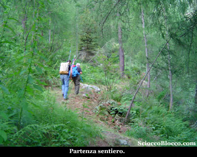

La giornata è incerta, le previsioni davano pioggia debole, ma al momento nuvole grigie si muovono velocemente dal basso verso l'alto, tra squarci d'azzurro.
La salita parte subito decisa, immersi in un bosco dominato dai larici guadagnamo quota rapidamente con secchi tornanti, avvolti da una vegetazione lussureggiante.
Cercando di rompere subito il fiato, arriviamo all'**Alpe Crevaloscia** (1386m) (15/20min).

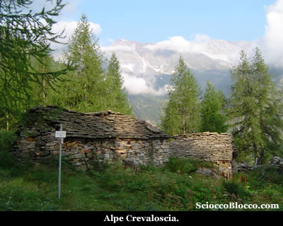

Le baite sono quasi totalmente cadenti, intorno cespugli di mirtilli, incontriamo un paio di persone del posto che ci dicono che turisti stranieri ci hanno preceduto il giorno prima con tende zaini e viveri.
Penso poco male avremo compagnia, ma i miei compagni pescatori di oggi sembrano gradire meno la notizia...
Il sentiero riprende a salire nel bosco, per poi poco dopo scendere in traverso a guadare un torrentello, e quindi riprendere a salire ancora un po' in diagonale, le piogge dei giorni precedenti hanno inzuppato la vegetazione, che alta e abbondante rilascia parte dell'acqua su pantaloni e scarponi.
In salita leggera superiamo una baita isolata e quindi di nuovo in salita ripida arriviamo in breve all'**Alpe Colmigia** (1583m) (40/50min).

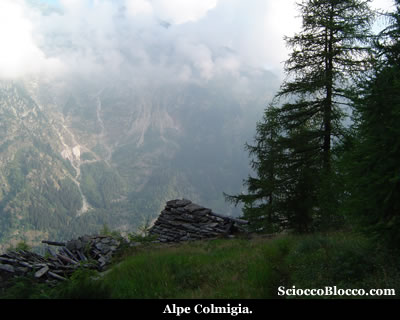

Il sentiero in diagonale, piega lungamente verso destra, per entrare in un largo vallone ormai fuori dal bosco.
Il percorso che ci attende appare evidente, il vallone sale stringendosi ripido verso la cima che lo chiude sulla destra, dietro la quale sella si trovano i laghi (1.10/1.20h).

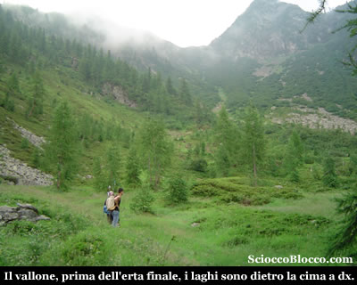

Riprendiamo a salire, il sentiero resta sempre evidente anche tra il rigoglioso sottobosco.
Lo scenario è superbo, una distesa di rododendri e cespugli di mirtilli ricoprono la vallata punteggiata qua e la da gli ultimi larici testardi.

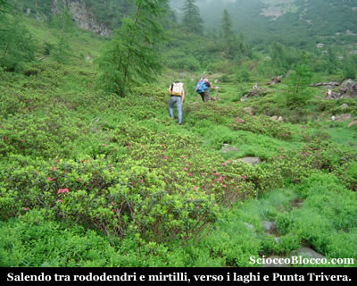

La traccia si fa davvero impegnativa, tra gli ontanelli sale ripida e verticale in direzione delle rocce sulla destra, la fatica bussa alle gambe, alzando lo sguardo la sella sembra essere sempre li ad un passo, ma non è così.
Delle nubi salgono velocissime verso di noi dal fondo valle, e in un attimo ci siamo dentro.
Incontriamo una breve placca rocciosa, che si supera senza troppe difficoltà tenendosi sulla sinistra, e quindi il sentiero sempre verticale piega a sinistra verso l'agognata sella erbosa.
In un momento di respiro volgendoci indietro, grazie al fatto che le nubi ci hanno superato verso l'alto, vediamo aprirsi sotto di noi tutta la valle appena percorsa e in fondo lo specchio d'acqua del Lago d'Antrona.

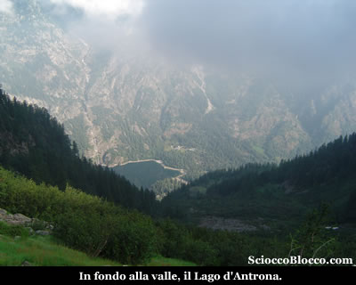

Quando le gambe ormai reclamano un po' di pietà, sul sentiero che verso sinistra sale ormai tra magri prati nella luce vivida delle creste, si intuisce prossima la meta.
Infatti poco dopo approdiamo alla sella (2120m)(2.20/2.40h) dalla quale appare ai nostri occhi come un premio il **primo Lago del Trivera** (2101m)(2.30/2.45h) che raggiungiamo in breve.

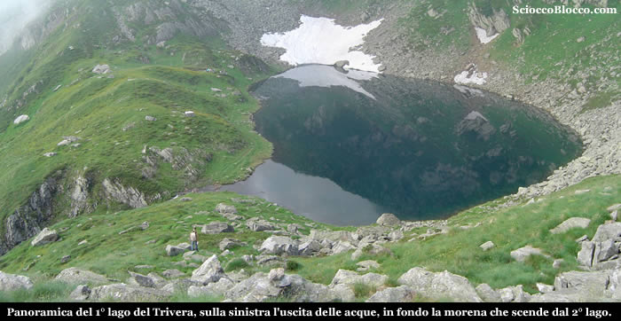

I due **Laghi del Trivera** sono adagiati in una classica conca di circo glaciale ai piedi del Pizzo del Ton, oggi coperto dalle nubi, tra i due laghi si trova una vasta zona dominata da grossi detriti morenici e da alcune pozze d'acqua che variano a seconda del tipo di innevamento annuale.
Siamo accolti da una numerosa famiglia olandese che ha trascorso la notte sul posto, mentre i pescatori preparano l'attrezzatura, osserviamo uno dei ragazzi che con stile si cimenta nella pesca con la mosca.
Lascio i pescatori, e mi dirigo verso il secondo lago.

Costeggiando sulla sinistra il primo lago, si arriva in prossimità
della morena detritica che scende dal secondo lago, qui è
possibile scegliere se risalirla liberamente in direttissima
verso la meta, oppure se piegare sulla sinistra e riprendere
il sentiero che sale al Passo del Mottone.

Nel primo caso è necessario prestare molta attenzione
risalendo i grossi massi, nel secondo caso il sentiero con
ampio giro contorna la vasta zona di sfasciumi rocciosi sulla
sinistra per approdare al secondo
**Lago del Trivera**(2144m) in circa 15/20 minuti.

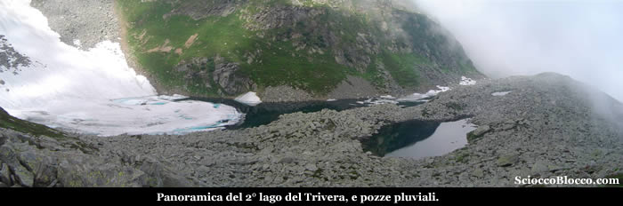

Il
lago nonostante la stagione avanzata è ancora per metà
ghiacciato, e colpisce per l'aspetto molto più brullo
e desolato rispetto al primo lago che si trova solo poche
decine di metri sotto.

Sopra di esso troviamo le pareti verticali del Pizzo del Ton
cima alpinistica e che con il suo profilo imponente, domina
lo sguardo già dal fondovalle.

Il sentiero prosegue per raggiungere il vicino [Passo del Mottone](http://scioccoblocco.com/recensioni/trivera.htm), naturale accesso alla vall'Anzasca.

Io torno indietro verso il primo lago, mentre le nuvole si
dissolvono aprendo sulla mia destra (tornando) la vista sull'intera
**Valle Antrona**,
i suoi centri, gli alpeggi disseminati sui fianchi della montagna
e **Villadossola**
la giù in fondo nella piana ossolana all'imbocco della
valle.

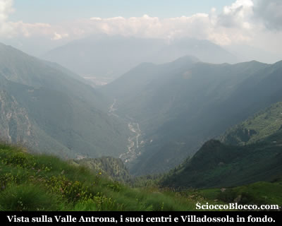

Poco
prima di arrivare nuovamente al lago, grazie alla visibilità
migliorata, sempre sulla destra è ben visibile nell
**Vallone di Trivera**,
l'**Alpe Mulini**
villaggio abbandonato e simbolo dell'antica attività
mineraria, che negli ultimi secoli sino all'inizio di quello
appena passato, ha portato gli alpigiani antronesi e anzaschini
a trasformarsi in cercatori d'oro.

L'emissario del **primo Lago del
Trivera**, che precipita nell omonimo vallone,
era la forza motrice dei cosiddetti "molinetti"
componenti principi tra le attrezzature del processo di estrazione.

Tornato al lago finalmente ci concediamo il meritato pranzo,
nel silenzio più totale che questo angolo di Alpi Lepontine
regala, insieme alle sensazioni di asprezza e solitudine.

Quindi i miei compagni riprendono le canne, per catturare
qualche trota alpina, e io decido di raggiungere la vetta
del giorno.

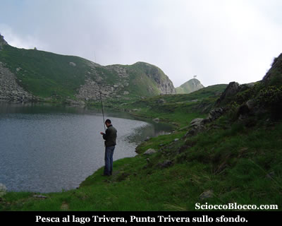

Torno verso la sella da cui siamo giunti al lago, che raggiungo
in 5 minuti camminando tra la fioritura dell'arnica.

Qui sulla sinistra riappare in fondo alla valle il Lago d'Antrona,
la cresta erbosa prosegue leggermente sulla destra, l'itinerario
è obbligato, in bilico tra i due valloni, il filo di
cresta prosegue sempre più sottile ed aereo sino sotto
la salita finale che si supera anche con l'ausilio delle mani
per arrivare in breve alla **Punta
Trivera** (2148m) (15/20min).

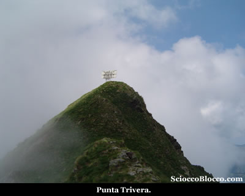

Dove
è posto un grosso pannello, credo per le telecomunicazioni,
e da dove si gode di una notevole vista sulla valle, almeno
nei giorni tersi...

Di nuovo al lago, e dopo un po di relax, e soddisfatti per
le catture, riprendiamo la strada del ritorno che avviene
per lo stesso percorso dell'andata, prestando attenzione
nella prima parte al terreno franoso e umido che abbinato
alla notevole inclinazione può riservare qualche
scivolone, per tornare alla **strada
ENEL** e all'auto(1290m)(4.30/5.00h).

Bella escursione per i luoghi pochissimo frequentati, per
l'alternarsi di vegetazione lussureggiante e luoghi aspri
e severi, che richiede però un buon allenamento per
il percorso totalmente verticale che mette a dura prova
gambe e fiato sia nella salita che nella discesa.

**Grazie
agli escursionisti di giornata Daniele, Remo e Dario.**

