Qui all'**Alpe San Bernardo** (1628m), alla sinistra del parcheggio parte un largo sentiero indicato dai cartelli con il codice (D0) e dai colori bianco-rosso del CAI, per il Lago di Ragozza e il Rifugio Gattascosa, che toccheremo nel tragitto scelto per raggiungere la meta odierna, la Cima Verosso.
In questa giornata incerta di fine agosto, dove grossi nuvoloni grigi lasciano solo qua e la spazio a squarci d'azzurro, soprattutto verso la Svizzera, io e Lella ci apprestiamo alla nostra prima escursione insieme.
Raggiunta la vetta odierna ci prefissiamo di compiere un giro quasi ad anello, percorrendo le creste che fanno da confine tra Italia e Svizzera e tornare dal lato opposto della valle.
Vedremo se le gambe saranno d'accordo.

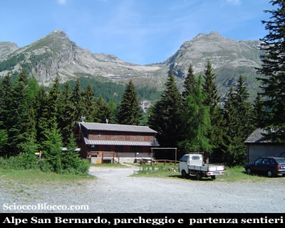

All'interno di un bosco l'ampia mulattiera sale dolcemente, dopo circa 10min arriviamo ad un bivio, seguiamo la traccia che sale ora più accentuatamente sulla destra, perché quella sulla sinistra ci porterebbe in pochi minuti al piccolo **Lago d'Arza** (1742m), di 1500mq e una cinquantina di centimetri di profondità, circondato da torbiere.
Deviazione che comunque ci farebbe perdere poco tempo.

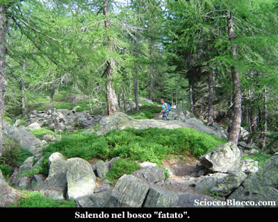

Saliamo ora un poco più decisamente sempre all'interno di un bosco dominato dai larici, al margine di un piccolo ruscello che in alcuni punti attraverseremo con l'aiuto di alcuni ponticelli di tronchi.
Quando il sentiero spiana, sbuchiamo dalla vegetazione in una larga radura.
E' questa la **Torbiera di Gattascosa** (1831m) (35/45min).

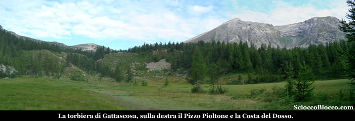

La Torbiera è solcata da numerosi rigagnoli e dal ruscello, popolato da numerosi *salmerini*, che abbiamo già costeggiato più in basso.
La vista è notevole, le cime della Val Bognanco ci circondano, la *Cima Verosso* nostra meta è li ad attenderci alla nostra sinistra, sulla destra domina il profilo severo del [Pizzo Pioltone](http://scioccoblocco.com/recensioni/pizzopioltone.htm) da noi salito.
Attraversiamo il pianoro, il sentiero sempre molto evidente si impenna sulla sinistra, tra un rado bosco di larici, tuttavia lo sforzo è breve e approdiamo al **Lago di Ragozza** (1958m) (45/55min).

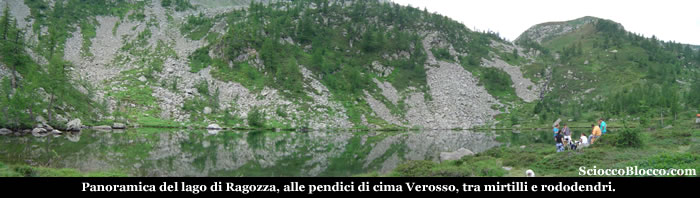

Possiamo notare l'immensa frana scesa dalla Cima di Verrosso, che ha occluso l'uscita del lago che formava il bacino sottostante oggi solo torbiera.
Questo lago immerso in un ambiente stupendo, ha una superficie di 10.000mq e una profondità di 3,5m, è circondato da larici e da una infinità di rododendri e cespugli di mirtilli.
Posto incantevole in qualsiasi stagione lo si raggiunga, sia nei colori intensi di primavera-estate, che nei colori fiammeggianti d'autunno o nel bianco incontaminato dell'inverno.
Prendiamo il sentiero che sale al margine destro del lago e ci apparirà il **Rifugio Gattascosa** (1993m) (50min/1.00h) che raggiungiamo in pochi minuti.

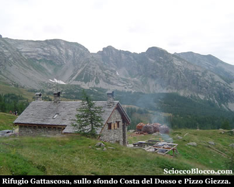

Il **Rifugio Gattascosa** dispone di 25 posti letto è gestito e può essere un ottimo punto d'appoggio sia per mangiare nelle gite di un giorno, sia per pernottare qualche giorno usandolo come punto di partenza per il trekking dei laghi della **Val Bognanco**.
Caratteristico il modo di accatastare la legna tagliata in piccoli pezzi disposti a forma di panettone che ricorda le vecchie carbonaie.
All'ingresso del rifugio sulla sinistra si stacca in salita un sentierino evidente, che costeggiando per qualche metro le canalizzazioni in legno che portano l'acqua al rifugio, si inerpica dritto per la piccola valletta.
In pochi minuti arriviamo ad un pianoro erboso, e davanti a noi si staglia l'imponente parete detritica della Cima Verosso, mentre sulla sinistra riappare in parte giù in basso il lago di Ragozza.
Il sentiero piega a destra e riprende a salire in direzione della sella ben evidente, ma sorpresa l'ultimo tratto è ancora ricoperto da un abbondante nevaio, che ormai per quest'anno ha deciso di trattenersi in attesa delle prossime nevi...

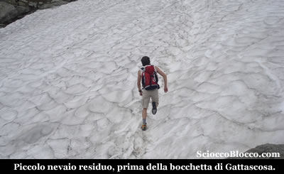

Tuttavia la neve è compatta e portante, quindi in diagonale e scalinando un poco il percorso con gli scarponi, superiamo agevolmente queste poche decine di metri, aggirando poi sulla destra grossi detriti morenici, approdiamo alla **Bocchetta di Gattascosa** (2158m)(1.30h/1.40h) nota anche come il *Passo di Ragozza*.
Qui lo scenario cambia di nuovo, verso la Svizzera il cielo è sereno e di fronte a noi si apre una vallata verde e ricca di laghetti, uno dei quali è solo pochi metri più avanti sulla sinistra.
La vetta è lassù a sinistra che ci attende, infatti appena giunti in bocchetta o anche poco prima pieghiamo appunto a sinistra prendendo a salire in direttissima verso il filo di cresta.
Il sentiero non è più evidente, ma non importa teniamoci sempre sulla sinistra nel versante Bognanchese, troveremo certamente dopo qualche decina di metri di dislivello ometti segnalatori e traccie di sentiero.
La salita si fa ora dura, tra gli sfasciumi della martoriata parete Nord e qualche centimetro quadrato di magri prati, saliamo zigzagando, con lo sguardo rivolto all'insù sempre alla ricerca del prossimo omino segnavia.
In un momento di pausa voltandoci indietro, possiamo cogliere l'occasione per ammirare la bellissima e poco conosciuta **valle dello Zwischbergen** e i **laghetti Tschawinersee**, che si aprono aldilà della Bocchetta di Gattascosa dove corre il confine Italo-Svizzero.
Questa valle nasce a Gondo, il primo paese dopo il confine entrando in Svizzera dal Canton Vallese verso il Passo del Sempione, per terminare appoggiando la propria testata alla parete Nord del *Pizzo Andolla*.

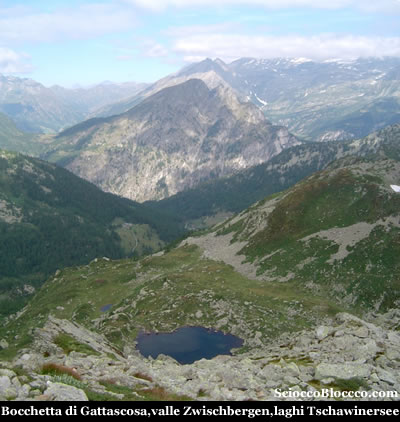

Raggiunta la cresta, che con sorpresa dal lato opposto degrada dolcemente quasi in un altipiano erboso, pieghiamo decisamente a sinistra, restando sempre in bilico sullo strapiombante lato Bognanchino che precipita nel sottostante lago.
In breve, superati un paio di avvallamenti, la traccia piega a destra e finalmente appare la sassosa e ampia vetta di **Cima Verosso** (2444m)(2.30h/2.45h).

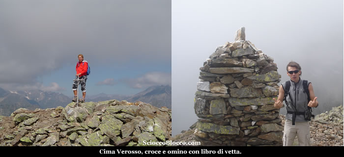

Il cielo purtroppo si va coprendo, ma il panorama seppur limitato resta notevole, sulla **Val Bognanco** sotto di noi a Nord, la **Val d'Ossola** verso Est, la **Val Antrona** verso Sud e lo svizzero **Vallese** verso Ovest.
Sulla vetta è posta una piccola croce posta in memoria di Giovanni Sala da parte di alcuni amici della Val Bognanco, e un grosso omino di vetta dove è incastonata una scatola metallica contenente il libro di vetta.
Finalmente ci riposiamo e rifociliamo, mentre ci raggiunge dal versante svizzero un signore visto al parcheggio la mattina, accompagnato dal simpaticissimo e affamatissimo Apache.
Scattate le foto di rito e più riposati decidiamo di scendere, visto il tempo sempre grigio e incerto.
Torniamo sui nostri passi, ripercorrendo in discesa il tragitto compiuto per arrivare in vetta, prestando attenzione al terreno franoso e molto inclinato che potrebbe riservare qualche brutto scivolone, per tornare alla **Bocchetta di Gattascosa** (2158m) dopo (3.15h/3.30h).
A questo punto dopo un rapido consulto, decidiamo che le gambe hanno ancora un po di energia e di proseguire per il nostro giro quasi ad anello, eccezione fatta per il tratto terminale di Cima Verosso che abbiamo percorso sia all'andata che al ritorno.
Di fronte a noi, oppure alla destra rispetto all'arrivo in bocchetta del mattino, si alza una motta ripida ed erbosa oggi popolata da una nutrita colonia bovina, questa non è altro che la cresta che a cavallo del confine Italo-Svizzero ci porta toccando due cime minori al Passo di Monscera.
Saliamo subito in direttissima tra cespugli di mirtilli, che Lella provvede a raccogliere gustandone parte già in loco, incontriamo subito la traccia che sale dalla sinistra e che in breve ci conduce in cresta e all'omino di **Cima Mattaroni** (2235m)(3.30h/3.45h).

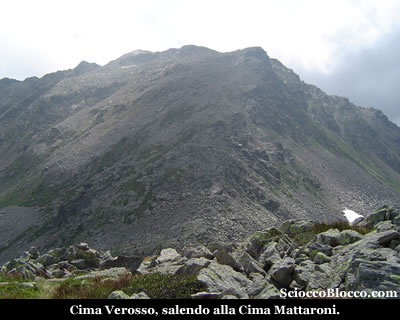

Voltandoci indietro possiamo vedere la **Cima Verosso** e la sua cresta brulla e detritica, appena percorsa per raggiungere la vetta.
Di fronte a noi, in direzione opposta ci attende una facile cresta pressoche in falsopiano, coperta da un tappeto di cespugli di mirtilli e rododendri e da rari e contorti larici martoriati dal vento.
Proseguiamo in un piacevole sali-scendi in bilico tra due stati, passando la parte centrale detta Bocchetta di Mezzo, per raggiungere l'omino della **Cima del Tirone** (2203m)(4.00h/4.15h).

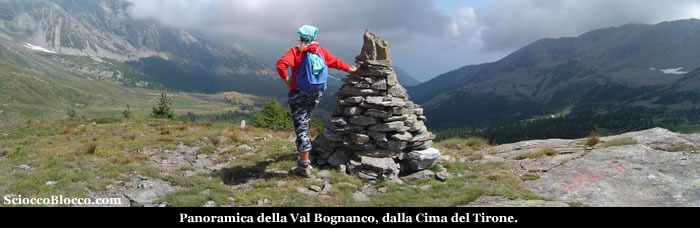

Verso Est si apre mirabile la **Val Bognanco**, chiusa a sinistra dalla cresta che scende dal vicino [Pizzo Pioltone](http://scioccoblocco.com/recensioni/pizzopioltone.htm), e a destra dalla cresta che scende dalla **Cima Verosso** appena salita, per confluire la giù in fondo nella **Val d'Ossola**.
Iniziamo ora la discesa verso il ben visibile sottostante **Passo Monscera** (2103m) che raggiungiamo in breve (4.15h/4.30h).
Dove è posto il cippo che delimita il confine e alcuni cartelli indicatori dei sentieri, luogo sempre molto panoramico che tuttavia oggi ci preclude la vista sui vicini 4000m del Vallese, causa cielo coperto.
In pochi minuti scendiamo veloci al vicinissimo **Lago di Monscera** (2072m) (4.20h/4.35h).

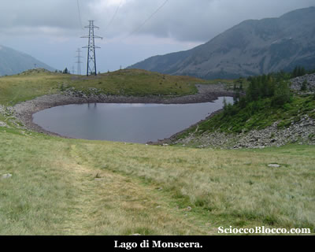

Proprio sotto la sella del Passo è posto il **Lago di Monscera**, collocato nel più alto dei terrazzi naturali della valle glaciale del **Rio Rasiga**, questo laghetto occupa attualmente una superfice di 5600mq con una profondità massima di 4,5m, circondato da bassa vegetazione perché posto sul limite altimetrico della vita arborea è comunque circondato da rari larici e popolato da anfibi.
Alcuni resti di canalizzazioni testimoniano un passato sfruttamento per l'irrigazione, oggi adibita solo a pascolo.
Nell'occasione si presenta con un livello d'acqua abbastanza basso, mostrando così ampiamente le proprie sponde.
Proseguiamo percorrendo il sentiero che lascia il lago alla nostra destra, e che in breve si trasforma in ampia mulattiera, scendendo tra i prati a raggiungere l'**Alpe Monscera** (1978m)(4.35h/4.50h).

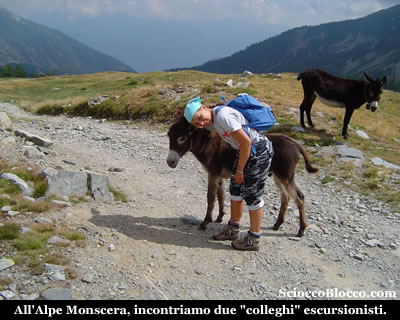

Alpeggio ancora caricato da bovini, capre, cavalli e asinelli con i quali stringiamo "amicizia", e dove ancora si producono specialità nostrane.
Riprendiamo a scendere ora su un ampia gippabile, attraversiamo un piccolo ruscello e quindi ci immergiamo nel bosco per affrontare un altro "guado" sul torrente che scende dal Lago d'Agaro.
La gippabile diventa ora asfaltata e scende ripida nel fitto della vegetazione, superiamo sulla sinistra la deviazione per i Laghi del Paione e poco dopo siamo all'**Alpe Arza** (1754m) (5.00h/5.25h).

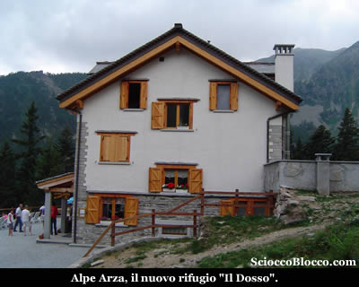

Qui all'**Alpe Arza** è situato il nuovissimo **Rifugio "Il Dosso"**, gestito con 6 stanze e 16 posti letto, facilmente raggiungibile a piedi da San Bernardo, ma anche in auto con permesso rilasciato dal comune.
Dove alcuni avventori si dilettano nel tradizionale gioco del lancio della moneta nella bocca della rana.
Riprendiamo a scendere, ormai la stanchezza avanza, con ripidi tornanti la strada scende rapida ad attraversare il ponte sul **Rio Rasiga**, per poi in leggera ascesa tornare all'**Alpe San Bernardo** (1628m) (5.30h/6.00h) partenza e arrivo della nostra escursione.
Escursione molto bella perché condotta spesso sul filo di cresta in bilico tra Italia e Svizzera, che porta a percorrere entrambi i lati dell'alta Val Bognanco, e che tempo permettendo regala panorami notevoli, consigliata a chi possiede un discreto allenamento per il dislivello e il tempo di percorrenza impegnativi.

Grazie
agli escursionisti di giornata Lella e Dario.

