Giunti a **Fondo li Gabbi** o **Fondi Ghebbi** (1256m), parcheggiamo l'auto in una della numerose piazzole e scendiamo ad attraversare il greto del **torrente Loana** che in questa stagione è quasi completamente asciutto, e ci portiamo sul lato destro della valle nei pressi dell'agriturismo.
Oggi la mattinata è serena, e il fresco di questi primi giorni di ottobre si fa sentire, la bella spianata della Val Loana si stende davanti a noi ancora immersa nell'ombra, lassù al centro svettano il Cimone di Cortechiuso e la Laurasca mentre la nostra meta odierna resta nascosta dal bosco alla nostra destra.
Ammirati dallo scenario sempre superbo di questa vallata Io e Lella partiamo per il nostro giro ad anello, sperando che arrivi presto il sole a scaldarci.
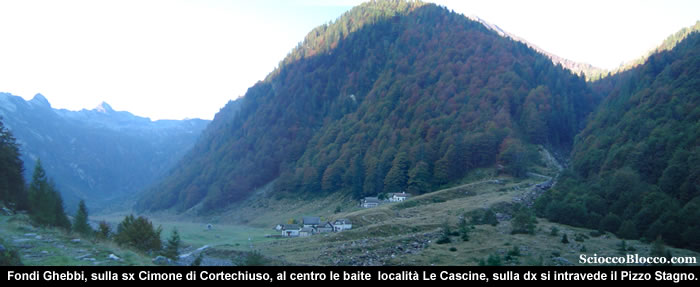

Il largo sentiero si dipana dopo l'agriturismo in leggerissima ascesa, sfiorando una cappelletta posta al centro del prato, costeggiando il lato destro della valle, passando quindi vicino ad un ponte in legno.
Oggi ci proponiamo di raggiungere il **Cimone di Straolgio** e quindi il Pizzo Stagno tornando a **Fondo li Gabbi** dall'Alpe Cavalla chiudendo così un perfetto giro ad anello.
Andando verso il restringimento dell'altipiano noteremo prima sulla sinistra, sul lato opposto, un piccolo gruppo di baite nei pressi del sentiero che scende dalla Forcola da noi percorso e recensito.
Il sentiero a questo punto aggira sulla sinistra una piccola pietraia e nei pressi di alcuni cartelli indicatori si infila nel bosco sul lato destro della montagna.
Da questo momento le pendenze si fanno impegnative in modo costante sino a **Scaredi** nostro primo obbiettivo.
Dopo qualche minuto arriviamo nei pressi delle **Fornaci** (circa 1340m) (25/30 min).

I resti delle antiche fornaci, ora restaurate, venivano utilizzate un tempo per la fabbricazione della calce.
Strutture di forma circolare, erano costruite in sasso a ridosso del pendio del terreno, nel muro a valle veniva costruita un’apertura denominata “bocca di carico” che serviva per introdurre la legna ed il carbone da ardere.
Il calcare, ricavato nei pressi di **Scaredi**, vicino al Laghetto del Marmo, veniva ridotto in piccoli pezzi e trasportato a dorso di mulo fin qui, dove veniva messo in queste fornaci a cuocere lentamente.
Dalla bocca di carico si inserivano il legname ed il carbone di legna che venivano fatti ardere a temperatura costante per circa 8 giorni.
Una persona sorvegliava giorno e notte la cottura finché il calcare non si riduceva in materiale più tenero.
La calce bianca ottenuta veniva messa nei sacchi e a dorso di mulo portata a valle per essere utilizzata nella fabbricazione dei muri delle case o delle baite.
La **Valle Loana**, con le sue fornaci, ed i suoi boschi ha fornito di legname e calce la Valle Vigezzo, e arredato la residenza borromea all’isola Bella, sul lago Maggiore.
Molte più di queste informazioni si possono trovare nel libro "Malesco" dello storico vigezzino Giacomo Pollini.
Riprendiamo il cammino, la larga mulattiera rudemente gradonata che spesso in zona vengono definite "Strà di vacch", sale ripida ai margini del bosco tra cespugli di mirtilli, quest'anno in parte devastati da evidenti segni del passaggio di slavine.
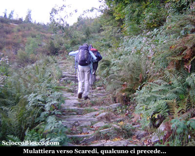

Incotriamo due signori diretti alla Laurasca, che ci danno qualche dritta sul nostro percorso .
Se non allenati la salita si fa sentire, il sole non ci ha ancora raggiunto, nei frequenti squarci però possiamo ammirare già scenari notevoli, dietro di noi la piana di **Fondo li Gabbi** che si allontana, alla nostra sinistra la cresta che dalla Forcola corre alla Testa del Mater e a La Cima, quindi di fronte a noi appunto laLaurasca .

Attraversiamo alcuni ruscelli e piccoli passaggi su lastroni che interrompono il grezzo lastricato, quindi una diagonale che finalmente ci porta all'**alpe Cortenuovo** (1792m)(1.15h/1.20h).
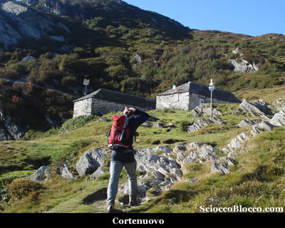

L'Alpe Cortenuovo è costituito da due baite ancora in buono stato.
Abbiamo percorso il tratto più lungo tra un punto di riferimento e l'altro, ripartiamo seguendo il sentiero che esce alla destra dell'alpeggio per poi piegare a sinistra per superare una bastionata rocciosa; sormontata la quale siamo all'imbocco della piccola conca dove si trova l'**alpe Scaredi** (1841m)(1.30h/1.40h) che raggiungiamo in breve.
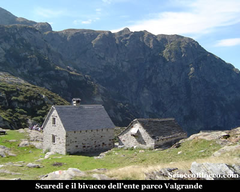

**Scaredi** vera e propria porta d' ingresso al Parco Nazionale Valgrande, ne fa luogo molto frequentato e dal forte fascino dato dalla sua storia secolare che si avverte subito sostando sui suoi prati.
La bella baita ben ristrutturata è il bivacco sempre aperto di proprietà dell'ente parco, dotato di stufa, pannello solare, e numerosi posti letto nel sottotetto.
Finalmente al sole, facciamo uno spuntino e visitiamo il bivacco, dove ci sono tracce di qualcuno che ha passato la notte in loco, forse quelli che con il binocolo vediamo sulla cresta andare verso la Bocchetta di Campo.
La giornata è inaspettatamente azzurra, viste le pioggie dei giorni precedenti, lo scenario è come sempre notevole le vette e le creste che delimitano la Val Grande, di cui **Scaredi** è una delle principali porte d'accesso, si ergono solenni e severe attorno a noi.
Ripreso un po' fiato ripartiamo, alla nostra destra (ovest) possiamo già notare una piccola cappelletta e sopra di essa alla destra la prima vetta di oggi.
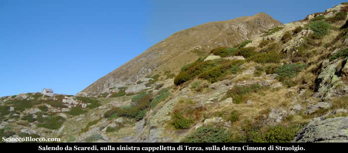

Seguiamo l'evidente sentiero che in circa 10 minuti ci conduce alla **Cappelletta di Terza**(1859m) (1.40h/1.50h).
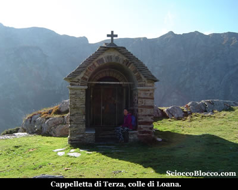

Posta sul **Colle di Loana**, il piccolo promontorio alle spalle di **Scaredi**, la **Cappelletta di Terza** è stata costruita nel 1847 da alpigiani e restaurata negli anni '80 dagli alpini di Malesco, deriva presumibilmente il nome dall'alpe Tercia ormai scomparsa e situata nella zona.
All'interno sono raffigurati tre santi, a destra S.Antonio patrono degli animali, a sinistra S.Gioacchino protettore dei pastori e al centro Santa Genoveffa patrona di Parigi luogo di emigrazione dei vigezzini dell'altro secolo.
Sopra la cappelletta sulla destra incombe il **Cimone di Straolgio** nostra prima vetta di oggi, le possibilità di ascesa sono due:
- Seguire l'evidente sentiero che quasi in piano lo aggira sul lato Sud, sinistra rispetto al nostro arrivo, andando a raggiungere l'Alpe di Straolgio, e quindi con sentiero più ripido salire alla vetta, più lungo ma meno faticoso.
- Salire direttamente per prati il costolone erboso di fronte a noi, in linea retta verso la vetta, più breve ma più faticoso.
Optiamo per la seconda ipotesi, ci spostiamo a destra di qualche metro, verso la sommità del **Colle di Loana** e quindi deviamo a sinistra direttamente sul ripido costolone che scende dalla cima.
Troviamo quasi immediatamente una labile traccia che risale il pendio, la salita è dura e non da tregua, dopo le prime decine di metri di dislivello piega verso sinistra, ed inizia a risalire sul lato destro di un avvalamento che divide in due il crinale.
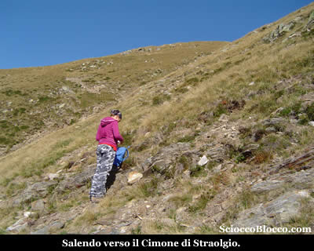

Ci fermiamo ogni tanto a riprendere fiato e ad ammirare il panorama, senza mai lasciare il lato destro dell'avvallamento approdiamo alla larga e pianeggiante cresta che in breve percorriamo e superata l'antecima raggiungiamo la vetta del **Cimone di Straolgio**(2151)(2.30h/2.45h) caratterizzata da un accumulo di pietre.

Volgendoci attorno il panorama è magnifico, alla destra in basso la Val Loana, di fronte il Pizzo Stagno e in fondo la Val Vigezzo, alla sinistra le creste della Val Grande che separano dalla Val d'Ossola e sullo sfondo sua Maestà il Monte Rosa, alle spalle la Val Grande che scende verso il Lago Maggiore e il Signore del parco il Pedum.

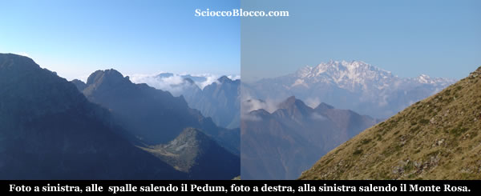

Siamo arrivati sulla vetta del Cimon, come lo chiamano da queste parti, è presto e decidiamo di proseguire per il nostro giro dopo una breve sosta.

Se fin qui il percorso è catalogabile in difficoltà (E), da questo punto in poi diventa di difficoltà (EE).

Proseguiamo ora sulla cresta che si fa più affilata e frastagliata, prima scendiamo di qualche metro ad un intaglio e poi sulla destra, poco sotto il filo di cresta sul lato di Loana, risaliamo una cima di altezza quasi pari al **Cimone di Straolgio**.

Lasciamo anche questa cima e su cresta sempre più sottile e dai lati strapiombanti avanziamo con prudenza.

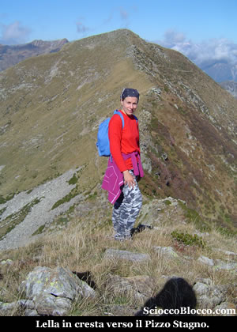

La meta è ben evidente di fronte a noi, mentre in basso a sinistra si vedono le baite dell'Alpe di Straolgio.

Procediamo sino nei pressi di alcune roccette, dove decidiamo che avanzare ancora sulla dorsale diventerebbe troppo azzardato.

Qualche decina di metri più sotto sul lato sinistro, vediamo un sentiero evidente che raggiunge la base della cuspide per poi risalirla.

Con attenzione e qualche difficoltà sui magri prati verticali, ci abbassiamo fino a raggiungerlo.

Ora su sentiero, compiamo  i pochi metri che ci portano sotto l'erta finale, che faticosamente ma in breve ci conduce sulla vetta del Pizzo Stagno(2183m)(3.30h/3.45h).

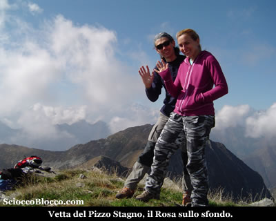

Soddisfatti per la seconda vetta giornaliera raggiunta, finalmente ci concediamo un po' di riposo e il meritato pranzo, ammirando il panorama.

Di fronte a noi un poco sulla sinistra si apre la bella Val di Basso con i suoi numerosi alpeggi che noi abbiamo visitato per raggiungere il Pizzo Ragno che chiude la dorsale la in fondo verso la Val Vigezzo.

Alle spalle ancora la Val Grande che scende verso il lago Maggiore e il Pedum li a un passo, sulla destra la Val Loana, mentre a sinistra il Monte Rosa che si va coprendo.

Si alza un venticello fresco e all'orizzonte si addensano  nuvole, è il momento di ripartire.

Torniamo di pochi passi indietro, dove sono posti dei cartelli indicatori, e quindi seguiamo per la Bocchetta di Cavalla.

La traccia ben marcata un poco sotto il filo di cresta, procede in traverso tra rocette e cespugli, dopo pochi minuti tuttavia scompare totalmente.

L'ipotesi iniziale era quella di raggiungere la bocchetta seguendo la dorsale, ma questa e ricoperta da cespugli di rododendri e sempre più obliqua e aerea procede verso alcune rocce spioventi.

Non ci pare di scorgere alcuna via sicura, guardando verso il basso in direzione della Val Loana e **Fondo li Gabbi** ben visibili laggiù in fondo, notiamo una cinquantina di metri più sotto una paio di tracce evidenti proprio sul cilio di un balzo roccioso.

Deciso, abbandoniamo la bocchetta e scendiamo in linea retta, con molta cautela superiamo alcuni sfasciumi e quindi su prati verticali, procediamo verso il labile sentiero visto dall'alto.

Nei pressi di un rado bosco, la traccia che appare e scompare, sempre sulla sinistra e in bilico su di un piccolo dirupo, giunge in una radura nei pressi  di alcuni resti di un muro in pietra.

Qui piega seccamente verso sinistra e scende costeggiando il balzo di roccia, in breve siamo nell'ampio fornale che scende dalla Boccetta di Cavalla.

Prima traversiamo orizzontalmente per poi riprendere a scendere e raggiungere velocemente l'Alpe Cavalla (1665m)(4.3oh/5.00).

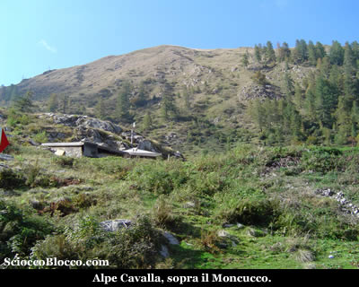

Qui all'Alpe Cavalla troviamo alcuni cacciatori e i loro cani impegnati nel riposino pomeridiano, e alcuni escursionisti discesi dal Moncucco, la modesta cima che sovrasta l'alpeggio.

Ci concediamo qualche minuto di riposo e uno spuntino, perchè la discesa è stata alquanto faticosa soprattutto per restare in equilibrio su inclinazioni così elevate.

Ripartiamo prendendo il sentiero che si stacca poco sotto sulla destra dando le spalle all'alpe, e dove vi sono dei cartelli indicatori.

Ormai l'ampia traccia scende facile ma decisa nel bosco fitto, dapprima superando una bella cappelletta di recente edificazione.

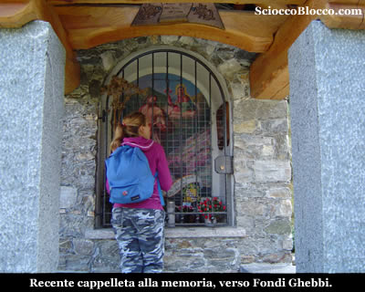

Poi ripida all'interno di un bel bosco di faggi e castagni, scende veloce a **Fondo li Gabbi** località Cascine(1256m)(5.00h/5.30) prorpio nei pressi dell'agriturismo.

Bellissima escursione per il percorso molto aereo e panoramico, che richiede però buona esperienza e allenamento.

**Un
grazie agli escursionisti di giornata Lella e
Dario.**

