La
strada termina in un piccolo ma capiente parcheggio a quota
circa 1217m, dove sulla sinistra sono ben visibili i cartelli
indicatori delle varie mete, tra cui il **Monte
Ziccher** nostro obbiettivo odierno.

Dopo parecchio tempo, oggi giorno dell'epifania torniamo
in montagna per una ciaspolata, la giornata è straordinariamente
serena e il cielo azzurro intenso.

Il parcheggio è perfettamente pulito, e siamo i primi
ad essere qui oggi, infiliamo
gli scarponi, gli zaini e le ciaspole visto che il sentiero
è subito coperto di neve.

Poco prima di partire arriva un gruppetto che ci chiede
se anche noi abbiamo come meta il **Monte Ziccher**, confermiamo
e ci diamo un arrivederci in cima.

Il sentiero parte proprio dove sono infissi i cartelli indicatori,
infilandosi subito nel bosco, la neve è gelata si
fatica un po' a tenere l'equilibrio.

Lella è alla sua prima esperienza con le ciaspole,
ma parte sicura sull'evidente traccia di predecessori, che
ci porta ad attraversare un recente ponticello dopo 5 minuti.

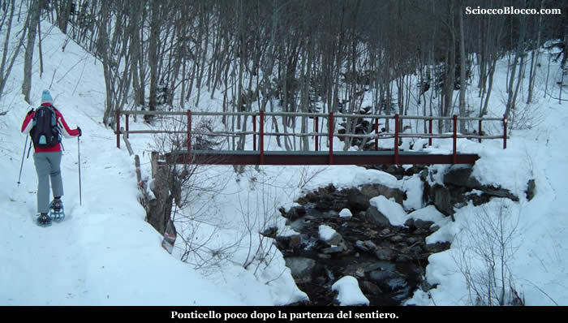

Il
ponticello costruito con grate metalliche non è
ovviamente innevato, e noi pigramente non togliamo le
ciaspole ma ci esibiamo in evoluzioni equilibristiche...

Dopo il ponte, il sentiero/solco prende a salire immediatamente
su pendenze impegnative, all'interno del bosco che si
fa fitto e scuro, piegando dapprima a sinistra e poi a
destra.

Bisogna rompere subito il fiato, ma in breve raggiungiamo
l'**Alpe Blizz**
(1282m)(15/20 min).

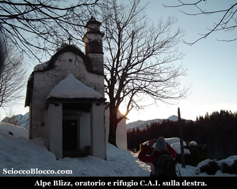

Posto
che per la sua facile raggiungibiltà permette a
chiunque di gustarsi panorami e relax, anche nel periodo
invernale.

Qui proprio all'entrata dell'alpe ci accoglie il bell'oratorio,
e dietro il Rifugio Blizz (per info: +39.0347.9237754
) con adiacente l'agriturismo "La Bricola" di
recente ristrutturazione.

Sulla balconata del Rifugio, guardando verso ovest, nella
direzione del nostro arrivo, si apre già un panorama
notevole sulla **Val Vigezzo**,
con i suoi centri che riposano ancora all'ombra e le sue
cime, mentre sullo sfondo nella limpida luce del mattino
svetta la catena del **Monte
Rosa**.

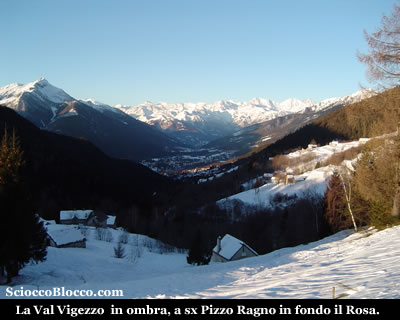

Ripartiamo,
salendo nel bosco alla sinistra dell'**Alpe Blizz**, in questo
periodo può essere utile per orientarsi dato l'innevamento,
prestare attenzione ai segni Bianco-Rosso del C.A.I. presenti
sui tronchi delle piante.

Usciamo
subito in una radura, disseminata di baite vecchie a destra
e una ben riattata e solitaria sulla sinistra, verso est
sulla destra, a farla da padrone li a un passo è
l'imponente parete del **Gridone**
o **Limidario**.

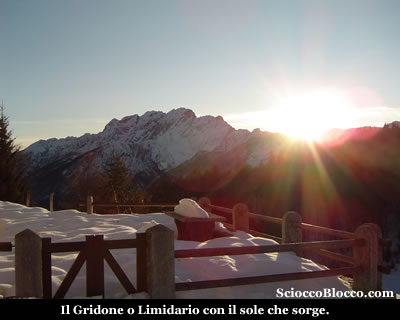

Il
sentiero/solco sale ora allo scoperto, su pendenze abbastanza
impegnative, tra le casere disseminate sui prati aperti,
in breve raggiungiamo un nucleo più cospicuo è
questo **Pragrande**
(1380m)(30/35min).

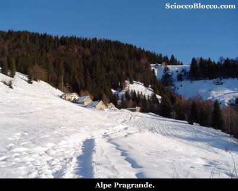

La neve è abbondante nonostante sia passato molto
tempo dall'ultima nevicata, ma è dura e crostosa.

Sulla
destra dell'alpe si stacca il sentiero/solco, che si infila
in piano all'interno di un bosco nuovamente fitto.

Dopo alcune decine di metri la traccia piega a sinistra
e prende a salire in modo deciso, sempre all'interno del
bosco.

Dopo questo strappo il bosco si dirada e raggiungiamo
una radura con una vecchia baita, è questo l'**Alpe
Oro** (1560m)(45/55min).

Ci
fermiamo ad ammirare il panorama e la giornata superba
che la sorte ci ha regalato.

Sopraggiunge il gruppo visto alla partenza, qualcuno con
le ciaspole e qualcuno con gli sci, facciamo due chiacchiere
sulle vette circostanti e ripartiamo.

La traccia si fa più confusa, il terreno qui permette
libertà di traiettorie nel bosco più rado di larici.

In ogni caso noi teniamo il più possibile il lato
destro onde evitare di andare verso la Bocchetta di Sant'Antonio
che ci impedirebbe in questo periodo di salire alla vetta.

Salendo nel bosco meno fitto ci voltiamo ogni tanto per
ammirare il panorama verso sud.

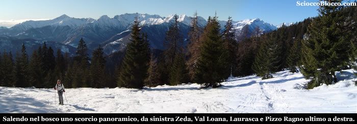

Alle nostre spalle da sinistra il **Monte
Zeda**, la **Val
Cannobina**, la **Val
Loana**, il **Cimone
di Cortechiuso**, la **Laurasca**
e il **Pizzo
Ragno**.

Difficile
dare dei punti di riferimento, non vi sono ne costruzioni
ne cartelli in questo tratto, tuttavia il solco è
sempre abbastanza evidente e sui tronchi troviamo i classici
colori Bianco-Rosso del C.A.I.

La visuale è più aperta e si possono trovare
punti di riferimento nelle vette circostanti.

Come detto teniamoci il più possibile a destra,
un lungo tratto nel bosco meno fitto ci conduce all'attacco
dell'erta finale.

Le pendenze si impennano, saliamo in verticale ormai quasi
senza vegetazione, la fatica si fa sentire ancor più
camminando sulla neve con le ciaspole, puntiamo all'evidente
cresta sopra di noi.

Raggiunta la quale iniziamo un traverso verso sinistra
in direzione dell'evidentissima cuspide sommitale.

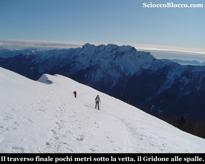

Ormai
manca poco, procediamo a vista, raggiungiamo qualcuno
del gruppo che ci aveva sorpassato, che paga la foga iniziale,
ed in breve in uno scenario bellissimo siamo alla meta
scialpinistica del **Monte
Ziccher** (1965m)(2.30/3.00h).

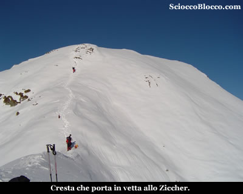

Prendiamo
fiato e ci rifocilliamo, davanti a noi la breve cresta
che porta alla croce di vetta dello Ziccher.

Decidiamo di guardare l'ascesa di chi ci ha prededuto
e valutare.

Con le ciapsole la salita è impossibile, con i
soli scarponi appare rischiosa, montano tutti i ramponi
e tentano, ma in prossimità delle rocette in alto
anche con i ramponi si bloccano senza saper salire o scendere
per diversi minuti, infine con qualche peripezia raggiungono
la vetta.

Non avendo con noi i ramponi decidiamo prudentemente di
rinunciare alla croce.

Lo scenario e l'ambiente restano straordinari, il cielo
blu cobalto è un vero regalo che capita raramente,
lo sguardo che può spaziare a 360° senza nuvole
è fantastico.

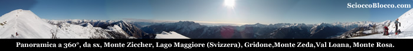

Non si vorrebbe mai scendere, ma mentre mangiamo qualcosa,
si alza una brezza fredda e pungente, diamo un ultimo
sguardo a **Locarno**
e al **Lago maggiore**,
al **Limidario**
al **Monte Zeda**
alla **Laurasca**
al **Pizzo Ragno**
e a sua maestà il **Monte
Rosa**.

Scattiamo la foto di vetta con il **Monte Rosa** sullo sfondo.

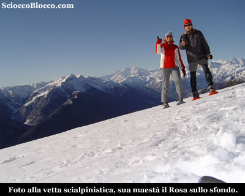

Iniziamo la discesa che effettuiamo per lo stesso percorso
di salita, lasciata la cresta le temperature tornano accettabili
e approfittiamo per gustarci ancora gli squarci che questa
giornata fantastica ci offre.

Rientrati tra i larici, non possiamo non fotografarne
uno, che si presenta secco e biforcuto quasi come simbolo
del limite della vita arborea.

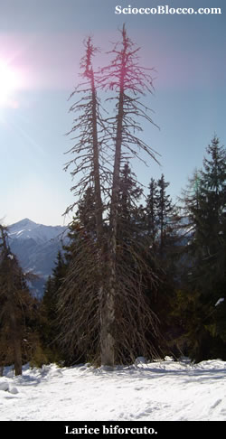

Ripercorriamo
a ritroso quindi il percorso dell'andata per tornare all'**Alpe
Blizz** e al parcheggio(1217m) dopo circa
(4.30h/5.00h).

Escursione bellissima sia per l'ambiente che per i panorami,
grazie anche alla giornata eccezionale.

Consigliabile un buon allenamento perchè camminare
sulla neve causa sempre un maggior dispendio energetico,
ed averla effettuata nel periodo estivo onde evitare problemi
d'orientamento.

**Un
ringraziamento agli escursionisti di giornata Lella e
Dario.**

