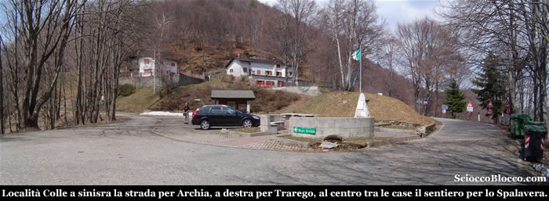
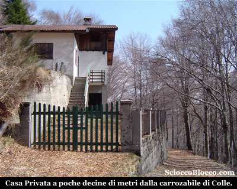
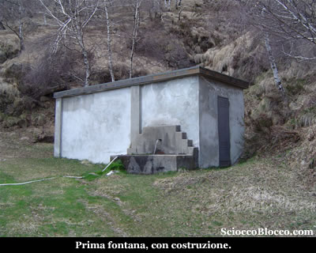
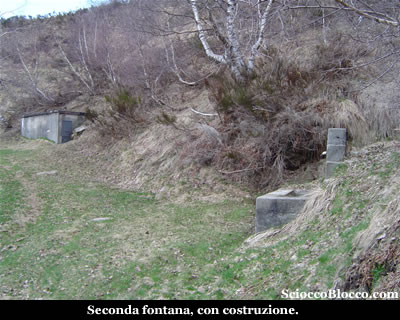
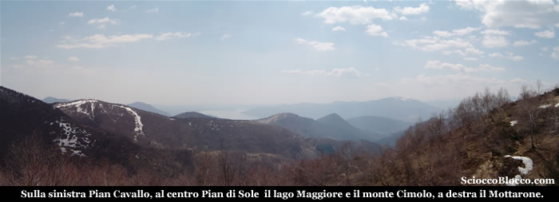
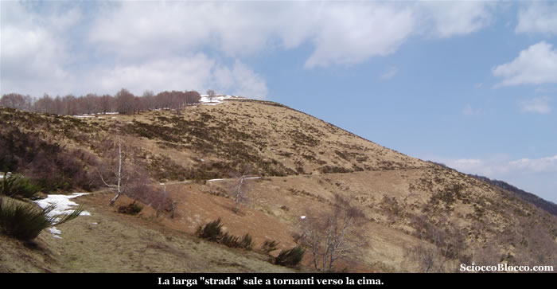
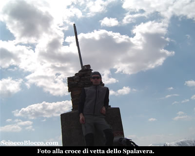
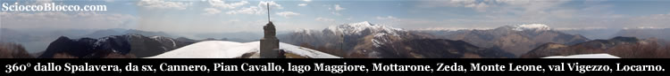
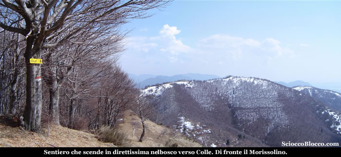
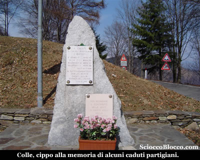

Giunti a Colle (1238m) troviamo una bella piazzetta di recente edificazione ed un comodo parcheggio proprio nei pressi di un cippo commemorativo, notiamo sulla sinistra la strada che conduce ad Archia e sulla destra quella che scende a Trarego.

Tra i due edifici poco sopra, parte la strada militare "Strada Cadorna" per il monte Spalavera, che vediamo già alzando lo sguardo, infatti sul muro di cinta del rifugio campeggia un enorme scritta "SPALAVERA" con tanto di freccia direzionale.
Saliamo la piccola scalinata al centro della piazza, dietro la tettoia con pannelli storico-geografici, ed iniziamo a salire sulla sinistra, passiamo tra i due edifici e noteremo subito un bivio, noi proseguiamo dritti sulla "strada", mentre torneremo dal sentiero che lasciamo sulla destra.
Oggi ci proponiamo un piccolo giro ad anello, salendo dalla strada militare e scendendo in direttissima nel bosco.
Dopo circa 5 minuti incontriamo una casa privata sulla nostra destra.

Continuiamo a salire su comoda strada, in salita non impegnativa nel bosco, oggi la giornata è bella e abbastanza calda ed è un piacere ritornare a camminare dopo un po di tempo, in questo tiepido sole primaverile.
Dopo circa 15 minuti incontriamo una fontana addossata ad una costruzione, presumibilmente per la presa dell'acqua visto il passaggio di un ruscello.

Proseguiamo sull'ampia strada e dopo qualche minuto incontriamo un altra fontana, nei pressi di un altra costruzione un poco più piccola sempre nei pressi di un rigagnolo.

Continuiamo a salire ormai fuori dal bosco e alla nostra sinistra possiamo già ammirare una notevole vista.

Infatti appare giù in fondo al centro il **Lago Maggiore** e più vicino a noi la striscia disboscata degli impianti sciistici di Pian di Sole e poco a destra il Monte Cimolo, sulla sinistra ad un passo gli ex impianti di Pian Cavallo, mentre la in fondo a destra il Mottarone.
La strada militare prosegue ampia e in buone condizioni, incredibile se si pensa quanto tempo è passato dalla sua costruzione.

Con il nome di "**Linea Cadorna**" si intende il sistema di fortificazioni militari costruito durante la Prima Guerra Mondiale tra il **Lago Maggiore** e il Monte Massone.
Le fortificazioni comprendono un fìtto reticolo di mulattiere militari, trincee, postazioni d'artiglieria, luoghi di avvistamento, ospedaletti e strutture logistiche, centri di comando.
Furono volute dal generale **Luigi Cadorna** di Pallanza, capo di stato maggiore dell'esercito italiano, per difendere il confine da un ipotizzato attacco austro-tedesco attraverso la Svizzera mai avvenuto.
Esse coprono, nella logica della "guerra di posizione", un dislivello di 2.000 m tra la piana del Toce e il Monte Massone e fra il **Lago Maggiore** (Carmine inferiore) e il **Monte Zeda** e proseguono nelle Alpi centrali fino alle Orobie. 
Tra l'Ossola e la Valtellina furono costruiti 72 km di trincee, 88 postazioni   di artiglierie                         di cui 11 in caverna, 296 km di strade   carrozzabili, 398                         km di mulattiere.

I lavori costarono più di 100 milioni di lire del                         tempo e impiegarono oltre 15.000 operai.

In un'economia di guerra, i lavori ebbero un   impatto positivo                         per le popolazioni locali in quanto offrirono   lavoro retribuito                         a muratori e scalpellini e costituirono una prima   occasione                         di lavoro salariato per la manodopera femminile   impegnata                         nel trasporto dei viveri alle squadre in montagna.

Un "sentiero storico", attrezzato con pannelli                         esplicativi per visite didattiche, è stato   allestito                         tra la Punta di Migiandone e il Forte di   Bara.

Altri tratti visitabili sono la mulattiera nord   del Montorfano e le alture del **Verbano** (**Passo Folungo**,  **Morissolo**,  **Monte Carza**.

La strada militare dopo circa 30 minuti, con un largo tornante inverte la direzione da Ovest a Est ed inizia a salire diagonalmente tra pratoni la parte sommitale della montagna.

Appare qualche chiazza di neve, le pendenze restano costanti ed abbordabili, dopo circa 5 minuti arriviamo ad un altro tornante dove sulla destra notiamo un cartello giallo con indicazione "Colle", noi proseguiamo sulla strada che piega a sinistra ora in direzione nord.

La strada diventa marcato sentiero, in alcuni punti ben rinforzato nel lato a valle da muri a secco, dopo qualche minuto ancora un tornante che ci riporta verso destra
in direzione Est, in vista della vetta.

Relativamente a sorpresa gli ultimi 150/200m sono ancora ricoperti di neve che al sole odierno sta mollando.

Si sprofonda parecchio, non avendo portato le ciaspole, la croce è li a pochi metri, che percorriamo con qualche difficoltà, ma alla fine ecco il Monte Spalavera (1538m)(45min/1h).

Un vento fresco spazza la vetta portando qualche nuvola a coprire il cielo, tuttavia il panorama si apre magnifico a 360°, facendo spaziare lo sguardo sui laghi, la Svizzera, la Lombardia e l'Ossola.

Da Nord ruotando verso destra il **Lago Maggiore** e Locarno, Cannero, Monti **Morissolo** e Morissolino, Pian Cavallo, Pian di Sole, Monte Cimolo, Mottarone, Monte Massone, Monte Rosa, Monte Marona e Zeda, Val Cannobina, Monte Leone, Monte Limidario, Val Vigezzo.

Affascinato da questo fantastico panorama circolare tento un filmato con la mia ormai vecchiotta macchina fotografica.....

Veramente superbo, ma il venticello si fa fresco è il momento di scendere, il ritorno lo faremo in direttissima nel bosco.

Prendiamo a scendere sulla destra del nostro arrivo in direzione del bosco qualche decina di metri sotto di noi verso Sud.

I primi metri sono difficoltosi per la presenza di neve anche su questo lato, poi velocemente dopo 10 minuti arriviamo al tornante con cartello indicatore giallo per "Colle" visto salendo.

Entriamo nel bosco seguendo qua e la i segni bianco-rosso del C.A.I. e una traccia a volte labile, teniamoci tendenzialmente sul limite destro del bosco senza farci attrarre dalla valle che scende a sinistra.

Prestando attenzione a non scivolare sulle foglie causa pendenze un po insidiose, perdiamo velocemente quota per sbucare nei pressi delle due costruzioni viste alla partenza e quindi in breve alla piazzetta di Colle(1238m)(1.30/2.00h).

Dove ritroviamo il cippo alla memoria di una pattuglia partigiana caduta nel lontano 1944.

Escursione semplice e alla portata di tutti, che tuttavia regala panorami straordinariamente appaganti.

**Un
ringraziamento all' escursionista di giornata
Dario.**

