Giunti in località Madonna(553m), alla fine della strada troviamo un piccolo parcheggio nei pressi del lavatoio e della bella chiesetta intitolata alla Madonna delle grazie risalente al XVII secolo.
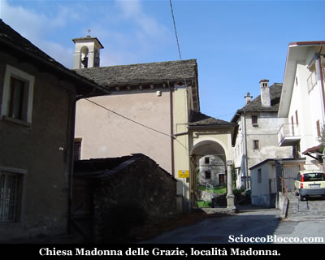

Dopo alcuni giorni di pioggia oggi il cielo sembra lasciare posto al sole, anche se nuvole bianche si sollevano dai fianchi delle montagne.
Pochi metri dietro il parcheggio, chiare indicazioni, sulla destra si stacca una strada asfaltata che sale subito molto ripida nel bosco, a superare alcune case, quindi la struttura dove arriva una conduttura dell'acqua.
In circa 10 minuti siamo al termine dell'asfalto, il sentiero prosegue subito su pendenze impegnative, mentre alla nostra sinistra possiamo già ammirare la Valle Anzasca e suoi centri più bassi.
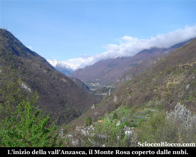

Il sentiero ben segnato dai colori bianco-rosso del C.A.I., sale ripido per giungere dopo circa 20 minuti nei pressi di una cappelletta di recente ristrutturazione ma la cui costruzione risale alla metà del 1800.
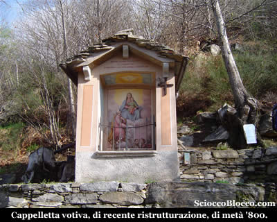

Riprendiamo a salire, immersi ora in un bosco più fitto dominato dai castagni, la traccia in alcuni punti è rudemente gradonata per aiutare l'avanzata tra foglie ricci e pendenze impegnative.
Dopo circa 35/40 minuti sbuchiamo all'Alpe Sarciera, costituita da un paio di baite in condizioni precarie.
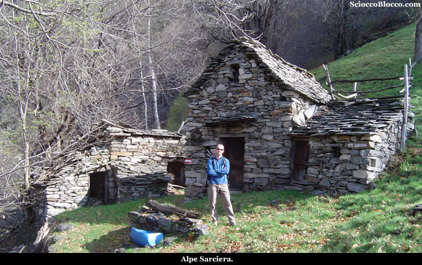

Lasciamo Sarciera e riprendiamo a salire, aggirato un dosso con un paio di tornanti in breve approdiamo all'Alpe Ceresole(950m)(45/50min).
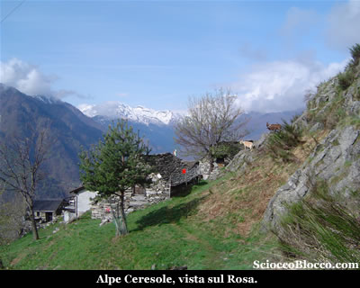

In un'improvvisa radura nel bosco, quest'alpeggio è un vero balcone naturale sulla bassa ossola e sul lago Maggiore e il lago di Mergozzo che appaiono la in fondo al corso del Toce.
Sotto di noi a strapiombo Piedimulera e poco sopra Fomarco, poco più in la Pieve Vergonte.
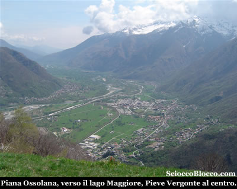

Lasciamo questo bell'alpeggio e ripartiamo aggirando per qualche metro sulla destra il costolone della montagna per poi riprendere a salire ora esposti sul versante sud e sui centri appena descritti.
Prestate attenzione in questo tratto perchè nascoto tra i bassi rami del bosco, scorre il cavo trainante di una teleferica che al passaggio del carrello scende sino ad altezza uomo.
Dopo circa 20/25 minuti, arriviamo in vista di una croce posta in posizione panoramica sulla valle sottostante, noi tralasciamo la traccia che conduce alla croce e pieghiamo decisamente a sinistra.
Torniamo quindi verso Ovest e verso la valle Anzasca, aggirando un piccolo promontorio, la salita torna impegnativa, notiamo sopra di noi l'arrivo della teleferica, superiamo un cancelletto in legno e la piccola costruzione della teleferica.
Scendiamo di qualche metro, e sorpresa dietro questo ambiente brullo e verticale, appare la verde conca dell'Alpe Propiano(1129m)(1.20h/1.30h).
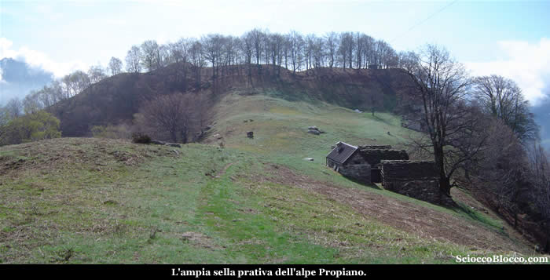

Alpeggio ben curato e costituito da baite ben ristrutturate, è una vera sorpresa dietro l'angolo per l'escursionista che arriva da Cimamulera, che regala bei panorami sulla Valle Anzasca ma soprattutto sull'alta Valle Ossola.
Risalendo verso il nucleo di Propiano sopra, apriamo una "finestra" sulla sottostante Villadossola, dove spicca in particolare il rettangolo del Villaggio Sisma.
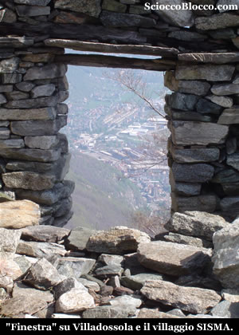

Villadossola, posta all'ingresso della Valle Antrona, di cui il Pizzo Castello che stiamo salendo è il baluardo terminale della cresta che la divide dalla Valle Anzasca, è stata uno dei poli siderurgici più importanti d'Italia.
Infatti grazie alle miniere di ferro della Valle Antrona, nella cittadina del fondo valle si sono sviluppate nei secoli industrie per la lavorazione di questo metallo.
La più famosa è stata appunto la SISMA dall'acronimo di Società Industrie Siderurgiche Meccaniche e Affini, che nel secondo dopo guerra è arrivata a occupare 1600 dipendenti, al punto da costruire nella zona settentrionale del comune, un intero quartiere detto "Villaggio SISMA", allora riservato alle famiglie dei dipendenti.
Con la crisi negli ultimi 15 anni dell'industria siderurgica italiana, purtroppo anche questa leggendaria fabbrica è andata via via riducendo il personale, sino alla quasi totale chiusura della primavera scorsa.
Dopo questa divagazione storico-sociale, riprendiamo il cammino, superiamo l'Alpe Propiano sopra, dove vi sono belle e ben curate baite, e in circa 10 minuti arriviamo ad un bivio con cartelli indicatori.
Noi proseguiamo a destra in salita, tralasciando il sentiero per l'Alpe Piana che vediamo sulla sinistra appollaiata su di un dosso al sole.
In pochi minuti arriviamo ad una radura, dove è posta una bella baita solitaria.
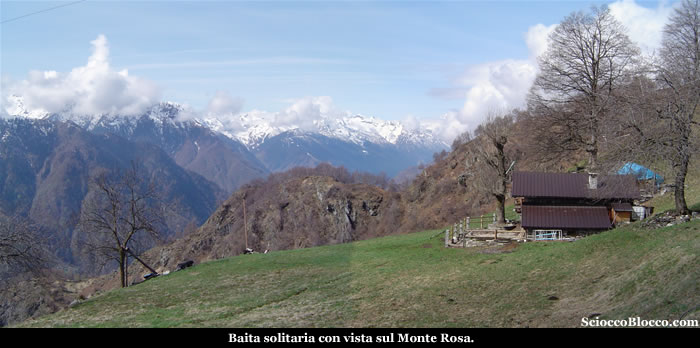

Il sentiero sale ora ai margini di un rado bosco su pendenze sempre impegnative, per giungere nel volgere di pochi minuti all'Alpe Castello(1320m)(2.00h/2.15h).
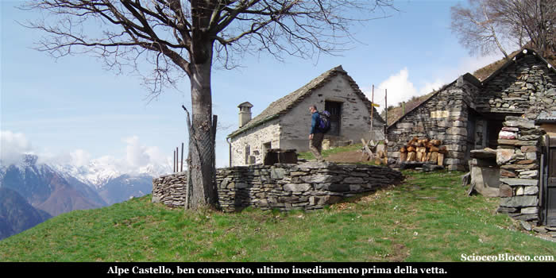

Ultimo alpeggio prima della vetta, è posto in bella posizione rivolta al sole del Sud, mentre verso Ovest domina lo sguardo il massiccio del Monte Rosa.
Dietro l'alpe la traccia si immerge nel bosco ora dominato dai faggi, le pendenze si fanno proibitive e le foglie complicano ancor più l'ascesa, in alcuni punti si ricorre all'aiuto delle mani per mantenere l'equilibrio.
Alle gambe inizia a bussare la fatica, ogni passo è una piccola scalata, ma la meta ormai è vicina, sulla sinistra appare la in alto la croce.
Usciamo dal bosco e risaliamo verso sinistra gli ultimi metri, approdiamo in cresta e superata una piccola zona di sfasciumi eccoci in vetta al Pizzo Castello(2.45h/3.15h)(1607m).
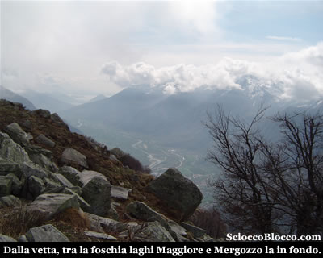

La fortuna ci ha assistito, la nuvola che ristagnava proprio sulla cima si dal nostro arrivo si è dissolta, e lo sguardo si apre a 360°, verso sud attira subito l'attenzione anche se tra la foschia il lago Maggiore.
Facciamo un piccolo filmato tutt'attorno...

Verso ovest oltre la croce di vetta, corre la lunga cresta che passando dalla Colma approda alle pareti del Pizzo del Ton ai piedi del quale sono posti i laghi del Trivera da noi recensiti.
Verso nord appare la piana Ossolana con Villadossola, Domodossola e le valli che si aprono a raggiera attorno ad essa, verso ovest sotto di noi l'imbocco della valle Antrona, con Montescheno in primo piano.
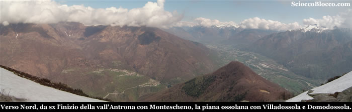

Dall'altro lato della cresta sempre verso ovest si stende la vall'Anzasca.
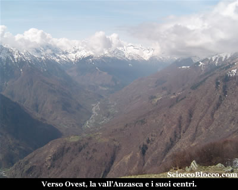

Ci concediamo il meritato pranzo al tiepido sole, vagando con lo sguardo tra vette, valli e fiumi, e non manchiamo di lasciare la nostra firma sul libro di vetta custodito in una scatola metallica sulla croce.
E' giunto il momento di scendere, un ultimo sguardo attorno poi scattiamo la classica foto di vetta.
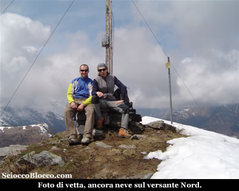

Durante la discesa incontriamo tre gruppetti che salgono verso la cima della montagna, scambiamo quattro chiacchere prima di proseguire nel rientro, che avviene per lo stesso percorso di andata per tornare a Cimamulera località Madonna dopo (4.45h/5.15h).
Escursione adatta a periodi di mezza stagione, per via delle quote modeste che presentano poco o nessun innevamento in questi periodi, che tuttavia richiede un buon allenamento per il dislivello superiore ai 1000m e per il tracciato costantemente in sailta impegnativa.

Un
ringraziamento agli escursionisti di giornata
Fabrizio e Dario.