Qui a Cicogna (732m), lasciamo l'auto nel parcheggio nei pressi del circolo e torniamo indietro in discesa al tornante che immette in paese.
Qui parte il famosissimo sentiero per Pogallo, detto anche "sentiero Sutermeister".
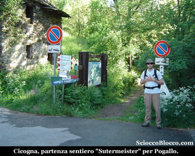

Infatti Pogallo nei primi del novecento sotto la spinta di Carlo Sutermeister divenne in breve tempo un centro vitale la popolazione arrivò a contare centinaia di lavoratori, sovente con famiglie al seguito, al servizio di un inpreditore attento alle esigenze della comunità e non solo a quelle della ditta.
Vennero rifatte le baite per gli operai più un fabbricato in muratura per la sede della ditta, che ancora oggi resiste all'ingresso dell'alpeggio,
Pogallo era allora un vero e proprio villaggio, con illuminazione elettrica, scuole elementari, asilo, spaccio,osteria, officina di fabbro-maniscalco,stalla-latteria, forno, lavatoio, infermeria, con canali e tubazioni vennero allestiti punti acqua.
Maggiori dettagli li trovate nella nostra recensione che trovate QUI.
Per chi ne volesse sapere di più consiglio "Carlo Sutermeister fra Intra e Val Grande" di Sutermeister Cassano Alberti editore 1992.

Oggi ci proponiamo di raggiungere l'Alpe Busarasca, meta poco famosa ma che permette di gustare la tanto decantata wilderness.
Inziamo a camminare lungo il sentiero che costeggia costatemente il rio Pogallo, che qualche decina di metri più sotto, scorre impetuoso per le abbondanti precipitazioni delle ultime settimane.
Il percorso tra saliscendi si snoda quasi alla stessa quota, superando alcuni punti un po' esposti sul torrente e qualche recente piccola frana.
Regalando tuttavia scorci fantastici sul rio Pogallo e la sua stretta e severa forra.
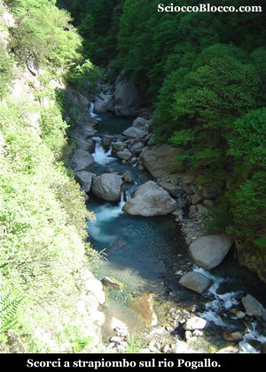

Nonostante il poco dislivello, il sentiero non va sottovalutato, perchè è abbastanza lungo ondulato e in alcuni tratti esposto.
Approdiamo finalmente a Pogallo(777m) dopo (1.15h/1.30h).
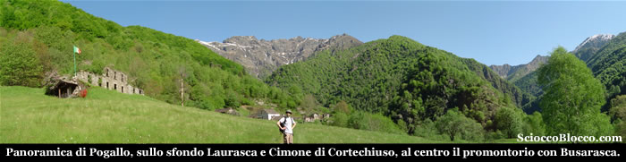

Il verde intenso della primavera domina la scena, il piccolo borgo è animato da alcuni proprietari delle baite, alcune ben riattate, che chiacchierano al centro dell'abitato, sulla sinistra come sempre ci accoglie la vecchia costruzione della ditta Sutermeister, ormai sempre più cadente.
La giornata è bellissima, sullo sfondo azzurro si stagliano la Laurasca e il Cimone di Cortechiuso.
Il promontorio proprio di fronte a noi, è la meta odierna, quindi dopo un breve giro tra le viuzze, torniamo sui nostri passi e proprio sulla destra rispetto al nostro arrivo, nei pressi di un pannello esplicativo, si stacca il sentiero che scende al fiume.
In pochissimi minuti eccoci sul ponticello che attraversa il rio Pogallo, proprio dove si unisce con l'immissario rio Pianezzoli.
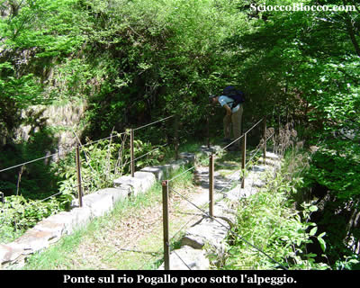

Superato il ponte, proseguiamo pressoché in piano sul sentiero che conduce a Pian di Boit, bisogna prestare attenzione però.
Dopo circa 200m sulla sinistra si stacca il sentiero per Busarasca, segnalato da un piccolo ometto.
Sulle piante qua e la un segnavia fatto con un punto rosso a vernice è l'unico riferimento.
La traccia è ancora abbastanza evidente ma da qui in poi è consigliabile avere an po' di esperienza.
Immersi ormai nel bosco, saliamo zig-zagando già su buone pendenze, per giungere dopo poco, nei pressi di un netto cambio di direzione verso destra su di un dosso (1.40h/1.55h) .
Dove uscendo un poco sulla sinsitra possiamo gustare una fantastica veduta di Pogallo dall'alto.
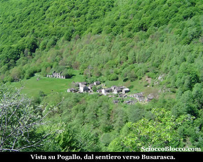

Riprendiamo a salire, con alcuni secchi tornanti guadagnamo un boschetto che attraversiamo in leggera salita.
Quindi la salita riprende impegnativa in un fitto bosco di betulle e qualche enorme faggio, in uno scenario quasi magico.
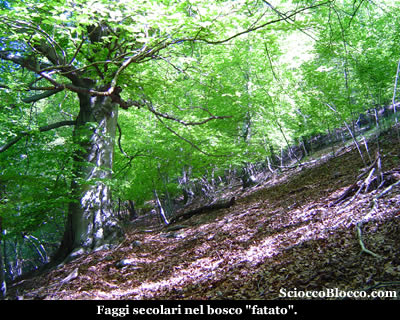

La traccia è ancora abbastanza evidente anche se ogni tanto tende a sparire, tuttavia i segnavia "punto rosso" ci vengono in soccorso.
Le pendenze non mollano mai, sempre dure, con lunghi traversi e secchi tornanti, raggiungiamo l'Alpe Color (1103m)(2.25h/2.45h)
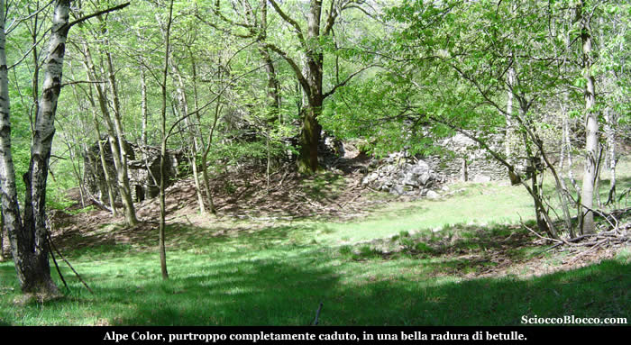

Bella radura in un betulleto, ma purtroppo l'alpe è completamente decaduto ed in balia del bosco.
Ripreso un poco fiato, riprendiamo il cammino uscendo sulla destra dell'alpeggio rispetto al nostro arrivo.
Inizia quindi un lungo e faticoso traverso tra i faggi che ormai hanno preso il sopravvento.
Arriviamo nei pressi di un "bivio" non evidentissimo dopo circa (2.55h./3.15h) .
Una traccia prosegue dritta in piano, mentre l'altra piega verso sinistra inerpicandosi nel bosco.
Noi andiamo a sinistra, dove ritroviamo i punti rossi, ed iniziamo a salire pressoche verticalmente.
La fatica si fa notevole, le pendenze al limite dell'equilibrio sulle abbondanti foglie, dopo alcuni minuti, costeggiamo alla nostra destra una piccola radura "verticale".
Finalmente in breve la traccia piega a destra e fuori dal bosco approda all'Alpe Busarasca(3.25h/3.45)(1540m).

La vista si apre a quasi 360°, grazie anche alla giornata limpida.
Dando le spalle all'alpeggio, in direzione sud spicca giù in fondo il Mottarone con le sue antenne e proseguendo in una carrellata verso destra, Cima Sasso, la Corona di Ghina con la bocchetta di Campo, la Laurasca, il Marsicce della quale non vediamo la vetta essedo proprio sulle sue pendici.
Quindi bocchetta di Terza, la Piota, la Zeda, la Marona, la dorsale del Pian Cavallone con il suo terminale Pizzo Pernice.
Facciamo un filmato tutt'attorno...

Con nostra sorpresa, non siamo soli, infatti nonostante questo luogo non sia certo molto "turistico" e di comodo accesso, incontriamo Adriano che ci ha preceduto.
Facciamo quattro chiacchere, e scopriamo che il nostro nuovo amico arriva da Busto, ma sfoggia una conoscenza sulla Val Grande notevole, cosa ancor più di tutto rispetto.
In piacevole compagnia ci concediamo il meritato pranzo, binocolando qua e la sulle cime circostanti, popolate da qualche escursionista.
Riposati e rifocillati decidiamo di scendere non prima di aver scattato la foto di "vetta".
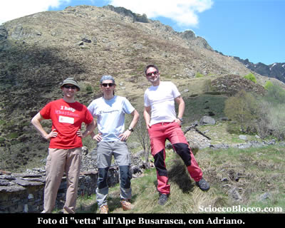

Salutiamo Adriano e iniziamo la discesa per il percorso di andata.
Ma un dubbio ci "tormenta", alcune guide indicano il passaggio per l'Alpe Brusà nel percorso di salita a Busarasca, ma noi non l'abbiamo incontrato...
Scendiamo nel bosco fitto e ripido percorso all'andata e in circa 20' torniamo al bivio descritto salendo.
Controlliamo l'altimetro siamo attorno a quota 1300m, quella del fantomatico "alpe fantasma", decidiamo quindi di seguire la traccia che prosegue in piano sulla sinistra scendendo.
In pochissimi minuti, aggirato un solco, la traccia sale su di un dosso dove in una piccola radura è posto l'Alpe Brusà(1310m)(3.50h/4.10h).
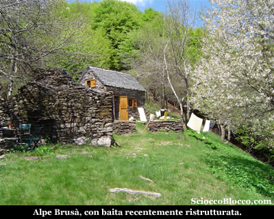

Costituito da due baite, una caduta e l'altra di recente e pregevole ristrutturazione.
Ci presentiamo ai proprietari, che ci raccontano la fatica fatta per ricostruire, in questo fazzoletto di prato lasciato libero dal bosco e ai quali va il nostro plauso.
Gentilmente ci offrono un goccio di grappa e ci indicano una via alternativa per il ritorno.
Grazie al loro impegno, hanno segnato una via che scende direttamente nel bosco sottostante, sino all'Alpe Preda.
Decidiamo di seguire questo nuovo itinerario, ringraziamo per le indicazioni e orgogliosi del fatto che dicono essere i primi a passare di li (almeno in loro presenza) da molti anni, ripartiamo.
Rientriamo nel bosco al margine destro, lasciando le baite alle spalle, e troviamo subito i punti rossi come indicatoci.
La traccia è inesistente, viaggiamo a vista cercando i punti di vernice sulle piante, la difficoltà sta tutta nel restare in piedi, le pendenze verticali e le foglie ci fanno procedere lenti e barcollanti.
Arriviamo nei pressi di una vecchia ruota della teleferica che un giovane faggio ha deciso si "sposare".
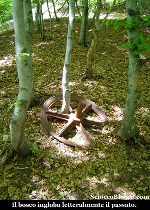

Qui pieghiamo decisamente a sinistra e riprendiamo a scendere.
Intorno a quota 1100m raggiungiamo un bivio, proseguiamo sulla traccia in discesa ricominciando la fatica di mantenersi in piedi.
Quindi dopo alcuni minuti nei pressi di una cascatella, eccoci all'Alpe Preda(1005m)(4.35h/4.55h).
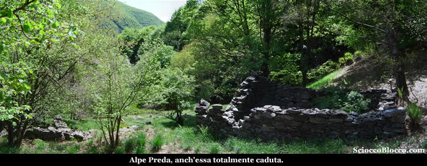

Bella radura, dove anche qui le vecchie casere purtroppo sono completamente distrutte.
Uscendo di poco sulla sinistra dell'alpe incontriamo il sentiero che collega Pogallo a Pian di Boit, che noi seguiamo sulla destra, con il torrente che scorre poco sotto alla nostra sinistra.
Dopo alcuni minuti si trova un bivio con cartello inleggibile, una traccia scende a guadare il fiume per seguirlo poi sulla sponda opposta per un tratto, mentre l'altra sale un poco e resta sullo stesso lato.
Quello che scende è certamente più panoramico, ma il cartello "se si leggesse" indica che in caso di torrente grosso è consigliato seguire il sentiero alternativo sulla destra.
Cosa che visto il rumore del rio Pianezzoli noi prudentemente facciamo.

Da qui continuiamo a ritroso sul sentiero in parte fatto all'andata fino a Pogallo (777m)(5.15h/5.40h).

E di nuovo il lungo percorso in saliscendi fino a tornare a Cicogna (732m)(6.30h/7.00h).

Escursione che fa assaporare appieno tutte le sfumature della wilderness, ma che richiede un buon allenamento visto la notevole lunghezza e durata del percorso.

Che richiede una buona esperienza di montagna in quanto buona parte del percorso è pressoché privo di segnalazioni, di sentieri e su terreno impervio.

Un
grazie agli escursionisti di giornata Fabrizio e Dario.

