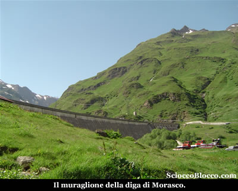
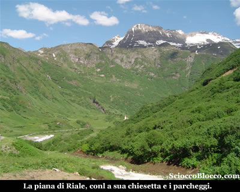
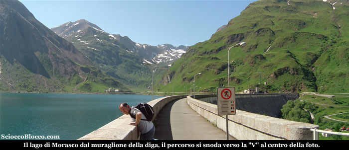
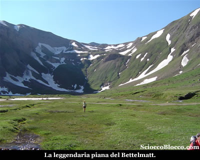
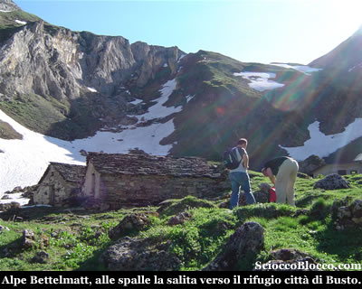
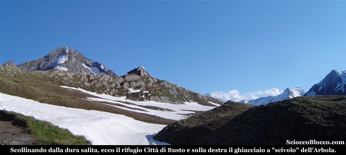
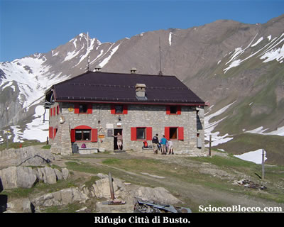
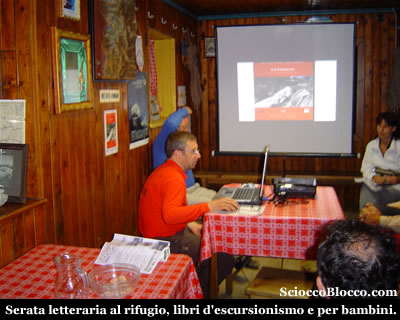
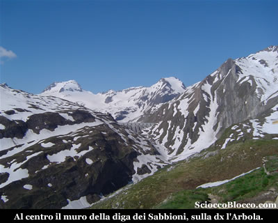
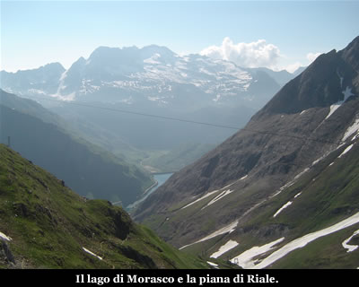

Qui ai piedi del muraglione della diga di Morasco (1748m) , lasciamo l'auto e iniziamo questa particolare escursione-letteraria, che ci porta a passare il sabato sera e notte in quota.

Infatti in occasione di un evento che riunisce tutti i rifugi CAI del Piemonte, questa sera al Rifugio Città di Busto, ci sarà la presentazione di alcuni libri tra cui quello dell'amico Marco sulla Valle Formazza.

Dal parcheggio sottostante il muraglione della diga, risaliamo la strada sulla destra, alle nostre spalle la piana di Riale con la caratteristica chiesetta appollaiata sul piccolo sperone.

In circa 10 minuti raggiungiamo la diga e il Lago di Morasco.

Iniziamo in leggerissima ascesa a costeggiare il lago sulla destra, su una comoda strada sterrata, che si snoda verso la "V" delle due creste che chiudono il lago verso la sua fonte.

In circa 15 minuti raggiungiamo la struttura della funivia dell'ENEL, dove la strada sterrata termina e proseguiamo sul sentiero che risale sulla destra il dosso alle spalle della stazione di funivia.

Il sentiero sale a tornanti con buona pendenza, per abbandonare il lago e addentrarsi nella valle, dopo un breve tratto in piano, la salita riprende sempre impegnativa, quindi superate alcune roccette, la traccia scende rapidamente portandoci nella magnifica piana del Bettelmatt (1.00h/1.15h).

Bellissima conca verde, chiusa da spettacolari cime.

Qui dove si produce il leggendario formaggio Bettelmatt, un intricato dedalo di rigagnoli solca i prati, sui quali una nutritissima colonia di marmotte si rincorre fischiando festosa.

Mantenendo il lato sinistro della piana superando qualche ruscello e qualche ultimo nevaio raggiungiamo l'Alpe Bettelmatt (2099m)(1.15/1.30).

Superiamo le casere dove nasce lo squisito formaggio, scendendo un poco, qui la segnaletica è davvero scarsa, tuttavi noteremo un piccolo e sbiadito cartello in legno che indica la direzione per il rifugio città di busto.

La traccia sale diretta per il pendio alla nostra sinistra rispetto al nostro arrivo, oggi una grossa slavina è ancora presente e copre la prima parte del sentiero.

Costeggiamo quindi la neve salendo in linea retta senza una traccia, le pendenze sono davvero proibitive, arrivati alla sommita della slavina ritroviamo il sentiero che seguiamo.

Da qui in poi la salita è sempre dura ripida e faticosa, la traccia sale con rari tornanti, in linea retta verso la cresta, c'è poco da dire, forza e resistenza sono le uniche armi...

Superati alcuni dossi quando sembra che la meta non voglia mai arrivare, ecco apparire sulla sommità del Piano dei Camosci l'agongnato rifugio, e sulla destra il superbo scivolo innevato dell'Arbola.

In pochi minuti finalmente eccoci al Riugio Città di Busto (2480m)(2.15h/2.30h).

Un po stanchi, ma giusti per l'ora di cena, che si svolge a base di pasta alla formazzina, arrosto, pure,  un paio di birrette e delle deliziose frittelle.

Ci assegnano la stanza,  molto bella con comodi letti a castello e materassi.

Infatti il rifugio è un’accogliente                   costruzione rivestita internamente in legno,  dotata di                     riscaldamento elettrico, acqua calda, docce, telefono e   52 comodi                   posti letto, è gestito e offre una cucina curata, il campo di calcio e quello di pallavolo  una rarità                   a queste quote, nonché la piccola palestra di   arrampicata                   didattica, sono la particolarità del rifugio.

Una giornata a mezza pensione (cena, pernotto e colazione) costa meno di 40€.

Dopo la cena in piacevole compagnia inizia la serata letteraria..

La nostra nuova amica Maria Giuliana Saletta, scrittrice di bellissimi libri per bambini, presenta la sua ultima fatica ambientata come sua consuetudine nel Parco Veglia Devero, dal titolo "Viola, lo Sgrunfolo e il Palio dei tritoni", la storia di una bambina, di suo nonno, del "nemico" Sgrunfolo e una curiosa sfida tra tritoni, che potete  trovare QUI.

Quindi è la volta dell'amico Marco De Ambrosis e di Marco Valsesia (gestore del rifugio), che presentano il loro libro da poco uscito "Val Formazza Escursioni e itinerari per tutti", dove i due hanno condensato la loro esperienza di montagna, di accompagnatori e di questa magnifica valle.

Dieci itinerari più un giro alto dei rifugi, oltre a numerevoli informazioni sulla valle, come ristoranti, rifugi, eventi, storia etc, il tutto in un maneggevole libro dal prezzo contenutissimo.

Chi volesse avere qualche informazione in più può vedere QUI.

La serata si conclude con una bella chiaccherata sulla montagna e dintorni e con il bicchierino della staffa.

Dopo una notte tranquilla la mattina gustiamo un abbondante colazione e facciamo un giro attorno al rifugio, dove ammiriamo alle sue spalle la diga dell Lago dei sabbioni.

Che noi abbiamo descritto in un altra recensione.

Quindi verso valle ecco apparire il Lago di Morasco e la piana di Riale nostro punto di partenza.

Quindi in compagnia di Giuliana e suo marito, prendiamo la via del ritorno che avviene per lo stesso percorso di andata e che ci riconduce al Lago di Morasco dopo (1.45h/2.00h), per un totale tra salita e discesa di (4.00h/4.30h) .

Un
grazie agli escursionisti  Marco, Matteo e Dario.

