Campello Monti (1305m), ultimo centro abitato della Valle Strona, è un'antico   villaggio che conserva ancora oggi   intatto il suo fascino di paese Walser.

Fondato nel lontano   1300, anche se taluni lo ritengono ben                         più antico, da una comunità di pastori di Rimella che                         lo utilizzava come alpeggio estivo per le greggi,                         divenne ben presto indipendente.

Lasciamo l'auto nel parcheggio all'ingresso del paese e ci incamminiamo verso il nucleo abitato, costeggiando il fiume che scorre impetuoso in basso alla nostra sinistra.

Subito alla nostra destra, al fondo di un vicolo notiamo una caratteristica torre.

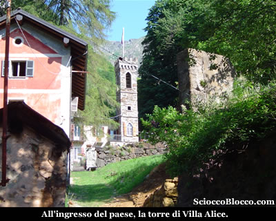

E' questa l'aristocratica Villa Alice, detta anche Castello del Bordo, con la sua torre in stile fiorentino e cappella privata.

Importante figura per Campello, fu Bartolomeo Janetti, commerciante a Firenze, che non recise mai il legame con il paese natio, dove risiedette nella sua Villa Alice, costruita in un eccentrico stile neo-gotico nel 1888 in posizione dominante.

Viene ricordato come uno dei  maggiori benefattori di Campello,  per aver contribuito in larga misura alla realizzazione della strada da Omegna a Forno.

All'inizio del secolo fece anche decorare la chiesa e donò all'edificio  un nuovo portale.

Proseguiamo verso il piccolo ponte, superato il quale passiamo di fonte al ristrutturato edificio della scuola elementare e quindi saliamo per la ripida scalinata che passa al fianco della chiesa.

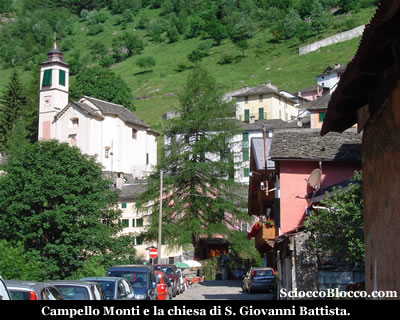

La Parrocchia è intitolata a S. Giovanni Battista,  è stata edificata nel 1749 in stile tardo-barocco e affiancata nel 1816 dal piccolo campanile.

E'
considerata la chiesa più ricca della valle per gli arredi e i paramenti sacri portati lassù dagli emigranti.

Di eccezionale pregio la  grande tela attribuita al Guercino, raffigurante San Francesco stigmatizzato, nonchè  gli affreschi del Peracino.

La
festa patronale cade il 24 giugno.

Continuiamo a salire e in breve la scalinata termina alle spalle del nucleo abitato, dove proseguiamo su un sentiero verso sinistra.

Dopo un centinaio di metri, arriviamo nei pressi di alcuni cartelli indicatori, noi seguiamo il sentiero che si stacca in salita sulla destra, mentre sotto di noi possiamo ammirare ancora il pese di Campello Monti.

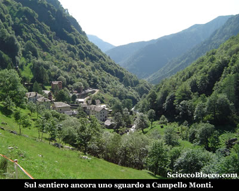

Il sentiero prende a salire su buone pendenze, in diagonale, attraversando un piccolo bosco caratterizzato da magnifici Maggiociondoli.

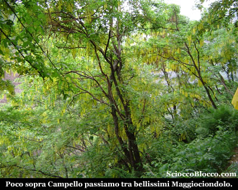

Quindi fuori dal bosco raggiungiamo l'Alpe Orlo (1400m circa) (15min) caratterizzato da due piccoli ruderi.

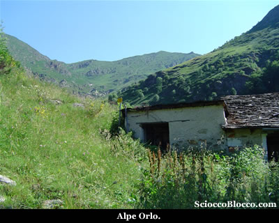

Dopo qualche minuto scendiamo velocemente ad attraversare un piccolo torrente, per iniziare a risalire la valle sul lato opposto.

Aggiriamo da prima un costolone,  su traccia sempre abbastanza evidente e segnata dai colori BIANCO-ROSSO. Il sentiero quasi invaso da una folta vegetazione, probabuilmente a causa della poca frequentazione di questi luoghi, su pendenze impegnative, supera un'altro ruscello per approdare all'Alpe Cunetta (1558m) (45min/50min) anch'essa costituita da poche baite in condizioni precarie.

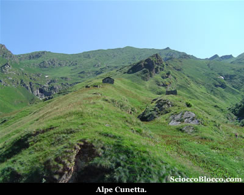

Siamo ormai allo scoperto, e su pendenze di tutto rispetto, l'alta Valle Strona si estende severa tutta attorno a noi, il suo fascino risiede anche nella sensazione di luoghi poco frequentati dall'uomo moderno.

Continuiamo a salire tra magri prati e un mare di rododendri in fiore.

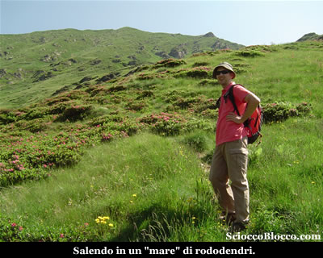

Proseguiamo, la salita è sempre costante e il sole ormai estivo non facilita lo sforzo, il sentiero resta evidente segnalato qua e là su rocce o con paletti in legno.

Raggiungiamo un bivio con cartelli indicatori, sulla nostra destra notiamo l'Alpe Cunetta superiore (1810m)(1.05h/1.15h).

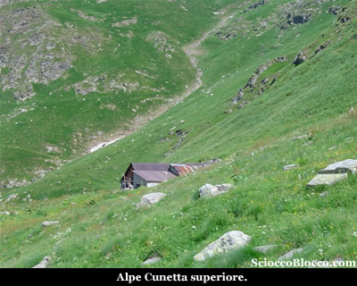

Noi lasciamo l'alpeggio e proseguiamo in salita verso destra.

In breve siamo in un'ampia conca verde, racchiusa dalle cime della testata della valle, proseguiamo tra i segni di vernice ma soprattutto a vista verso la "V" un poco sulla destra dove è posto il passo.

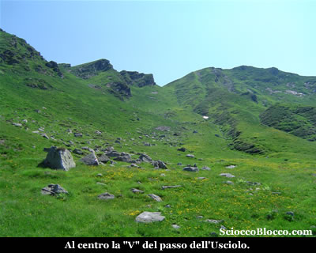

Più ci avviciniamo alla bocchetta più il pendio si fa ripido, tuttavia lo scenario che ci circonda fatto di cime, fiori gialli e prati verdi ci consola.

Con ultimo sforzo finalmente eccoci al Passo dell'Usciolo (2037m)(1.40h/1.55h) .

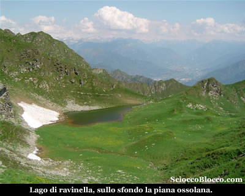

Sul versante opposto appare subito il Lago di Ravinella (1974m)(1.50h/2.05h) che raggiungiamo in breve.

Al di la della conca del lago, si apre la vista sull'alta valle Ossola con i suoi centri.

Questo lago è di origine glaciale, e anche se geograficamente in valle Strona, orograficamente è posto nel bacino della valle del Toce, posto in una sella chiusa tra la Punta dell'Usciolo e la Cima di Ravinella.

La sua alimentazione è dovuta allo scioglimento dei nevai, non avendo immissari, a un altezza massima di circa 1,5m ed è popolato da rane.

Finalmente ci concediamo un po di riposo e il meritato pranzo gustandoci l'incanto di questa conca verde.

Sopraggiungono alcuni ragazzi dal versante ossolano, con  cani giocherelloni che si esibiscono in tuffi ed evoluzioni nelle fredde acque del lago.

Decidiamo di salire alla Punta dell'Usciolo, all'inizio del lago rispetto al nostro arrivo, risaliamo in linea retta il pendio, per incrociare in breve un sentiero che seguiamo sulla sinistra.

Dopo pochi minuti raggiungiamo il filo di cresta, che divide lo sguardo tra Valle Strona e Valle Ossola, ed iniziamo a risalirlo.

Il sentiero è evidente e segnalato dai consueti colori BIANCO-ROSSO, sotto di noi  la visione stupenda del lago.

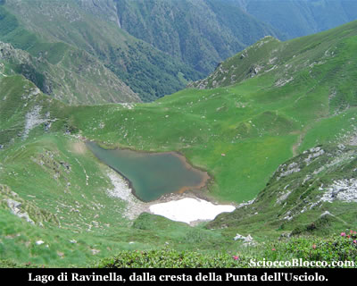

Salendo verso sinistra ci accompagnano le cima  Capezzone, cima Lago, etc. che dividono dalla Val Sesia, sulla destra le cime della val Grande, di fronte quelle dell'alta ossola nonchè quelle svizzere.

Rapidamente eccoci in vetta alla Punta dell'Usciolo (2187m)(2.20h/2.40h).

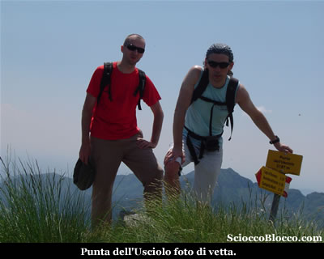

Dove scattiamo la consueta foto di vetta, e facciamo un filmato tutt'attorno, con anche alcuni momenti della salita.

Come sempre le sensazione sono uniche, lo sguardo si può perdere a 360° tra l'ossola, il lago Maggiore, la val Strona, la val Sesia, il Monte Rosa e i ghiacciai della vicina Svizzera.

Ma dalle vette come ha già detto qualcuno ben più importante di me "non si può che scendere".

Torniamo al lago e quindi al passo dell'Usciolo, dove se avete ancora forze potete risalire (sulla sinistra dando le spalle al lago) la cima di Ravinella.

Quindi per lo stesso percorso di andata torniamo, senza farci mancare poco prima del paese un breve temporale.

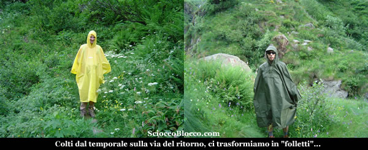

Di nuovo a Campello Monti (1305m)(4.30h/5.00h), dove ci gustiamo al bar la meritata birretta.

Bella escursione, in una zona poco conosciuta ai più, che dona sensazioni di novità e unicità, che richiede un discreto allenamento.

Un
grazie agli escursionisti  Fabrizio e Dario.

