A Isella (1226m), troviamo degli ampi spiazzi adibiti a parcheggio, la gita potrebbe iniziare anche dalla frazione precedente di Borca risparmiando qualche centinaio di metri, ma dove ci sono pochi parcheggi.

Noi visto l'affluenza del periodo estivo, scegliamo Isella dove sono poste delle comode e capienti aree parcheggio.

Ci dirigiamo in discesa per qualche decina di metri verso il Bar/rifugio dove finisce l'asfalto e inizia una larga strada sterrata sulla sinistra che imbocchiamo.

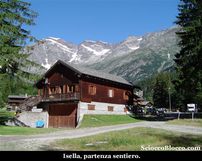

In piano immersa nel bosco, la sterrata si dipana piacevole prima verso destra e giunti alle pendici della montagna, prosegue sulla sinistra iniziando a costeggiare il corso del Torrente Anza.

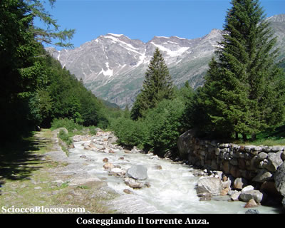

Raggiungiamo una tettoia posta a riparo della sorgente Scheber, un acqua minerale certificata a livello nazionale da analisi microbiologiche (10min).

Qui incrociamo il ponte asfaltato che arriva dalla frazione Borca, noi teniamo la destra e saliamo per il sentiero ben segnalato che in breve ci conduce in Località Guia (1195m) (15min) .

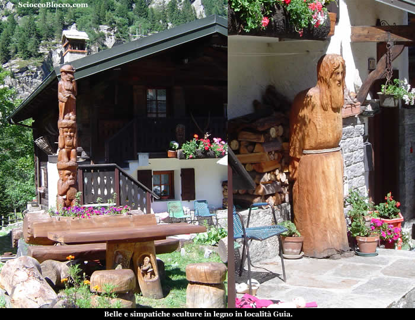

Dove ci sono bellissime e curate case in stile Walser e alcune simpatiche e belle sculture in legno.

Uscendo dall'abitato verso destra , troviamo dei cartelli indicatori, noi imbocchiamo il sentiero che sale sulla sinistra.

Ben protetto, sale ripido nel bosco sul ciglio di un dirupo dove possiamo veder alcune cascate e scorrere il torrente che esce dal soprastante lago.

Le pendenze sono piuttosto accentuate, ma protetti dall'ombra del bosco saliamo rapidamente a incotrare una gippabile, che seguiamo sulla sinistra.

In pochi minuti eccoci al Lago delle Fate (1309m) (20/25min).

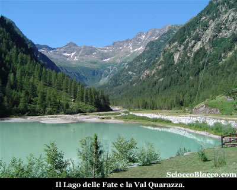

Lago Artificiale, creato con lo sbarramento dell torrente della Val Quarazza, dalla ormai leggendaria società Dinamo che produceva energia elettrica per le imprese minerarie, ha sommerso l'antico abitato di Krats, il suo tipico colore lattiginoso è dovuto all'alimentazione del lago, dalle acque di disgelo.

Qui troviamo numerosi bar/rifugio che nel periodo estivo sono letteralmente assaltati dai turisti.

Proseguiamo costeggiando il lago sulla destra, e proseguendo sulla larga mulattiera che si inoltra al centro della splendida Val Quarazza che si apre di fronte a noi.

In leggerissima ascesa, camminiamo tra le conifere su comoda mulattiera, superati in un paio di occasioni da biker, per giungere ad un grosso alpeggio semi cadente Crocette (1360m)(45/50min) .

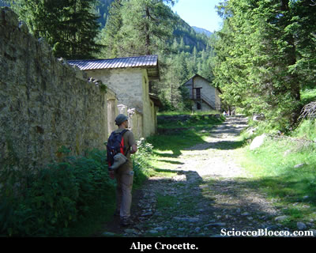

Qui troviamo una bella fontana, qualche gitante e i biker che tornano sui loro passi.

L'ampia sterrata a termine, si può considerare il limite della gita turistica senza necessità di atrezzatura e calzature adatte.

Alle spalle dell'alpeggio sono posti alcuni cartelli indicatori, noi prediamo il sentiero che esce sulla destra.

Dapprima nel bosco poi allo scoperto, il sentiero sale un poco più impegnativo nello splendido anfiteatro delle cime che fanno da testata alla Val Quarazza.

Sulla sinistra ci troviamo a costeggiare spledide cascatelle, pozze e rocce levigate dall'acqua cristallina (1.00h/1.10h).

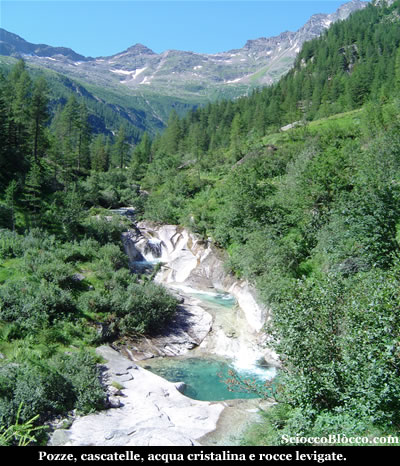

Proseguiamo qualche minuto sino ad incontrare a quota (1454m)(1.05h/1.15h) un bel ponticello in legno che ci porta sul lato opposto del torrente.

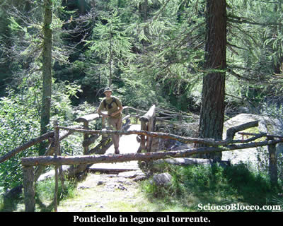

Costeggiando il torrente e la montagna il sentiero sale lungamente ai margini del bosco, quindi piega a sinistra per aggirare un costolone e prende a salire più decisamente, in breve approdiamo all'Alpe La Piana (1613m)(1.40h/1.55h).

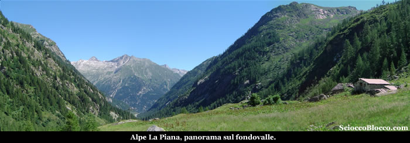

Bel poggio verde che guarda verso la valle, con alle spalle le pareti scoscese delle vette circostanti.

Da qui la traccia, sempre evidentissima, prende a salire decisamente, con secchi tornanti guadagnamo quota rapidamente e faticosamente.

Risaliamo l'evidente bastionata che abbiamo di fronte, per giungere ai ruderi dell'Alpe Schena(1987m) (2.25h/2.40h) .

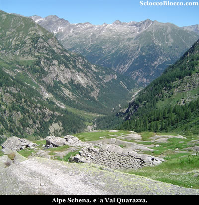

Bel posto dove purtroppo le vecchie casere sono ormai abbandonate al loro destino.

Qui il sentiero torna facile, in leggerissima ascesa contorna l'anfiteatro naturale, e al centro possiamo già distinguere la nostra meta.

In leggera ascesa in breve raggiungiamo il Bivacco Lanti (2150m)(2.45h/3.00h).

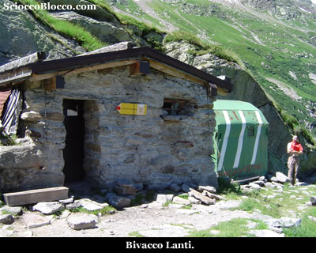

Il bivacco è composto oltre da quello in muratura anche da una "Capanna" in metallo, entrambi sempre aperti e molto spartani che possono accogliere un totale di 6/8 persone.

Finalmente ci concediamo il meritato pranzo gustando il fantastico panorama su tutta la Val Quarazza il Lago delle Fate e il fondo valle di Isella che si gode da qui.

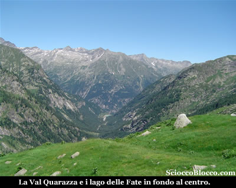

Quindi possiamo guardare un breve video della nostra salita...

Il rientro avviene per lo stesso percorso di andata, sino a tornare a Isella(1226m) dopo (5.30h/6.00h).

Escursione negli scenari della magnifica Val Quarazza, ricca di verde, cascate, pozze cristalline e cime dirupate. Nella prima parte alla portata di tutti, mentre nella seconda anche causa lungo avvicinamento prima della salita vera e propria, è consigliabile un buon allenamento.

**Un
grazie agli escursionisti  di giornata Fabrizio e Dario.**

