Giunti a Fondo li Gabbi o Fondi Ghebbi (1256m), parcheggiamo l'auto in una della numerose piazzole e scendiamo ad attraversare il greto del torrente Loana che in questa stagione è quasi completamente asciutto, e ci portiamo sul lato destro della valle nei pressi dell'agriturismo localita Le Cascine.
Questa mattina di fine agosto il cielo e terso grazie ad un vento che in quota sembra spirare impetuoso, la bella spianata della Val Loana si stende davanti a noi ancora immersa nell'ombra, lassù al centro svettano il Cimone di Cortechiuso e la Laurasca.
Dopo qualche settimana di inattività, io e Fabrizio partiamo di buona lena.
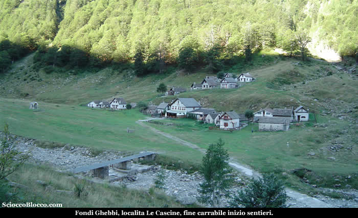

Il largo sentiero si dipana dopo l'agriturismo in leggerissima ascesa, sfiorando una cappelletta posta al centro del prato, costeggiando il lato destro della valle, passando quindi vicino ad un ponte in legno.
Oggi ci proponiamo di raggiungere la mitica Bocchetta di Campo.
Andando verso il restringimento dell'altipiano noteremo prima sulla sinistra, sul lato opposto, un piccolo gruppo di baite nei pressi del sentiero che scende dalla Forcola da noi percorso e recensito.
Il sentiero a questo punto aggira sulla sinistra una piccola pietraia e nei pressi di alcuni cartelli indicatori si infila nel bosco sul lato destro della montagna.
Da questo momento le pendenze si fanno impegnative in modo costante sino a Scaredi nostro primo obbiettivo.
Dopo qualche minuto arriviamo nei pressi delle Fornaci (circa 1340m) (25/30 min).

I resti delle antiche fornaci, ora restaurate, venivano utilizzate un tempo per la fabbricazione della calce.
Strutture di forma circolare, erano costruite in sasso a ridosso del pendio del terreno, nel muro a valle veniva costruita un’apertura denominata “bocca di carico” che serviva per introdurre la legna ed il carbone da ardere. 
Il calcare, ricavato nei pressi di Scaredi,
vicino al Laghetto del Marmo, veniva ridotto in piccoli
pezzi e trasportato a dorso di mulo fin qui, dove veniva
messo in queste fornaci a cuocere lentamente.

Dalla bocca di carico si inserivano il legname ed il carbone
di legna che venivano fatti ardere a temperatura costante
per circa 8 giorni.

Una persona sorvegliava giorno e notte la cottura finché
il calcare non si riduceva in materiale più tenero.

La calce bianca ottenuta veniva messa nei sacchi e a dorso
di mulo portata a valle per essere utilizzata nella fabbricazione
dei muri delle case o delle baite.

La Valle Loana,
con le sue fornaci, ed i suoi boschi ha fornito di legname
e calce la Valle Vigezzo,
e arredato la residenza borromea all’isola
Bella, sul lago
Maggiore.

Molte più di queste informazioni si possono trovare
nel libro "Malesco" dello storico vigezzino  Giacomo
Pollini.

Riprendiamo il cammino, la larga mulattiera rudemente
gradonata che spesso in zona vengono definite "Strà
di vacch", sale ripida ai margini del bosco
tra cespugli di mirtilli, quest'anno in parte devastati da evidenti segni del passaggio di slavine.

Se non allenati la salita si fa sentire, dietro di noi la piana di Fondo li Gabbi
che si allontana, alla nostra sinistra la cresta che dalla Forcola
corre alla Testa del Mater e a La Cima, quindi di
fronte a noi  la Laurasca e il Cimone di Cortechiuso.

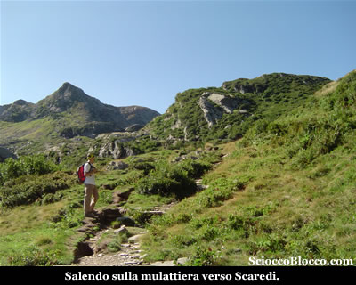

Attraversiamo alcuni ruscelli e piccoli passaggi su lastroni
che interrompono il grezzo lastricato, quindi una diagonale
che finalmente ci porta all'alpe
Cortenuovo (1792m)(1.15h/1.20h).

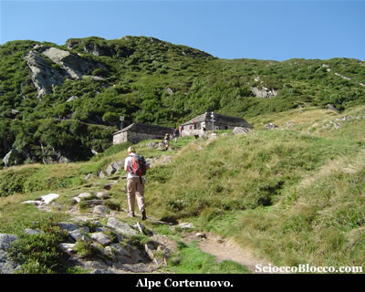

L'Alpe Cortenuovo è costituito da due baite ancora
in buono stato.

Abbiamo percorso il tratto più lungo tra un punto
di riferimento e l'altro, ripartiamo seguendo il sentiero
che esce alla destra dell'alpeggio per poi piegare a sinistra
per superare una bastionata rocciosa;
sormontata la quale siamo all'imbocco della piccola conca
dove si trova l'alpe Scaredi (1841m)(1.30h/1.40h) che raggiungiamo in breve.

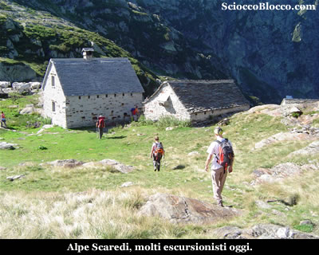

Scaredi vera e propria porta d' ingresso al Parco
Nazionale Valgrande, ne fa luogo molto frequentato
e dal forte fascino dato dalla sua storia secolare che
si avverte subito sostando sui suoi prati.

La bella baita ben ristrutturata è il bivacco sempre
aperto di proprietà dell'ente parco, dotato di
stufa, pannello solare, e numerosi posti letto nel sottotetto.

Oggi i suoi prati sono punteggiati da numerosi escursionisti, diretti alle svariate mete che si possono raggiungere da quest'alpeggio.

Facciamo uno spuntino e visitiamo il bivacco, mentre con lo sguardo scrutiamo la bocchetta di Scaredi la in alto.

La giornata è serena e soffia a tratti un vento sostenuto, donando al cielo un azzurro intenso.

Dietro l'alpeggio parte il sentiero ben evidente.

Prestiamo attenzione però, vi sono due tracce quella più evidente  piega a sinistra,
mentre un altra prosegue pressoché dritta in direzione della vetta
della Laurasca.

Noi andiamo dritti, verso una parete che risaliamo piegando a destra.

Quindi i segni tornano evidenti e superiamo alcuni brevi saliscendi, tra alcune pozze d'acqua.

Sono questi i laghetti del Marmo (circa 2000m)(1.40h/1.50h).

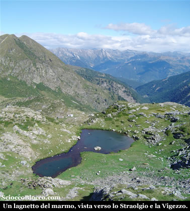

I
laghetti sono poco più che piccole pozze sparse
nei declivi tra il Cimone di Cortechiuso e della Laurasca,
che derivano il loro nome dagli affioramenti di marmo
bianco tra gli specchi d'acqua.

Iniziamo quindi a salire verticalmente per linea retta, sotto la cuspide sommitale della Laurasca, la fatica è notevole ma in breve arriviamo nei pressi di alcuni cartelli indicatori.

La nostra meta è ben segnalata, pieghiamo verso destra in leggera ascesa, superiamo un cartello che segnala l'attacco del sentiero finale per la Laurasca e proseguiamo in costa aggirandola sulla destra.

Iniziamo ora a salire in traverso verso la bocchetta che appare ora evidente sulla destra.

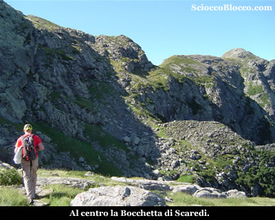

Tra sfasciumi e magri prati, il sentiero torna ripido ma in breve approda alla Bocchetta di Scaredi (2095m)(2.00/2.15h).

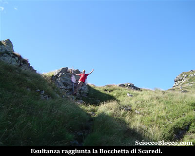

Dove sono posti alcuni cartelli indicatori.

Qui il vento si fa insistente e freddo, siamo costretti a coprici, ma in compenso il cielo e limpido e appena affacciati verso Sud il panorama toglie il fiato!

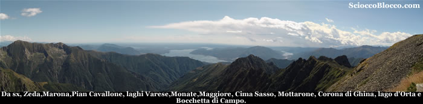

Lo sguardo si perde verso la pianura e i laghi.

In una carrellata da sinistra a destra,  Monte Zeda, Pizzo Marona, Pian Cavallone,  lago di Varese,  lago di Monate,  lago Maggiore,  Mottarone, Cima Sasso, lago d'Orta e Omegna, Corona di Ghina e Bocchetta di Campo.

Il sentiero prosegue in cresta verso destra, aggirando una modesta elevazione, e quindi prosegue passando pochi metri sotto la vetta di Cima Binà o Cima Campo, attorno a quota (2151m) altimetro personale.

La traccia continua lungamente su sali scendi, con alcuni brevi tratti esposti ben assicurati da paletti e catene.

A volte sul versante sud verso la Val Pogallo e i laghi, altre
sul versante nord verso la Val Portaiola e il fondovalle Vigezzino.

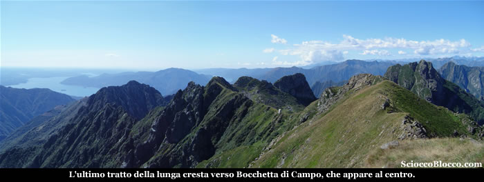

Superiamo brevi trati ripidi, che scavallano da un versante all'altro, e alcuni traversi su sfasciumi e magri prati, che richiedono attenzione, un passo falso potrebbe essere rovinoso.

Il vento ci sferza con forza, concedendoci solo qualche istante di pausa, la fatica si fa sentire, questi continui su e giù rompono ritmo e gambe.

Finalmente al culmine dell'ennesimo cambio di versante, ecco apparire la sotto Bocchetta di Campo (1994m)(2.45h/3.10h) che raggiungiamo in breve.

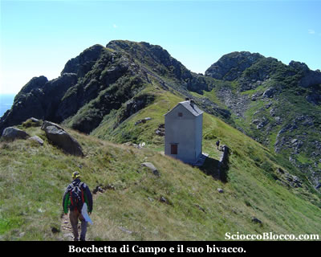

All'interno del bivacco, restaurato nel 1999 e diviso per verticale in due parti, metà chiuso ad uso della Forestale e metà sempre aperto per gli escursionisti, al riparo dal vento ci concediamo un frugale  pranzo.

La struttura è dotata di stufa a legna, tavolo con panche, pentolame e luce elettrica a mezzo di pannello solare, al piano superiore su tavolato possono dormire circa 10 persone molto adossate.

Dopo alcuni anni, in cui per vari motivi questa escursione veniva rimandata, finalmente siamo alla leggendaria Bocchetta di Campo, siamo felici !

Davanti a noi si staglia maestoso il Pedum, signore della val Grande!

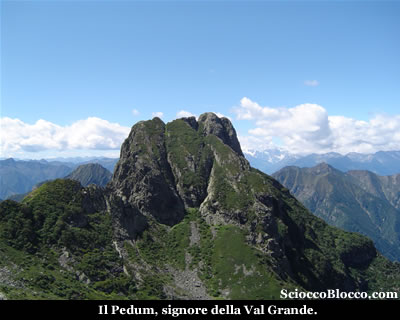

Questa cima è nella storia del nostro territorio, perché sulle sue scoscese pareti è nato l'alpinismo locale e le prime imprese del C.A.I. Verbano negli ultimi anni del 1800.

Quando una figura mitica come Carlo Sutermeister con Enrico Weiss, accompagnati dal leggendario Giacomo Benzi (Pà Iachin) di Cicogna, prima guida alpina, ne conquistarono per la prima volta la vetta.

La giornata grazie al vento è limpida, il lago Maggiore e la cresta del monte Zeda e del pizzo Marona sembrano a un passo.

Questo posto è incredibile, e lo si apprezza ancor più nel lento avvicinarsi in cresta.

Il bivacco è appoggiato su di una esile lama erbosa, in bilico tra la val Pogallo e la val Grande, intesa come valle e non come parco.

Luogo pregno di storia, evoca mille pensieri e ricordi, letti o ascoltati in questi anni di passione crescente per questo angolo di alpi Lepontine.

Qui corre il confine dei territori delle comunità di Malesco e Cossogno, in lotta tra loro sin dai primi secoli dell'anno mille, per strapparsi questi pochi e impervi prati che significavano sopravvivenza.

Su di una pietra poco più avanti, all'imbocco delle altrettanto leggendarie Strette del Casè, un incisione ricorda la storia e la fatica di queste due comunità.

Alla memoria sovvengono racconti e letture sulla seconda guerra mondiale, di cui questo luogo è stato muto testimone e inerme vittima.

Infatti, il restauro del 1999 avvenne dopo decenni di abbandono, in seguito alla distruzione da parte delle truppe nazi-fasciste nel drammatico rastrellamento del giugno 1944, dove persero la vita quasi cento partigiani.

Chi è capitato in questi luoghi in giornate grigie e nebbiose, racconta di sensazioni tetre e angoscianti.

E così dev'essere stata quella mattina del 15 giugno 1944, quando per sfuggire al rastrellamento in corso da giorni, da parte di ingenti truppe nazi-fasciste, il comandante della formazione partigiana Valdossola Dionigi Superti, con una settantina di partigiani, affamati, stanchi e demoralizzati risale verso Bocchetta di Campo.

"Nel tardo pomeriggio arrivano alla bocchetta, sopra il mare di nebbia. I partigiani si preparano a dormire all'addiaccio (il rifugio da anni in istato d'abbandono non può contenerne che una ventina) attorno a stentati falò di sterpi per combattere il freddo umido che penetra nelle ossa".

Nino Chiovini, "I giorni della semina" edizioni Tàràrà 2005.

Staccarsi da questo posto e da questi pensieri è più difficile del consueto, ma come sempre bisogna tornare.

Scattiamo quindi la classica foto di "vetta" prima di ripartire.

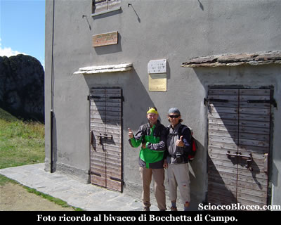

Ci incamminiamo a ritroso sul sentiero percorso all'andata, voltandoci spesso ad ammirare il rifugio che si allontana.

Un piccolo montaggio video del nostro percorso, come ultimo regalo finale.

E come detto, ricalcando a ritroso il percorso di andata, torniamo a Fondi Ghebbi (1254m) dopo(5.30h/6.00h).

Escursione di grande appagamento paesaggistico e storico, che richiede buon allenamento e in alcuni tratti assenza di vertigini.

Un
grazie agli escursionisti  di giornata Fabrizio e Dario.

