A Pian d'Arla (1307m), lasciamo l'auto dove proprio non è più possibile proseguire causa neve e ghiaccio, in un'ampia piazzola che si apre a belvedere sul lago, mentre alle spalle vediamo una costruzione recintata, in passato colonia, dove la strada cadorna effettua una deviazione verso il Monte Spalavera.
La neve è poca e gelata, facciamo qualche preparativo e partiamo, la strada prosegue in leggera discesa immergendosi nel bosco, superando alcuni cartelli esplicativi.
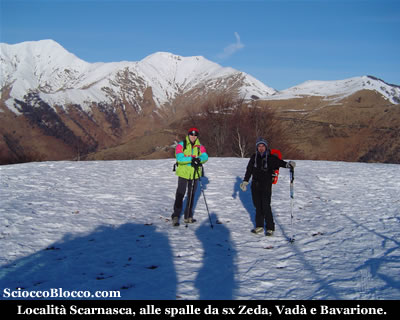

Di fronte a noi possiamo già ben vedere al sole le nostre mete, da sinistra il **Monte Zeda**, Monte Vadà e Monte Bavarione.
Il cammino è facile e piacevole in leggera discesa, anche se il freddo oggi è abbastanza pungente il termometro segna -5°C, e all'ombra del bosco si sente ancor di più.
Dopo circa 25/30 minuti arriviamo ai vecchi ospedaletti militari.
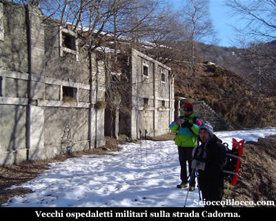

I quali fanno parte dell' imponente opera che va sotto il nome di "**Linea Cadorna**".
Un sistema di fortificazioni militari costruito durante la Prima Guerra Mondiale tra **il Lago Maggiore** e il **Monte Massone**.
Le fortificazioni comprendono un fitto reticolo di mulattiere militari, trincee, postazioni d'artiglieria, luoghi di avvistamento, ospedaletti e strutture logistiche, centri di comando.
Furono volute dal generale **Luigi Cadorna** di Pallanza, capo di stato maggiore dell'esercito italiano, per difendere il confine da un ipotizzato attacco austro-tedesco attraverso la Svizzera mai avvenuto.
Esse coprono, nella logica della "**guerra di posizion**e", un dislivello di 2.000 m tra la piana del **Toce** e il **Monte Massone** e fra **il Lago Maggiore** (Carmine inferiore) e il **Monte Zeda** e proseguono nelle Alpi centrali fino alle Orobie. 

Tra l'**Ossola** e la **Valtellina** furono costruiti 72 km di trincee, 88 postazioni di artiglierie
di cui 11 in caverna, 296 km di strade carrozzabili, 398
km di mulattiere.

I lavori costarono più di 100 milioni di lire del
tempo e impiegarono oltre 15.000 operai.

In un'economia di guerra, i lavori ebbero un impatto positivo
per le popolazioni locali in quanto offrirono lavoro retribuito
a muratori e scalpellini e costituirono una prima occasione
di lavoro salariato per la manodopera femminile impegnata
nel trasporto dei viveri alle squadre in montagna.

Dopo questo tuffo nella storia, riprendiamo il cammino, sempre in leggera discesa la strada ci conduce dopo alcuni minuti nei pressi di un bivio in località Pian Puzzo.

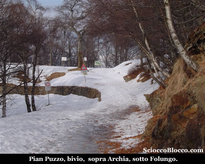

La strada che sale a destra conduce ad Archia, quella che prosegue in piano a sinistra direttamente a passo Folungo.

Decidiamo di compiere una sorta di anello e quindi andiamo a destra verso Archia con l'intento di tornare dall'altra strada.

Finalmente torniamo, anche se parzialmente nel bosco, al sole.

La strada si rivela un po accidentata, infatti da alcune piccole vallette la neve si è scaricata sulla sede stradale e siamo costretti a superare quattro micro valanghe.

Tuttavia a parte questi piccoli inconvenienti la neve resta scarsa e compatta.

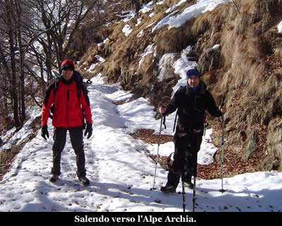

In breve raggiungiamo l'Alpe Archia (1290m)(1.20/1.30h).

Le batterie della macchina fotografica, fanno le bizze probabilmente causa freddo, e non riesco a fare una foto all'alpe.

Usciamo dall'alpeggio lasciando l'agriturismo sulla nostra sinistra, in leggera ascesa e all'ombra, che fa precipitare di nuovo le temperature, raggiungiamo velocemente passo Folungo(1369m)(1.35/1.45h).

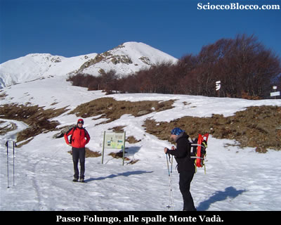

Magicamente la fotocamera riprende a funzionare...

La giornata è limpida in alto, solo un po di foschia verso **il Lago Maggiore**.

Una breve sosta per uno spuntino, ne approfitto per una piccola panoramica sui monti di fronte a noi.

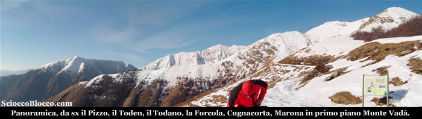

Da sinistra sulla linea di cresta più lontana il Pizzo, Toden, Todano, Forcola, Cugnacorta e Marona, sopra di noi a destra il Monte Vadà.

Possiamo notare alla sinistra del nostro arrivo l'altra strada che riporta al bivio passato poco prima, e che noi non abbiamo scelto, che contiamo di fare al ritorno.

Ripartiamo alla destra del nostro arrivo, lasciamo momentaneamente la strada Cadorna e saliamo in linea retta sull'ampia cresta.

La neve resta poca e dura ma calziamo le ciaspole per evitare
scivolate sul pendio che ora si fa più ripido.

Dopo alcuni minuti incrociamo di nuovo la strada che riprendiamo a seguire.

Iniziano i tornanti che con lunghe diagonali ci fanno guadagnare quota velocemente.

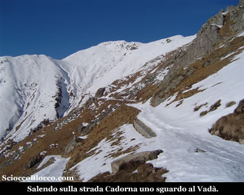

Giunti sotto le pareti del Monte Vadà, la neve diventa più abbondante, in alcuni brevi traversi bisogna essere prudenti per evitare rovinose scivolate.

Ma velocemente raggiungiamo Pian Vadà (1711m)(2.20/2.30h).

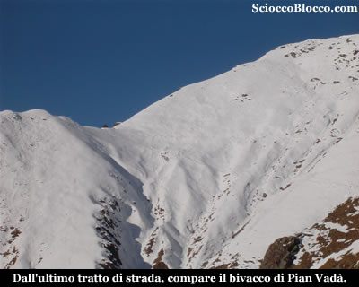

La fotocamera mi abbandona di nuovo, niente foto al nuovo bivacco dell'Ente Parco Val Grande.

Finalmente ci concediamo il meritato pranzo, mentre ammiriamo il panorama circostante e **il Lago Maggiore** laggiù in fondo.

Un leggero venticello ci costrige a coprirci ma la soddisfazione e la bellezza di questi luoghi resta impagabile.

Rifocillati e appagati prendiamo la strada del ritorno, che avviene per lo stesso percorso di andata sino a tornare a passo Folungo (1369m)(3.00/3.15h).

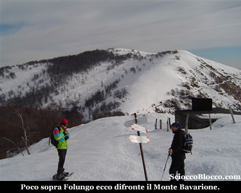

Scendendo ci intriga di fronte a noi il Monte Bavarione, la cima attorno alla quale girano le due strade che si separano al bivio incontrato all'andata, e che si mostra bianco, compatto e invitante.

La fotocamera torna tra noi...

Scambiate due chiacchiere con dei ragazzi
incotrati al passo Folungo, decidiamo di salire al Bavarione.

Il percorso è a vista, il panettone quasi senza bosco, sale proprio di fronte a noi scendendo da Pian Vadà o sulla sinistra arrivando dall'Alpe Archia come questa mattina.

La salita è abbastanza impegnativa ma abbordabile e breve, la neve oggi resta compatta anche nel pomeriggio, raggiungiamo un pianoro poco prima della cima con vista **Lago Maggiore** oggi nella foschia.

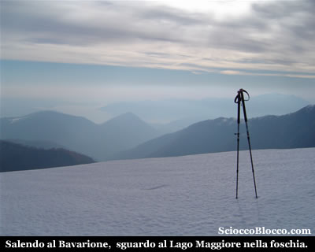

Quindi pieghiamo a sinistra e percorriamo gli ultimi metri di fatica.

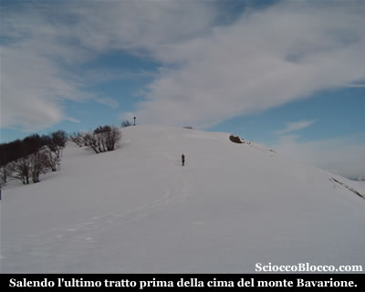

Che in breve ci conducono alla cima del Monte Bavarione (1505m)(3.25/3.45h).

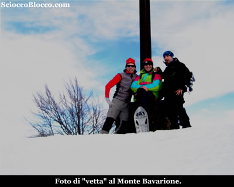

Scattiamo la classica foto di "vetta", e facciamo un breve spuntino mentre ammiriamo ancora una volta il panorama circostante.

Decidiamo di scendere dal versante opposto rispetto alla nostra salita.

Con prudenza in alcuni tratti abbastanza ripidi, scendiamo tenendoci sulla destra con la strada che volevamo percorrerre al ritorno sempre ben visibile sotto di noi.

Velocemente approdiamo di nuovo sulla strada Cadorna poco prima del Bivio visto all'andata, che raggiungiamo in breve.

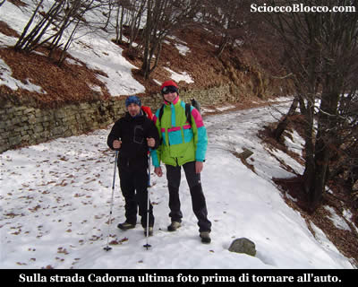

Quindi tolte le ciaspole, ripercorriamo il tragitto di andata, ripassando per gli ospedaletti e tornando a

Pian d'Arla (1307m) e all'auto dopo (5.00/5.30h).

Bella escursione che richiede prudenza a seconda dell'innevamento e un buon allenamento, che regala ampi spazi e panorami.

**Un
grazie agli escursionisti di giornata Riccardo, Fabrizio e Dario.**

**Per informazioni scrivici a :** trekking-bike@scioccoblocco.com

**Se vuoi lasciare una tua opinione o un tuo commento scrivi sul nostro** FORUM.

