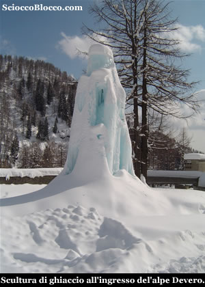
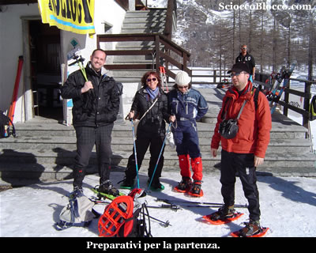
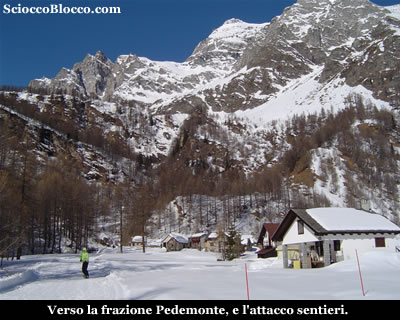
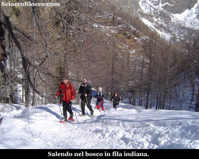
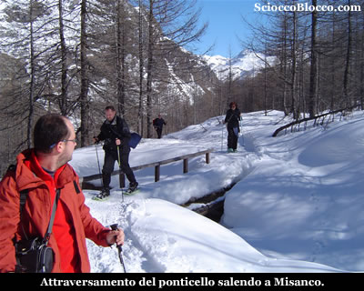
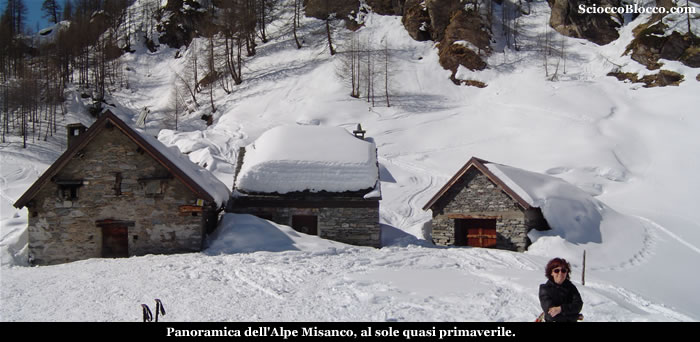
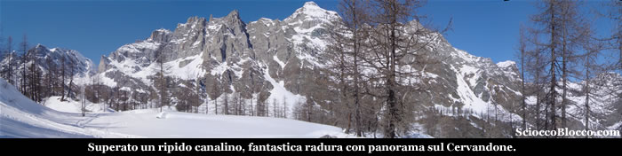
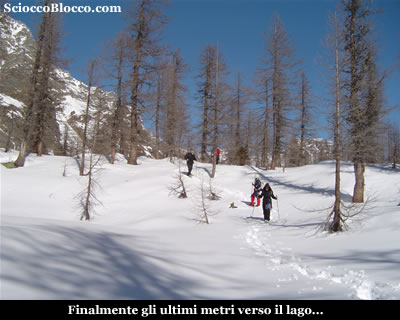
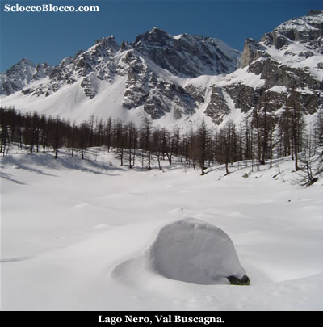
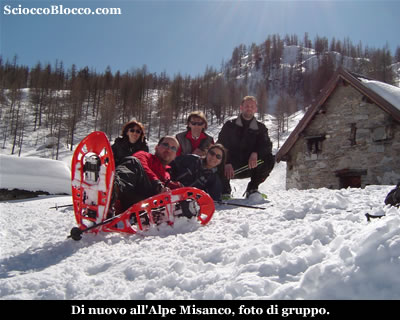

All'**Alpe
Devero** (1640m) lasciamo la macchina lungo la strada nelle immediate vicinanze del
comodo parcheggio sotterraneo di recente costruzione, oggi già esaurito,
e risaliamo la stradina che si insinua tra le prime baite
dell'alpe.

Dopo pochi metri ci troviamo di fronte ad un piccolo ponticello,
al di là del quale vi è la caratteristica cascata di ghiaccio.

Noi non lo attraversiamo ma andiamo a sinistra in piano
e dopo circa 300m arriviamo agli impianti da sci rimodernati
pochi  anni fa.

Proprio sotto il bar/rifugio alla partenza della seggiovia è posto il noleggio atrezzatura, dove alcuni di noi affittano ciaspole e bastoni, per 10€ cadauno.

Terminati i preparativi, lasciando gli impianti sulla sinistra, iniziamo a camminare
in piano verso il nucleo di baite che chiude verso il
rio Buscagna la piana del Devero.

Il cielo è straordinariamente terso, il contrasto del blu con il bianco delle cime innevate ogni volta mi sorprende come fosse la prima.

In pochi minuti, arriviamo in località **Pedemonte**, al margine sinistro del nucleo, arrivando dalla piana del Devero, attraversiamo un ponticello e iniziamo a salire verso destra nel bosco su evidentissima traccia.

La salita è subito decisa e costante, ma la giornata è calda e piacevole, anche nel bosco e all'ombra si procede  a temperature gradevoli, ogni tanto ci accostiamo per far passare qualche sciatore sia in discesa che in salita.

Dopo circa mezz'ora arriviamo nei pressi del caratteristico ponticello che precede l'ultimo tratto prima dell'alpe Misanco.

Riprendiamo a salire prima su un breve tratto in leggera ascesa, quindi le pendenze tornano più impegnative, fuori ormai dal bosco il sole scalda piacevolmente il nostro cammino in un atmosfera primaverile.

Finalmente dopo circa un'ora eccoci all'**Alpe Misanco** (1907m).

Bell'alpeggio ben conservato, ai margini del bosco la sua conca è invasa dalla luce mattutina.

Ci fermiamo per un piccolo spuntino e per scattare qualche foto, mentre sull'ampia traccia che prosegue verso il Monte Cazzola da noi recensito, passano su e giù numerosi scialpinisti.

Dopo aver recuperato un po di energie, proseguiamo uscendo in salita dall'alpeggio.

Circa 50m sopra le baite, sulla destra semisommersi dalla neve troviamo dei cartelli indicatori, purtroppo qualche "burlone" per non usare epiteti più adatti, ha staccato il cartello che indica la nostra meta, di cui restano le due viti a far intuire la direzione.

Lasciamo il tracciato principale che sale al Cazzola e risaliamo sulla destra, una traccia abbastanza evidente ci porta in breve
sul costolone soprastante.

Quindi prendiamo a salire verso sinistra, in direzione di un breve ma ripido canalino.

Le pendenze iniziano a farsi impegnative, e gli ultimi metri del piccolo canale sono ripidi e scivolosi, ma non vi è alcun pericolo, velocemente approdiamo in una bellissima radura.

Siamo entrati in **Val Buscagna**.

Una piccola e immacolata radura, ci accoglie aprendo una spettacolare vista sul **Monte Cervandone**.

Infatti dopo la recente nevicata che ha posato un fresco manto di circa 25cm, nessuno sembra essere passato di qua.

Dopo qualche minuto di contemplazione, proseguiamo costeggiando la radura sul margine sinistro rispetto al nostro arrivo, per poi scendere in breve ad un piccolo avvallamento dove, anche qui semisommersi dalla neve, troviamo dei cartelli indicatori.

Sulla sinistra si va verso Curt du Vel e lo Scatta d'Orogna, proseguendo dritti di fronte a noi, verso la nostra meta.

Superato un un piccolo boschetto, al culmine di un dosso, prima di iniziare un breve discesa nei pressi di una grosso masso, pieghiamo a sinistra.

Tra i radi larici, sulla nostra sinistra noteremo un po più in basso un largo avvallamento privo di vegetazione, camminando nella neve immacolata senza un percorso definito ci dirigiamo verso quella "radura".

Giunti nei pressi, troviamo appena emerso nella neve il cartello che indica **Lago Nero** (1994m)(1.30/145h).

L'ambiente è fantastico e immacolato, nessuno è passato di qui dopo la recente nevicata, le vette circostanti si stagliano nel cielo blu cobalto, gli amici nonostante la fatica della ciaspolata, per qualcuno la prima, sostano in silenzio per qualche secondo, prima di scatenarsi in fotografie e pronunciare la classica frase:

-  "..ne valeva la pena!".

Si potrebbe restare qui a lungo, ma anche il miraggio di un buon pranzo tipico ha il suo fascino...

Così torniamo sui nostri passi, divertendoci tornati al canalino già fatto in salita a fare un po di slitta "naturale".

Quindi tornati all'**Alpe Misanco** scattiamo una foto di gruppo.

Riprendiamo  il tracciato super frequentato, per tornare a **Pedemonte** e all'**Alpe Devero** (1640m) dopo circa (3.00/3.30h).

Bella escursione, alla portata di tutti, che dopo fresche nevicate e in giornate terse regala scorci appaganti, ancor più gratificanti se in giusta compagnia.

**Un
grazie agli escursionisti di giornata** **Sandra, Zouby, Davide, Francesco** **e Dario.**

