Oggi mi propongo un piccolo giro ad anello prima attorno e poi in vetta al Pizzo Pernice.

Questa
semplice escursione ricalca nella prima parte l'itinerario
classico per il Pian Cavallone,
accesso per molte ascensioni alle montagne
del comprensorio verbanese della Valgrande.

Può essere effettuata comodamente al pomeriggio,
ideale breve gita da stagioni intermedie che concedono
con più frequenza giornate terse per apprezzare
il notevole panorama che si gode da questi luoghi.

In verità purtroppo oggi la foschia la fa da padrona sul lago...

Qui nell'ampio parcheggio sterrato contraddistinto
al centro dalla cappella
Fina (1100m), lasciamo l'auto e imbocchiamo
il largo sentiero gippabile che parte sul fondo.

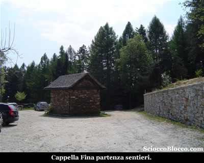

Ignoriamo
il sentiero che subito sulla destra prosegue in piano,
il quale porta alla cappella di Porta e quindi a Caprezzo,
e dritti saliamo sulla comoda strada che si immerge
in un bosco.

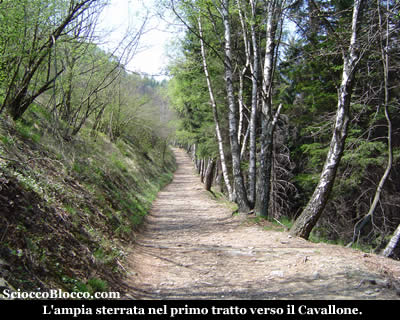

Superiamo una cappelletta dedicata da un padre alla
memoria del figlio, quindi la deviazione per l'Alpe
Cavallotti e Testa del Cremisello, dove un cartello metallico ha le indicazioni cancellate.

La strada diviene comoda mulattiera,
quindi marcatissimo sentiero, e arriviamo nei pressi
di una fontana ormai fuori dal bosco (30/35min).

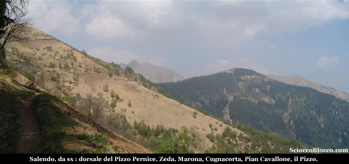

Se
il tempo vi assiste il panorama è già
notevole,  Verbania si stende sulle rive del Lago
Maggiore, il Monte
Rosso appare sulla destra e i monti
lombardi fanno da sfondo.

Oggi la giornata non è delle migliori, una fastidiosa foschia aleggia sul lago negandoci il panorama.

Tuttavia verso il Pian Cavallone la vista è migliore, e possiamo già ammirare da sinistra, Zeda, Marona, Cugnacorta, Pian Cavallone e Il Pizzo.

Proseguiamo ora su battutissimo sentiero tanto che
i bordi risultano spesso 40cm più alti del
centro, da far sembrare il camminamento più
una trincea che una traccia.

Aggiriamo il Pizzo Pernice  che
è sopra alla nostra sinistra.

Saliamo facilmente verso  alcune rocce, che si protendono verso il lago come una polena.

Quindi pieghiamo decisamente a sinistra in discesa,  ai margini di
un fittissimo e scuro bosco di abeti rossi risaliamo brevemente per arrivare
alla lunga spianata che precede il Pian
Cavallone(45/50min).

Dove sono posti molti cartelli indicatori per le varie mete.

Infatti siamo giunti sulla dorsale sparti acque, arrivando dalla Valle Intrasca e dal lago, ci affacciamo ora verso la Val Grande e Cicogna.

Qui la vista si apre mirabile verso nord.

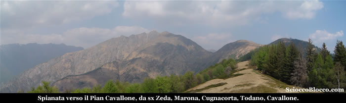

Di fronte a noi si apre la Val Grande, sulla destra Il Monte Zeda, Pizzo Marona, Cugnacorta, La Forcola, Todano e Pian Cavallone preceduto dall'ampia sella erbosa che abbiamo davanti.

Alla nostra sinistra la breve salita che porta al Pizzo Pernice.

Imbocco l'evidente sentiero ben indicato con cartelli, che diritti rispetto all'arrivo scende dall'altro versante, immergendomi in un bosco.

In pochi minuti ecco l'Alpe Curgei (1350m)(50/60min).

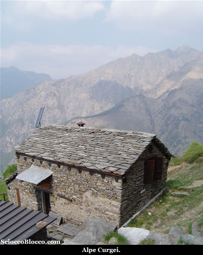

L'alpe è quasi totalmente decaduto, eccezione fatta per il Bivacco il Gufo, realizzato nel maggio 2004 dalla proloco di Miazzina con la comunità montana Valgrande, ristrutturando una baita dono della famiglia Crivelli.

Il bivacco è incustodito e sempre aperto, dispone di stufa a legna e può ospitare circa 8 persone nel sottotetto fornito di qualche branda, ben tenuto è fornito anche di stoviglie e qualche atrezzo, a pochi metri una fontana.

Un ampia tavola, all'esterno domina dalla balconata la valle con Cicogna e l'Alpino di fronte.

Scambio qualche parola con due ragazzi che hanno passato la notte in loco, e stanno approntando i preparativi per il ritorno.

Un bel posto facile da raggiungere, ma tranquillo e isolato, ideale per un paio di notti in compagnia di qualche amico.

Scatto la foto ricordo e riparto.

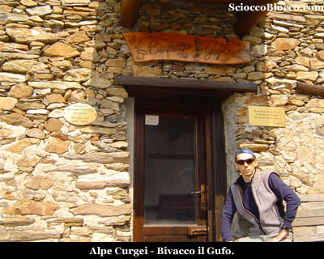

Sin qui un escursione prettamente turistica, e se si decide di tornare a ritroso sui propri passi ovviamente lo resta.

Io ho deciso per un giro ad anello, le cartine indicano un vecchio e flebile sentiero che poco più avanti guadagna la vetta del Pizzo Pernice.

Esco quindi dall'alpeggio in direzione di una piccola baita recentemente ristrutturata, che suppongo essere una presa dell'acqua.

Supero la fontana, dando uno sguardo ai sottostanti ruderi del vecchio alpeggio.

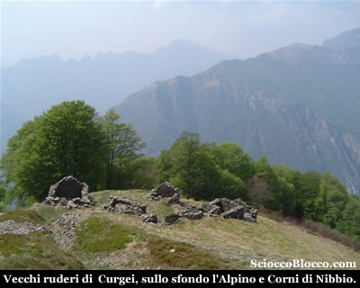

Passata la piccola baita, il sentiero è evidente e si immerge nel bosco, subito dopo quasi scompare, bisogna prestare attenzione, non farsi trarre in inganno da una traccia che scende, ma restare pressoché alla stessa altezza, risalendo pochi metri per aggirare una piccola insenatura al di sopra di alcune rocce.

La traccia torna evidente ma stretta, dopo circa 10 minuti quando i ruderi dell'alpe riappaiono alle nostre spalle, lascio il sentiero salendo per prati sulla sinistra.

Infatti la traccia poco più avanti, superati aluni passaggi un poco esposti termina sotto una parete verticale dalla quale esce una sorgente ed è posto un mestolo per bere.

Risalendo i prati dapprima in un rado bosco, la fatica diventa notevole, la pendenza proibitiva, fuori dal bosco l'erba  secca e schiacciata dalla recente neve, fa diventare la salita un impresa di equilibrio.

Non vi è alcun segno di sentiero (almeno io non ne ho visti), ogni due/tre passi mi fermo per recuperare la fatica sia di salire che di restare in equilibrio.

Ne approfitto per scattare una foto a Cicogna, che sull'altro versante della valle sembra ridere dei miei sforzi.

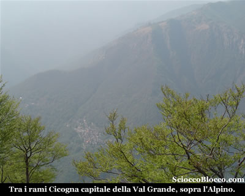

Dopo circa 15 minuti di camminata a quattro zampe e fatica da capre, eccomi sbucare proprio nei pressi dell'omino di vetta del Pizzo Pernice (1500m)(1.10/1.25h).

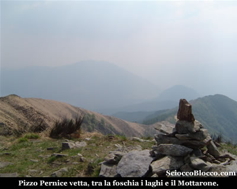

Purtroppo il panorama verso i laghi è precluso da una noiosa foschia, tuttavia la cresta che scende verso la Colma di Cossogno o Monte Todun è sempre spettacolare.

La via da me scelta per giungere sin qui, non è consigliabile  per fatica ma soprattutto per sicurezza, è consigliabile dall'Alpe Curgei tornare al bivio per il Cavallone, che da qui si vede poco più sotto a sinistra, e in pochi minuti risalire il Pernice.

Ripreso fiato, inizio a scendere, verso destra rispetto al mio arrivo, cavalcando l'aerea sella.

Giunto all'inizio del bosco, nei pressi di un segno indicatore Bianco/Rosso, una traccia non segnalata scende nel bosco a sinistra.

La imbocco, inizio la discesa superando qualche piccolo rigagnolo, e alcuni tratti in traverso, quindi entrato in una fitta abetaia risalgo leggermente sino ad incontare un curioso e multiplo cartello indicatore.

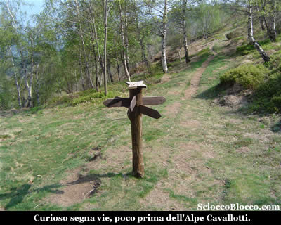

Oltre alla rosa dei venti con i punti cardinali, vi sono posti molti cartelli che indicano i diversi sentieri che si diramano da qui per le varie mete.

Proseguo pressoché in piano sulla destra del mio arrivo, mentre scendendo in breve si incontrerebbe la strada fatta all'andata.

In pochi minuti eccomi all'Alpe Cavallotti (1200m)(1.45/2.10h).

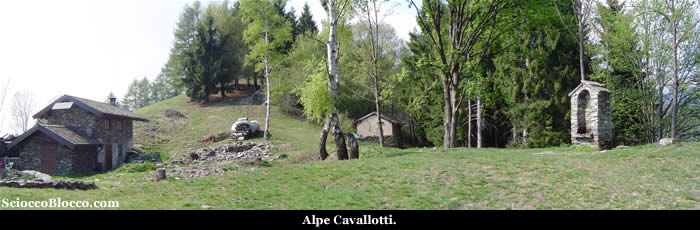

Bell'alpeggio con baite ben ristrutturate.

Uscendo, sempre dritti, dalla radura seguendo un largo tracciato, si incontrano delle vere e proprie villette recintate che farebbero invidia a quelle in centro a Intra.

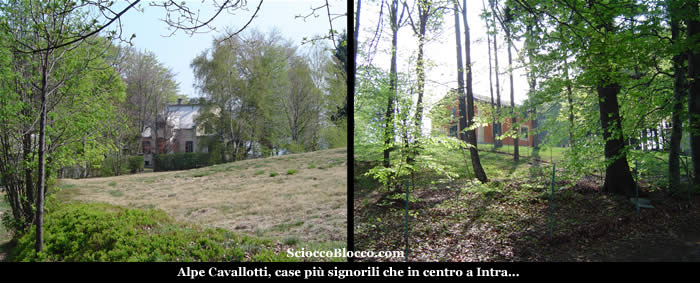

L'ampio sentiero inizia a scendere lasciando le case sulla destra, quindi  con breve tratto più ripido torna rapidamente a Cappella Fina(1100m)(2.00h/2.30h) nostro punto di partenza e arrivo.

Bel giro ad anello, anche se consigliabile ricalcare in parte il percorso per evitare la salita in direttissima al Pernice, nella versione più soft alla portata di tutti, che  nelle giuste giornate può regalare panorami mozzafiato.

