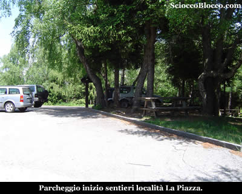
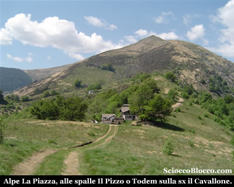
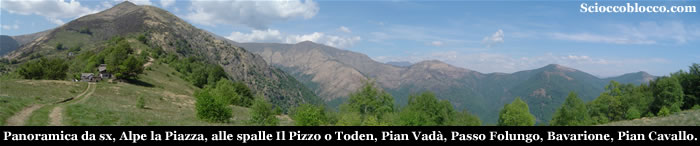
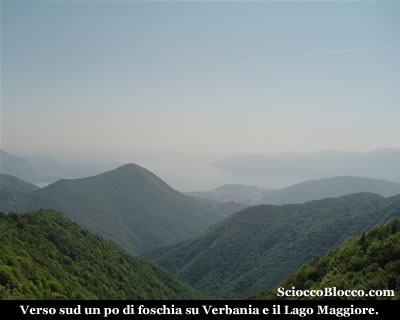
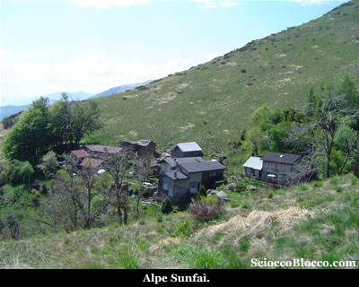
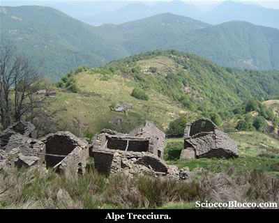
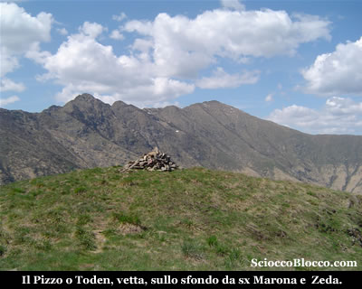
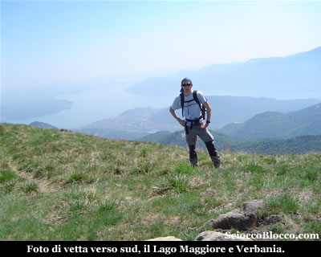

Lasciata l'auto nell'ampio parcheggio in località la Piazza (1130 m), torniamo verso l'ingresso dove sulla destra sale un'ampia scalinata.

Dopo pochi metri la scalinata, approda su un ampia traccia gippabile, dove un cartello improvvisato indica "Rifugio" verso sinistra, indicazione che seguiamo.

Pressoché in piano la strada sterrata prosegue nel bosco, per poi in pochi minuti dopo una brevissima rampa sbucare all'aperto.

Superato un breve avvallamento eccoci alle baite di la Piazza (10 min).

Dove vi sono delle vere e proprie case ristrutturate con tutti i confort, all'ingresso dell'alpeggio è posta una cappelletta dedicata a San Giacomo.

Alle spalle imponente il Pizzo o Toden (come più comunemente chiamato nella zona), nostra metà odierna che fa bella mostra della sua "ripidità".

Alla nostra destra verso Nord-Est, si apre già uno sguardo panoramico sulla cresta con il Pian Vadà, Passo Folungo, Monte Bavarione, Colle e Pian Cavallo.

Proseguiamo aggirando sulla destra le baite, dopo una breve salita raggiungiamo sempre su gippabile un tratto pianeggiante.

Dove voltandoci verso Sud alla nostra sinistra appare già il lago Maggiore e Verbania.

Qui sulla destra troviamo un cartello metallico scolorito che indica ancora il numero 10, lasciamo l'ampia gippabile che prosegue verso il Rifugio del Pian Cavallone, e prendiamo a salire in modo deciso, ora il sentiero si fa sottile in direzione di una piccola e isolata baita di recente ristrutturazione.

Proseguiamo sulla sinistra della baita, la traccia
continua a salire tra le ultime piante, mentre alla nostra sinistra al di là di una piccola valletta vediamo Sunfaì (1247m)(20 min).

Bell'alpeggio, ancora in ottime condizioni dove si vede brulicare vita fuori e dentro i cortili.

Continua la salita, il sentiero ci conduce ad una piccola costruzione con pannello solare che suppongo essere una presa dell'acqua.

Quindi piega a sinistra guadando un piccolo rigagnolo e portandosi al di là della valletta.

In breve attraversiamo l'alpe la Trecciura(25/30min).

Alpeggio completamente abbandonato e decaduto, che si trova poche decine di metri sopra Sunfaì.

Attraversato il quale la traccia si inerpica verticalmente verso destra.

Da questo punto in poi il sentiero si fa a volte un po labile, ma poco importa non c'è nulla tra noi e la cima, la navigazione avviene a vista.

Le pendenze sono piuttosto impegnative, si sale in direttissima verso la vetta che ci domina alzando lo sguardo.

Superiamo nell'ultimo tratto una zona di sfasciumi rocciosi, quindi come sempre gli ultimi metri si fanno ancor più ripidi e impegnativi, ma finalmente ecco la vetta de Il Pizzo o Toden (1644m)(1.00h/1.15h).

Di fronte a noi subito ci accoglie la vista sul Pizzo Marona e il Monte Zeda.

Anche se si tratta di una cima di altitudine modesta, la sua posizione regala una visione a 360° davvero fantastica, che invita ad immortalarla...

Detto fatto !!!

Non servono parole per descrivere lo spettacolo...

Rifocillato scatto la classica foto di vetta, verso il lago prima della partenza.

Quindi ritorno per lo stesso tragitto fatto all'andata, ma giunto all'alpe la Trecciura, lascio il sentiero e mi dirigo per prati  in direttissima verso Sunfaì solo sfiorata all' andata, che attraverso e riprendendo il sentiero passo per la Piazza e quindi nuovamente al parcheggio (1130m) dopo (1.40h/2.00h).

Escursione che per la facilità di orientamento e la brevità può essere considerata turistica, che tuttavia a causa delle pendenze notevoli non è da sottovalutare ed è consigliabile affrontare con un minimo di allenamento.

