A Pian d'Arla (1307m), lasciamo l'auto in un'ampia piazzola che si apre a belvedere sul lago, mentre alle spalle vediamo una costruzione recintata, in passato colonia, dove la strada Cadorna effettua una deviazione verso il Monte Spalavera.
La strada è percorribile ancora lungamente in auto, con prudenza, sino ad Archia e passo Folungo, noi onde evitare spiacevoli inconvenienti meccanici e gustarci la mattinata, preferiamo proseguire a piedi.
La nostra meta di oggi è la Regina del Verbano, la Zeda, scelta obbligata per la prima escursione nel bacino verbanese di Lella, mia socia odierna.
Alle nostre spalle verso sud il Lago Maggiore la fa già da padrone.
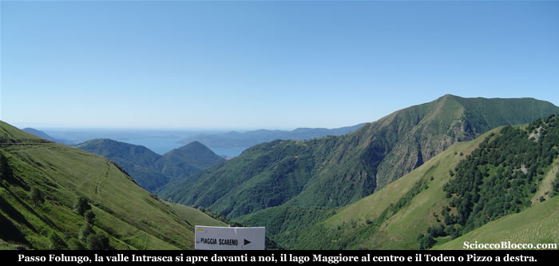

Alla nostra sinistra verso nord/ovest, appare tutto il percorso che andremo ad affrontare, quasi a farci da promemoria, ecco da sinistra Pizzo Marona, Monte Zeda, Pian Vadà e Monte Bavarione.
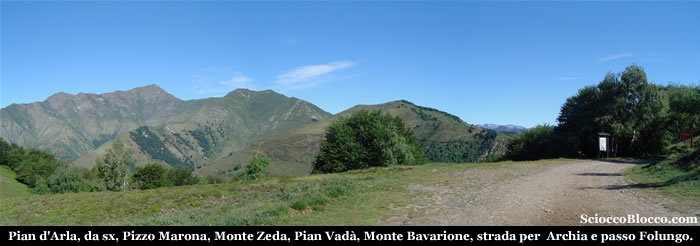

La strada prosegue in leggera discesa immergendosi nel bosco, superando alcuni cartelli esplicativi.
I temporali di ieri hanno abbassato notevolmente le temperature, e come previsto soffia un po' di vento, camminando nel bosco ci copriamo, l'anticipo d'estate dei giorni passati è già un ricordo...
Dopo circa 25/30 minuti arriviamo ai vecchi ospedaletti militari.
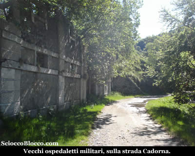

Dopo alcuni minuti, arriviamo in località Pian Puzzo, nei pressi di un bivio, la strada che sale a destra porta ad Archia, quella che prosegue in piano a sinistra direttamente a Passo Folungo.
Noi proseguiamo in piano a sinistra per Folungo.
Dopo poco la cosa si ripete, altro bivio, sopra a destra per Archia, sotto a sinistra per Folungo.
Noi confermiamo la scelta e andiamo a sinistra in piano.
Il bosco si dirada, al sole si sta molto meglio e il vento sembra essersi placato.
Il largo percorso prosegue in leggera ascesa, superando una grossa costruzione cadente, infine piega a destra per aggirare l'ultima parte del Monte Bavarione.
Finalmente eccoci a Passo Folungo (1369m)(1h/1.10h).

La giornata è straordinariamente tersa, non una nuvola all'orizzonte.
Qui troviamo una bella fontana (fate scorta dopo non ci saranno altre fonti), alla destra rispetto al nostro arrivo si dipana in leggera discesa la strada per Archia.
Sulla sinistra si apre la Valle Intrasca con i suoi alpeggi, laggiù in fondo ancora il Lago Maggiore e un poco sulla destra il Toden o Pizzo.
Di fronte a noi prosegue (chiusa da una sbarra) la strada Cadorna, nel primo tratto decidiamo di salire per il sentiero sulla destra che in linea retta supera il primo tratto di cresta.
Dopo alcuni minuti il sentiero ci riporta sulla strada nei pressi di un tornante.
Riprendiamo la strada su pendenze non eccessive.
Sopra di noi vediamo lo scollinamento di Pian Vadà e il profilo del bivacco.
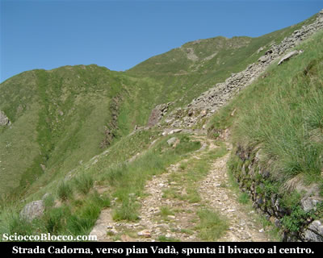

Voltandoci alle nostre spalle, possiamo ammirare il serpentone della strada Cadorna fin qui percorso, il passo Folungo e il Monte Bavarione i cui prati sono curiosamente divisi a metà, verde smeraldo a nord e verde scuro a sud.
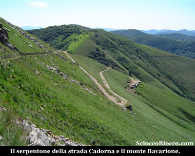

Con il nome di "Linea Cadorna"/"Sentiero/Strada Cadorna" si intende il sistema di fortificazioni militari costruito durante la Prima Guerra Mondiale tra il Lago Maggiore e il Monte Massone.
Le fortificazioni comprendono un fitto reticolo di mulattiere militari, trincee, postazioni d'artiglieria, luoghi di avvistamento, ospedaletti, strutture logistiche e centri di comando.
Furono volute dal generale Luigi Cadorna di Pallanza, capo di stato maggiore dell'esercito italiano, per difendere il confine da un ipotizzato attacco austro-tedesco attraverso la Svizzera mai avvenuto.
Esse coprono, nella logica della "guerra di posizione", un dislivello di 2.000 m tra la piana del Toce e il Monte Massone e fra il Lago Maggiore (Carmine inferiore) e il Monte Zeda e proseguono nelle Alpi centrali fino alle Orobie.
Tra l'Ossola e la Valtellina furono costruiti 72 km di trincee, 88 postazioni di artiglierie di cui 11 in caverna, 296 km di strade carrozzabili, 398 km di mulattiere.
I lavori costarono più di 100 milioni di lire del tempo e impiegarono oltre 15.000 operai.
In un'economia di guerra, i lavori ebbero un impatto positivo per le popolazioni locali in quanto offrirono lavoro retribuito a muratori e scalpellini e costituirono una prima occasione di lavoro salariato per la manodopera femminile impegnata nel trasporto dei viveri alle squadre in montagna.
Un "sentiero storico", attrezzato con pannelli esplicativi per visite didattiche, è stato allestito tra la Punta di Migiandone e il Forte di Bara.
Altri tratti visitabili sono la mulattiera nord del Montorfano e le alture del Verbano (Morissolo, Monte Carza).
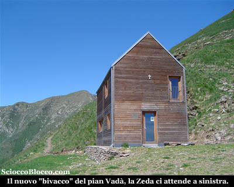

Dopo questo excursus storico, riprendiamo il cammino sull'ampia strada militare, ogni tanto Lella si incanta ipnotizzata dalla macchia blu del lago che catalizza l'attenzione, come darle torto, lo spettacolo odierno è impagabile.
Forse sono più felice d'aver azzeccato la giornata e vedere lei incantata, che dello scenario.
Raggiungiamo in breve Pian Vadà(1711m)(2.00h/2.15h).

Dove nel 2009, nei pressi dei resti del vecchio rifugio, è stato costruito un nuovo "bivacco" dall'ente parco.
Bivacco che ho scritto tra virgolette, in quanto aldilà di polemiche (già numerose), va detto che è CHIUSO e le chiavi devono essere richieste all'ente parco.
Se, forse per evitare vandalismi, si è deciso di tenerlo chiuso, sarebbe stato il caso semplicemente di definirlo rifugio, onde evitare di indurre in errore gli escursionisti (soprattutto stranieri) che da vocabolario intendono per bivacco, locale di emergenza sempre APERTO... (WIKIPEDIA BIVACCO)
Da qui la strada si fa marcato sentiero, e in leggera ascesa prosegue a mezza costa sotto la cima del Monte Vadà, la nostra meta è ormai ben visibile di fronte a noi, e in breve raggiungiamo il Piè di Zeda
(circa 1820m) (2.20h/2.30h).
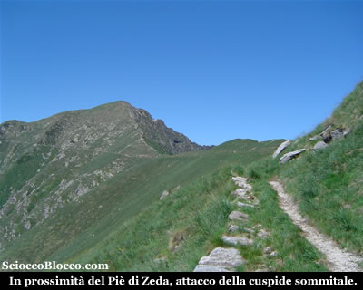

Sulla destra verso nord ci affacciamo sulla Valle Cannobina, poco sotto possiamo vedere l'alpe Forna, mentre sopra vediamo la Piota e dalla cresta sbucare il Torione.
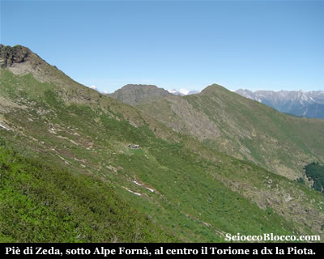

Ma difronte a noi si staglia la cuspide sommitale della Zeda, circa 300 metri di dislivello ci dividono dalla croce.

Quindi partiamo, il sentiero è sempre segnalato dai colori Bianco-Rosso del C.A.I. , le pendenze ormai sono impegnative il terreno in alcuni punti un po franoso richiede attenzione.

La fatica si fa sentire, e la vetta che sembra sempre essere li ad un passo non vuole venirci incontro.

Ma finalmente eccoci sbucare alla croce di vetta del Monte Zeda (2156m)(2.50h/3.10h).

La giornata si è mantenuta incredibilmente limpida, una vera rarità verso il lago e la pianura, quale migliore occasione per effettuare una panoramica a 360° sulla provincia del VCO e ben oltre.

Appena giunti in vetta di fronte a noi (ovest) si apre la Val Pogallo con Pogallo in basso a sinistra, quindi la cresta che dall'Alpino sopra Cicogna corre alla Cima Sasso, alla Bocchetta di Campo con il Pedum e alla Laurasca.

In secondo piano la cresta dei Corni di Nibbio, e oltre sua Maestà il Rosa.

Alla destra del Monte Rosa, complice la giornata limpida appare lontana la punta del Cervino.

Verso destra (nord), dopo la Laurasca, il Cimone di Cortechiuso, il Marsicce, il Torione, per tornare verso di noi con la Piota.

Dietro si aprono la Val Vigezzo e le valli ossolane, con la corona delle alpi svizzere che fanno da sfondo, dove spicca l'inconfondibile e ardita guglia del Finsteraarhorn.

Alle nostre spalle (est) la Val Cannobina, con il Gridone o Limidario,  vicino a noi Spalavera e Morissolo, sullo sfondo il Lago Maggiore nel suo tratto Svizzero, con Locarno e la piana di Magadino.

Quindi a sinistra (sud), concludendo il giro, il Lago Maggiore e il Lago d'Orta, il Mottarone, le isole Borromee, i laghi di Varese e Monate, l'aereoporto di Malpensa, l'inizio della pianura padana, e giù in fondo le Alpi Marittime che ci precludono Genova, stemperandosi negli Appennini.

Ben poco da dire difronte a tanta bellezza e giornata così fortunata.

Ma le sorprese non finiscono qui, da dietro la croce spunta un ex compagno di scuola, dopo tanti anni ritrovarsi qui con Fabrizio è veramente particolare !!!

Insieme al suo socio Marco e alla mia socia Lella, complice totale assenza di vento, facciamo una piacevole chiacchierata mentre diamo fondo alle provviste.

Racconti di montagne già fatte o da fare, si mescolano con lontani ricordi scolastici e il tempo vola letteralmente.

Veramente raro potersi trattenere in vetta così a lungo, e pure in piacevole compagnia, giorno speciale !!!

Ma bisogna scendere, scatto a Marco, Lella e Fabrizio la classica foto di vetta.

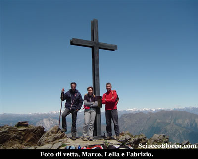

E loro ricambiano il favore, così Lella raddoppia.

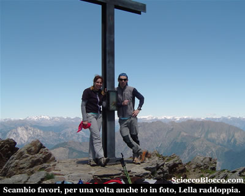

Quindi in compagnia, torniamo sui nostri passi, poco sotto la cima incontriamo un gruppetto di tedeschi in tenuta ciclistica, che con tanto di scarpette da bici cercano di salire in vetta dopo aver lasciato le bici dopo Pian Vadà, complimenti !

Ripercorriamo a ritroso il percoso di andata fino a Passo Folungo.

Quindi salutati Fabrizio e Marco, decidiamo di andare verso l'alpe Archia, imboccando la strada a sinistra scendendo.

Velocemente (15min) raggiungiamo, l' alpe Archia (1290m).

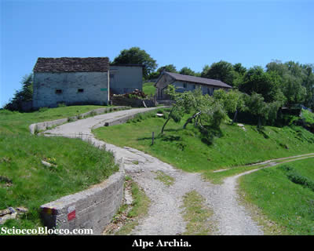

L'agriturismo è ancora chiuso, imbocchiamo la strada che scende a destra e aggiriamo sul lato opposto dell'andata il Monte Bavarione, per tornare al bivio di Pian Puzzo.

Quindi di nuovo sulla strada percorsa all'andata torniamo con pazienza a Pian d'Arla (1307m)(5.30h/6.00h) nostro punto di partenza e arrivo.

Bellissima escursione che grazie alla complicità del meteo, regala panorami straordinari, un po lunga se fatta da pian d'Arla, che diventa molto più abbordabile se si arriva in auto sino ad Archia

Un
grazie agli escursionisti  di giornata  Lella e  Dario, e per un tratto Fabrizio e Marco.

