Qui ad **Arvogno** (1247m), lasciamo la macchina qualche centinaio di metri dopo i rifugi, nei pressi della seggiovia.

Seggiovia inaugurata nel 2004 che permette il collegamento con la soprastante **Piana di Vigezzo**, che con  questa nuova pista e la nuova cabinovia di Prestinone, ha notevolmente ampliato e rimodernato il proprio comprensorio.

Dopo alcuni mesi di inattività, grazie all'invito di Fabrizio, eccomi finalmente di nuovo zaino in spalla.

La giornata è di quelle da nuvole basse, ma la pioggia non dovrebbe arrivare, quindi partiamo fiduciosi.

Scendiamo su  strada asfaltata ad attraversare in pochi minuti il ponte sul torrente Melezzo (1202m)(5min).

Subito dopo il ponte, sulla destra, imbocchiamo una mulattiera gradonata che permette di tagliare la strada, che ora diventata sterrata sale ancora per alcune centinaia di metri.

Tornati sulla strada, notiamo sulla destra un sentiero con diversi cartelli indicatori, è quello da cui faremo ritorno.

Abbiamo infatti in programma un giro ad anello, che sale al lago Panelatte e torna dalla bochetta di Muino.

Quindi seguiamo la strada sterrata per pochi minuti e attraversiamo sulla sinistra un largo ponte sul rio Verzasca.

Oltre il quale la larga mulattiera  in breve ci conduce all'Alpe Verzasca(1333m)(15min) già ben visibile dal ponte.

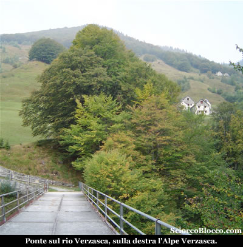

Dove vi è un cospicuo gruppo di baite in buone condizioni, anche favorite dalla vicinanza della strada carrabile.

Si scende per poco, per poi riprendere lungamente in costante, ma non proibitiva ascesa, su di una larga e abbondantemente lastricata mulattiera.

Una leggenda locale, racconta che il sentiero verso il lago Panelatte, è formato da 1700 scalini ottenuti dalle scistose bancate di roccia circostanti.

I tornanti regolari consentono a uomini e bestie di guadagnare agevolmente quota con una camminata uniforme.

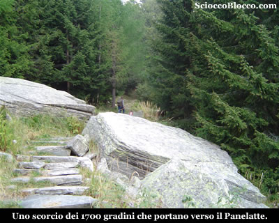

Tra faggi,  abeti rossi e larici, saliamo protetti dal bosco fino a sbucare all'Alpe Villasco (1642m)(1h/1.15h).

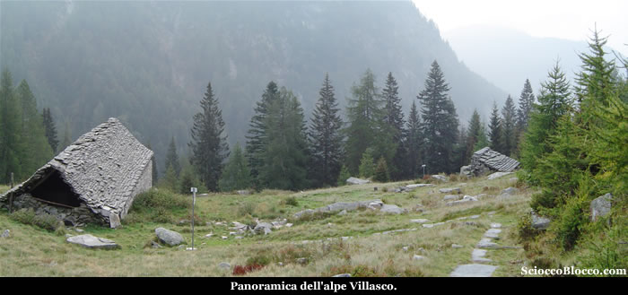

Qui troviamo sul sentiero una fontana dall'acqua gelida che ci permette di ricaricare le borracce, tra alcune diroccate baite.

Sempre ben pavimentato, il sentiero rientra nel bosco ormai dominato dalle conifere, e in costante ascesa  approda alla radura dell' Alpe ai Motti (1810m)(1.30h/1.40h).

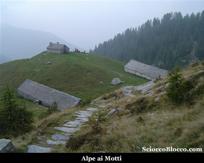

Alpeggio caratterizzato da due lunghissime stalle, ben riattate e ancora caricato, testimone un piccolo escavatore nei pressi della casera.

Guardando verso la direzione del nostro arrivo (sud-est), tra le basse nubi si possono intravedere  gli spiazzi tra il bosco, degli impianti sciistici della **Piana di Vigezzo**.

Riprendiamo il cammino ora allo scoperto, che in giornate di sole estivo, può diventare impegnativo, non certo oggi dove il sole fa capolino raramente tra le brume.

Infatti, giunti a questa quota la vegetazione rarefatta, permette in un momento di maggior visibilità di ammirare le cime che ci circondano e su tutte il profilo straordinario della Pioda di Crana.

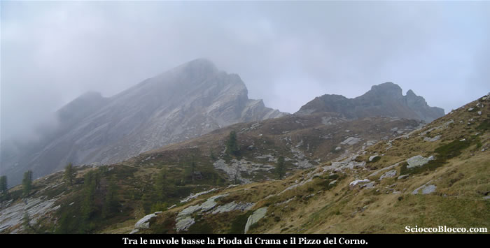

Proseguiamo in salita regolare, sino alla cappella di San Pantaleone (2026m)(1.50/2.00h).

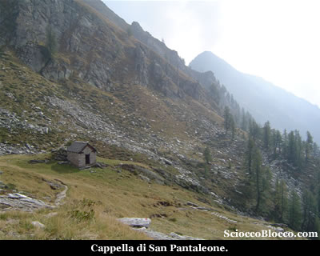

San Pantaleone è patrono dei medici e delle ostetriche come i santi Cosma e Damiano.

Secondo la
leggenda, Pantaleone, medico, vissuto
nel III secolo D.C. è convinto da un
cristiano ad abbandonare la medicina per
guarire nel solo nome di Cristo.

E' così che Pantaleone resuscita un
bimbo morto a causa del morso di
una vipera.

Forse è a causa di quell’episodio che i
Vigezzini hanno costruito questa cappella votiva montanara.

Qui troviamo alcuni cartelli segnavia, alle spalle della cappelletta si dipana il sentiero per il nostro ritorno, ma noi per ora proseguiamo dritti in salita mantenendo la destra.

Superato un breve e ripido tratto eccoci al Passo di Fontanalba (2046m)(2.10h/2.25h).

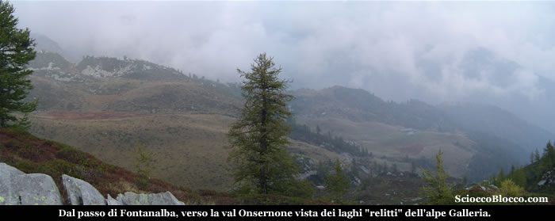

Il passo è caratterizzato da un muretto a secco che corre per quasi tutta la larghezza della bocchetta.

Oltre si apre la Val Onsernone, ovvero se politicamente siamo ancora in territorio italiano, orograficamente si entra nel bacino svizzero.

Ben visibile sulla sinistra uno dei laghi dell'Alpe Galleria, un lago così detto "relitto" per l'ormai totale evoluzione all'intorbamento.

Qui senza superare il passo, pieghiamo a sinistra in direzione della conca limitata da evidenti sfasciumi detritici, e superati alcuni brevi dossi approdiamo  alla conca che ospita il Lago Panelatte (2063m) (2.20h/2.35h).

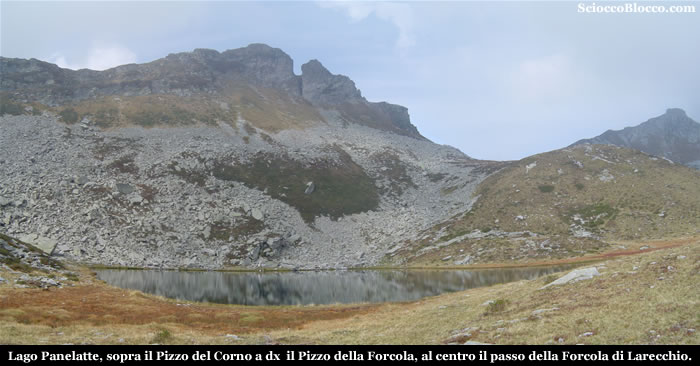

Il nome curioso di questo lago ha origini ignote, tuttavia proprio questo nome così accattivante  attira molti escursionisti fino alle sue sponde.

Il Lago Panelatte che appare all'ultimo momento dal sentiero, è un lago di circo.

Genericamente i laghi
vallivi in roccia,  quelli di gradinata, di circo, di terrazza,
sono pure detti di erosione, in quanto la conca che li ospita fu scavata da
masse glaciali in movimento o meglio dalle acque sub glaciali di fusione.

Dominato  dal Pizzo del Corno(2280m), mentre sulla destra svetta il Pizzo della Forcola, tra le due cime appare evidente il passo della Forcola di Larecchio.

Il Panelatte è popolato da anfibi e rare trote, privo di vegetazione ad alto fusto
le sue sponde sono caratterizzate da materiali detritici sotto la parete della montagna e da magri prati e rododendri dal lato verso valle.

Anche se convenzionalmente considerato parte della Val Vigezzo in realtà è compreso nella parte alta del bacino della Valle Onsernone.

Qui senza tornare al passo, troviamo un sentiero che dal lago ci riporta in discesa direttamente alla cappelletta di San Pantaleone(5min/10min).

Come detto poc'anzi, dietro la cappelletta parte il sentiero per la nostra possima meta.

Un lungo traverso sotto il Pizzo Ruggia, pressoché  sempre alla stessa quota, ci conduce alla Bocchetta di Ruggia (1990m)(3.10h/3.35h).

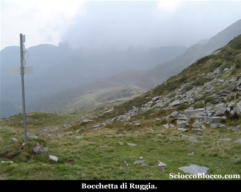

Sulla nostra sinistra  le larghe piodate di cresta che conducono al Pizzo Ruggia, mentre difronte proprio sotto di noi uno dei laghetti di muino e l'Alpe Ruggia(1890m)(3.25h/3.50h) che raggiungiamo in breve.

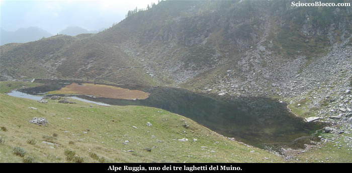

Sotto il dosso, alla sinistra del laghetto scendendo, troviamo le baite ben ristrutturate dell'alpe tutt'oggi caricato.

Siamo nei declivi dei laghetti di Muino, uscendo oltre il lago seguendo l'evidente sentiero, raggiungiamo in breve il Rifugio Greppi (1915m)(3.30h/3.55h).

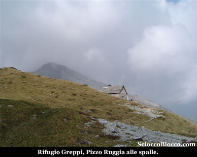

Il **Rifugio E. Greppi** affittato nel 1987 dal figlio di Emilio Greppi costruttore
della baita su terreo comunale al C.A.I. Vigezzo, è
di recente ristrutturazione è piccolo ma accogliente
può ospitare massimo 6 persone è dotato di
stufa a gas e pannello solare, nel sottotetto ci sono materassi e coperte
in abbondanza, ideale per un paio di notti in tranquillità
con pochi amici (per accedere chiedere le chiavi a **Santa
Maria Maggiore** C.A.I. sezione di Valle Vigezzo Tel.0324/94737
, il venerdì sera).

Pochi metri sotto è posto un secondo laghetto, in questa stagione molto scarso d'acqua, mentre poco sopra alle spalle del rifugio è situato il terzo laghetto.

Finalmente ci concediamo la meritata pausa pranzo, in compagnia di alcuni gruppi d'escursionisti che cercano di scaldarsi con qualche timido raggio di sole.

Dopo esserci rifocillati e riposati, ripartiamo il ritorno è ancora lungo...

Superiamo il laghetto e iniziamo a risalire verso la bocchetta, in compagnia di alcune vacche che lasciano l'alpeggio estivo decisamente in ritardo, complice questo settembre caldo.

Sotto a sinistra possiamo vedere l'Alpe Canva di recentissima ristrutturazione.

La salita è abbastanza impegnativa ma breve e arriviamo velocemente alla **Bocchetta di Muino**(1977m)(3.45h/4.10h).

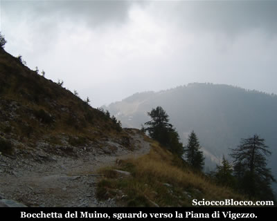

Difronte a noi appare tra le nuvole la **Piana di Vigezzo**.

Noi pieghiamo a destra su sentiero più sottile, indicato da un cartello poco sotto la traccia principale.

Iniziamo la discesa, rientrando nel bosco, con lunga diagonale sotto le Schegge di Muino, raggiungiamo **l'Alpe Sdun** (4.20h/4.45h).

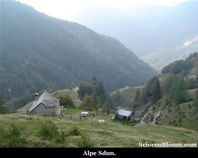

Bell'alpeggio ben curato, dove veniamo sorpresi dallo sbucare al galoppo di un pony nero,  mentre alcuni escursionisti intenti ad uno spuntino vengono anch'essi sorpresi dal cavallino affamato.

All'uscita dell'alpeggio prestiamo attenzione ad alcuni cartelli posti ad un bivio, per **Arvogno** dobbiamo andare a destra, quindi guadare un ruscello e  risalire sul versante opposto.

Dopo poco riprende la discesa che ci conduce all'**Alpe Cortina** (1355m)(4.50h/5.20h).

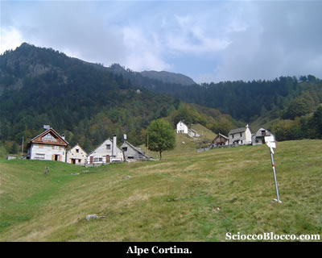

Alpeggio caratterizzato nella parte alta da un piccolo oratorio.

Da qui è ben visibile il ponte asfaltato sul **Torrente Melezzo**.

Infatti in pochi minuti sbuchiamo sulla strada sterrata proprio come previsto alla partenza, quindi ripercorriamo la scalinata e attraversato il ponte torniamo ad **Arvogno**  (1247m)(5.00h/5.30h) e all'auto, nei pressi della seggiovia.

Bella escursione nonostante la visibilità scarsa della giornata odierna, un anello perfetto che permette di gustare storia, laghi, boschi e cime, ma che richiede un buon allenamento per la durata e il lungo ritorno in discesa.

Un mio grazie a Fabrizio per avermela proposta.

**Un
grazie agli escursionisti  di giornata**   **Fabrizio M. e Dario**.

