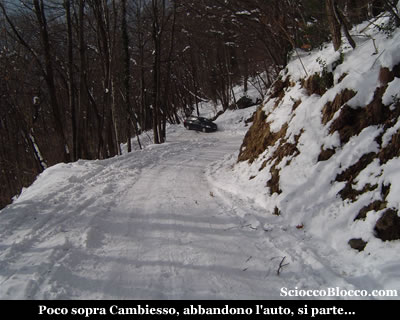
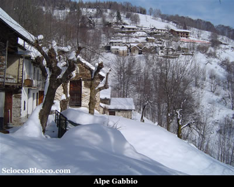
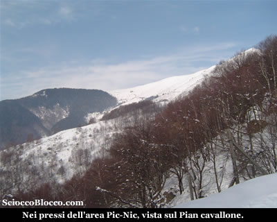
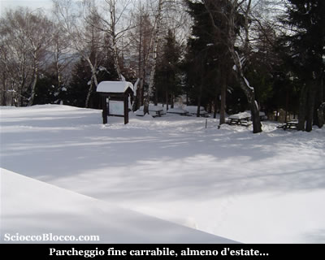
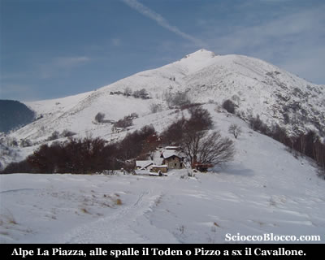
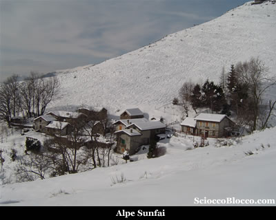
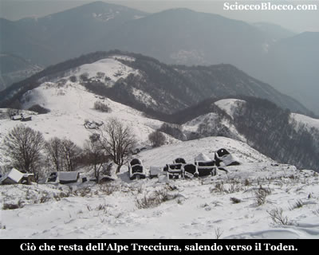
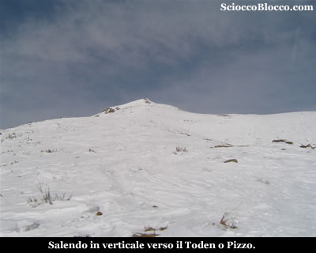
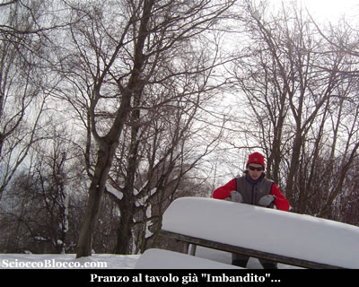

Alla strettoia che esce dalla frazione di Cambiesso (810m), ci sono chiari cartelli, che indicano "strada chiusa per neve", proseguo ancora per qualche decina di metri su strada sporca e al primo tornante lascio l'auto dove la strada diventa ripida e completamente innevata.

Qualche auto, probabilmente 4X4, ha battuto la strada e la neve è schiacciata sulla carrabile, ma con auto normali è meglio non rischiare.
Preparo lo zaino e l'attrezzatura e parto, si cammina tranquillamente con gli scarponcini da trekking, su neve ben battuta.
Tuttavia dopo qualche centinaio di metri, anche se le tracce di pneumatici sono ancora evidenti e la strada battuta si inizia a sprofondare.

Resisto ancora un poco, ma poi dopo circa 1Km decido di calzare le ciaspole.

Il che mi permette di fare qualche taglio nel bosco, per accorciare la strada.

Raggiungo l'Alpe Gabbio (1000m)(30'/35').

La neve è molto farinosa e per niente portante, nei tagli nel bosco appena le pendenze aumentano la presa delle ciaspole è molto scarsa, quindi riguadagno la strada e attraverso l'alpeggio dove vi sono molte baite/case in ristrutturazione.

Nei pressi dell'area Pic-Nic il bosco si dirada e verso sinistra si apre un bel panorama sul Pian Cavallone.

In breve ecco la fine della carrabile e il "parcheggio" in località La Piazza (1130m)(50'/1h).

Prendo un po di fiato e mi rifocillo.

Sulla sinistra del nostro arrivo vi è una scalinata, che appare evidente anche sotto la neve già pestata, la quale approda su un ampia traccia gippabile, dove un cartello improvvisato indica "Rifugio" verso sinistra.

Oggi anziché seguire il sentiero estivo, proseguo dritto davanti a me seguendo delle tracce di scialpinisti.

In breve raggiungo il culmine di un piccolo dosso, e superato un breve avvallamento eccoci alle baite di La Piazza (1h/1.10h).

Dove vi sono delle vere e proprie case ristrutturate con tutti i confort, all'ingresso dell'alpeggio è posta una cappelletta dedicata a San Giacomo.

Alle spalle imponente il Pizzo o Toden (come più comunemente chiamato nella zona).

Alla nostra destra verso Nord-Est, si apre già uno sguardo panoramico sulla cresta con il Pian Vadà, Passo Folungo, Monte Bavarione, Colle e Pian Cavallo.

Oggi dopo giornate di freddo polare, al sole si sta molto bene e l'assenza di vento rende l'aria gradevole

Proseguo aggirando sulla destra le baite, dopo una breve salita raggiungo sempre seguendo tracce già battute un tratto pianeggiante.

Dove voltandomi verso Sud alla mia sinistra tra la foschia intuisco  il lago Maggiore e Verbania.

Qui sulla destra trovo un cartello metallico scolorito che indica ancora il numero 10, lascio la traccia che prosegue in piano, e seguo quella che sale a destra, procedo in direzione di una piccola e isolata baita di recente ristrutturazione.

Sulla sinistra della baita, la traccia
continua a salire tra le ultime piante, mentre alla  sinistra al di là di una piccola valletta vediamo Sunfai (1247m)(1.15h/1.25h min).

Bell'alpeggio, ancora in ottime condizioni.

Continua la salita, proseguo tra tracce e a vista verso  una piccola costruzione con pannello solare che funge da presa dell'acqua.

Quindi piego a sinistra superando un piccolo rigagnolo e portandomi al di là della valletta.

In breve eccomi all'alpe La Trecciura(1310m)(1.30h/1.45h).

Alpeggio completamente abbandonato e decaduto, che si trova poche decine di metri sopra Sunfai.

Attraversato il quale la traccia si inerpica verticalmente verso destra.

Inizio a salire ormai su
pendenze  piuttosto impegnative, la neve è poco portante e affiorano molti rami, si sale in direttissima verso la vetta che ci domina alzando lo sguardo.

Purtroppo un rapido sguardo all'orologio, mi ricorda che impegni pomeridiani non mi cosentono di raggiungere la vetta e rientrare per tempo.

Così a malincuore devo rinunciare e iniziare il ritorno.

Scendo in direttissima ad attraversare Sunfai solo sfiorata salendo.

Quindi tornato a La Piazza, approfitto di una panchina liberata dal Sole per un veloce pranzo.

Riprendo la discesa e mi accorgo che avrei potuto approfittare per il pranzo di una tavola già "Imbandita".

Il  ritorno avviene per lo stesso tragitto fatto all'andata,  sino a tornare a Cambiesso(815m)(3.00h/3.30h) partenza e arrivo dell'escursione.

Escursione che per la facilità di orientamento  può essere considerata turistica, che tuttavia a causa della partenza poco fuori il paese  non è da sottovalutare ed è consigliabile affrontare con un minimo di allenamento.

**Escursionist**a  **di giornata   Dario.**

