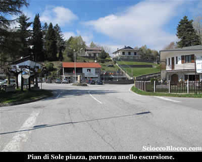
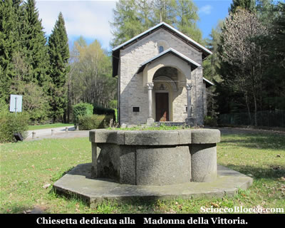
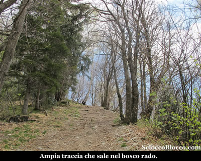
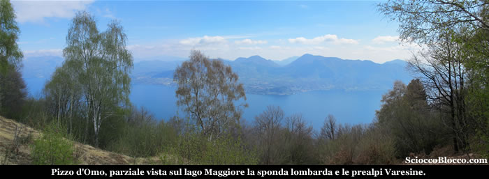
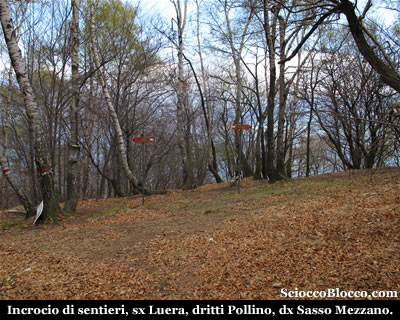
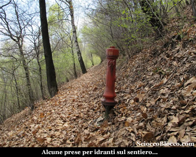
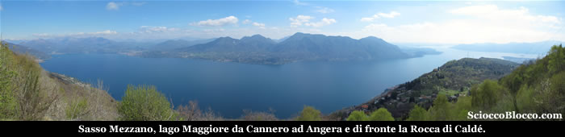

A Pian di Sole (935m), lasciamo l'auto nel parcheggio nella ampia piazza all'ingresso della frazione, sopra di noi svetta il promontorio dove sono posti gli impianti sciistici.

Sulla destra, rispetto al nostro arrivo, all'ingresso della piazza parte una strada asfaltata indicata con i cartelli "Via Meneveri (segue Via Pineta)", la imbocchiamo e in poche decine di metri di salita raggiungiamo la Chiesetta della Madonna della Vittoria (945m)(5min) .

Edificio in splendide condizioni, con piccolo parco antistante che permette nelle giornate primaverili qualche ora di relax.

Proseguiamo sempre su asfalto, in breve ci troviamo davanti al cancello del Golf Club, che ignoriamo per proseguire sulla strada che piega a destra.

Un lungo rettilineo in salita sempre asfaltato, costeggia alcune case sulla sinistra, giunti nei pressi di una curva a sinistra, notiamo dei cartelli indicatori proprio per la nostra prima meta(10/15min).

Lasciamo ora l'asfalto e proseguiamo diritti in salita su un largo sentiero.

Il sentiero sale deciso per alcune decine di metri, per poi piegare a sinistra, iniziamo ora a camminare in leggera ascesa in costa, mentre il lago Maggiore appare già alla nostra destra tra la vegetazione.

La traccia si fa più stretta ma sempre evidente, nonché segnalata dai colori Bianco/Rosso del C.A.I. , tra il bosco rado in breve raggiungiamo Pizzo d'Omo (1070m)(20/30min).

La vegetazione copre parzialmente la vista, ma il panorama sul Lago Maggiore, sulla sponda lombarda e le prealpi Varesine è già notevole.

Come segno di "vetta" è posto un basamento in cemento con palo e cartelli.

Proseguendo dritti rispetto al nostro arrivo, scolliniamo sull'altro versante e iniziamo a scendere.

Dapprima quasi allo scoperto poi all'interno di un bosco dominato dalle betulle, scendiamo decisamente.

Superato un traliccio della linea elettrica, in breve approdiamo ad un crocevia di sentieri con cartelli indicatori (926m)(35/40min).

Lasciamo il sentiero che a sinistra porta a Luera e quello che scende dritto verso Pollino, e pieghiamo a destra verso la nostra seconda meta.

La traccia è evidente, anche se in qualche punto un poco stretta e ricoperta di foglie, e pressoché in piano costeggia la montagna con il Lago Maggiore ora alla nostra sinistra.

Quando incrociamo delle prese d'acqua rosse per idrante siamo quasi arrivati...

Infatti superati alcuni di questi idranti rossi e un traliccio, proprio su una curva verso destra del sentiero, eccoci al belvedere del Sasso Mezzano(940m)(50/60min).

Ora il panorama toglie quasi il fiato, il Lago Maggiore si estende quasi in tutta la sua interezza, da Cannero ad Angera.

Difronte a noi la Rocca di Caldé, le prealpi Varesine con il Tamaro il Gambarogno, il Cuvignone, sulla sinistra Cannero e i suoi castelli, a destra Verbania e il golfo Borromeo con le sue isole, sotto Pollino, Ghiffa e Oggebio.

Sempre difficile lasciare certi scenari, ma ripartiamo.

Proseguiamo in piano ora su larga mulattiera, per poi scendere brevemente ad una strada sterrata nei pressi di una abitazione.

Continuiamo ancora in piano sino ad un bivio dove la strada torna asfaltata proprio nei pressi di alcuni cartelli indicatori (932m)(1h/1.10h).

Siamo al punto più basso della nostra escursione, proseguiamo sulla strada asfaltata seguendo le indicazioni per Pian di Sole.

La strada sale velocemente a ricondurci sulla provinciale proprio al centro di un ampio tornante, sulla nostra destra una bella tenuta con casa d'epoca.

Non ci resta che iniziare a salire lungo la provinciale asfaltata che in meno di un chilometro ci riconduce alla piazzetta di Pian di Sole e all'auto (935m)(1.15h/1.30h).

Bella gita alla portata di tutti, che può essere fatta comodamente al pomeriggio, ma che regala panorami di alto livello.

Escursionista  di giornata   Dario.

