Lasciata l'auto nell'ampio parcheggio in località Alpe Gabbio (1130 m), torniamo verso l'ingresso dove sulla destra sale un'ampia scalinata.

Oggi approfittando di una giornata libera infrasettimanale, finalmente torniamo in montagna, con una formazione del tutto inedita.

Ci proponiamo come escursione, una sorta di anello, prima in cresta tra **Toden** e Todano e quindi ritorno in traverso dal Pian Cavallone.

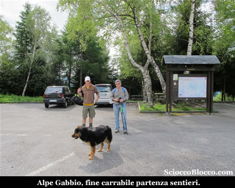

Dopo pochi metri la scalinata, approda su un ampia traccia gippabile, dove un cartello improvvisato indica "Rifugio" verso sinistra, indicazione che seguiamo.

Pressoché in piano la strada sterrata prosegue nel bosco, per poi in pochi minuti dopo una brevissima rampa sbucare all'aperto.

Superato un breve avvallamento eccoci alle baite di la Piazza (1160m)(10 min).

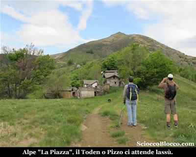

Dove vi sono delle vere e proprie case ristrutturate con tutti i confort, all'ingresso dell'alpeggio è posta una cappelletta dedicata a San Giacomo.

Alle spalle imponente il Pizzo o **Toden** (come più comunemente chiamato nella zona), nostra metà odierna che fa bella mostra della sua "ripidità".

Contrariamente alle previsioni il cielo non è limpido e tende a rannuvolarsi, ma non ci demoralizziamo, soprattutto la più giovane della compagnia che scorazza piena di energie.

Proseguiamo aggirando sulla destra le baite, dopo una breve salita raggiungiamo sempre su gippabile un tratto pianeggiante.

Dove voltandoci verso Sud alla nostra sinistra appare già il **lago** **Maggiore** e **Verbania**.

Qui sulla destra troviamo un cartello metallico scolorito che indica ancora il numero 10, lasciamo l'ampia gippabile che prosegue verso il Rifugio del Pian Cavallone, e prendiamo a salire in modo deciso, ora il sentiero si fa sottile in direzione di una piccola e isolata baita di recente ristrutturazione.

Dove facciamo il primo Pit-Stop di rifornimento e Margot gradisce...

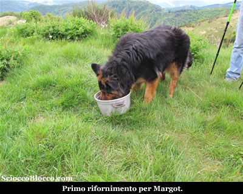

Proseguiamo sulla sinistra della baita, la traccia
continua a salire tra le ultime piante, mentre alla nostra sinistra al di là di una piccola valletta vediamo Sunfaì (1247m)(20 min).

Bell'alpeggio, ancora in ottime condizioni dove si sentono voci  fuori e dentro i cortili.

Continua la salita, il sentiero ci conduce ad una piccola costruzione con pannello solare che suppongo essere una presa dell'acqua.

Quindi piega a sinistra guadando un piccolo rigagnolo e portandosi al di là della valletta.

In breve attraversiamo l'alpe la Trecciura(25/30min).

Alpeggio completamente abbandonato e decaduto, che si trova poche decine di metri sopra Sunfaì.

Attraversato il quale la traccia si inerpica verticalmente verso destra.

Da questo punto in poi il sentiero si fa a volte un po labile, ma poco importa non c'è nulla tra noi e la cima, la navigazione avviene a vista.

Le pendenze sono piuttosto impegnative, si sale in direttissima verso la vetta che ci domina alzando lo sguardo.

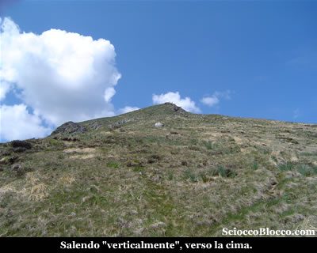

Il cielo si chiude completamente sopra di noi, mentre verso il basso la visibilità resta ottima, approfittiamo di qualche pausa per ammirare il panorama e riprendere fiato.

Anche Margot non è più così baldanzosa...

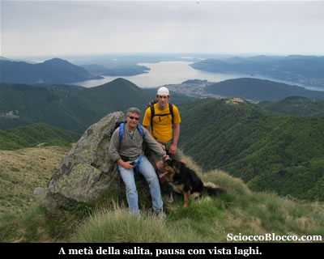

Superiamo nell'ultimo tratto una zona di sfasciumi rocciosi, dove una nutrita colonia di capre ci osserva incuriosita, quindi come sempre gli ultimi metri si fanno ancor più ripidi e impegnativi, ma finalmente ecco la vetta de Il Pizzo o **Toden** (1644m)(1.00h/1.15h).

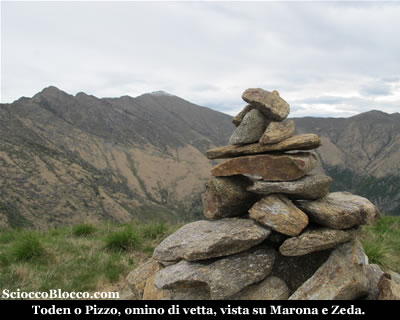

Di fronte a noi subito ci accoglie la vista sul Pizzo Marona e il Monte Zeda.

Anche se si tratta di una cima di altitudine modesta, la sua posizione regala una visione a 360° davvero fantastica, che invita ad immortalarla...

Verso sud-ovest domina il Lago **Maggiore** e le isole Borromee, quindi verso destra il Mottarone, il Monte Rosa e i Corni di Nibbio, più vicino a noi la cresta del Pernice il Todano e il Cugnacorta.

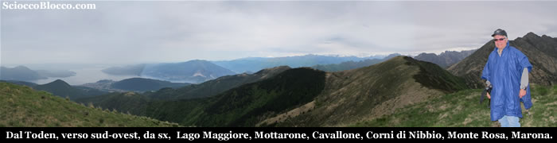

Verso nord-est, il Pizzo Marona, il Monte Zeda, Pian Vadà, Bavarione, Spalavera e Pian Cavallo.

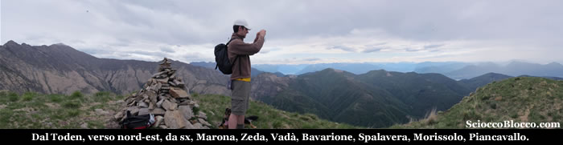

Non servono parole per descrivere lo spettacolo...

Purtroppo inizia a cadere qualche goccia di pioggia e si alza un po di vento, riprendiamo il cammino.

Il sentiero prosegue esattamente in avanti rispetto alla direzione del nostro arrivo.

Ora in cresta il cammino si fa piacevole, dolci saliscendi tra i magri prati scorrono veloci e nonostante il tempo incerto è appagante guardarsi attorno per gustare il panorama.

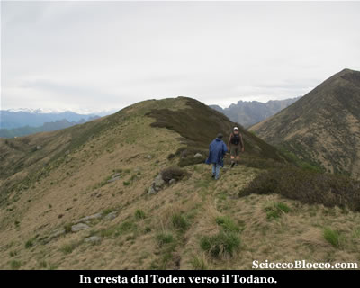

In breve raggiungiamo la vetta del **Monte Todano** o I Balmitt su alcune cartine, (1667m)(1.20h/1.40h).

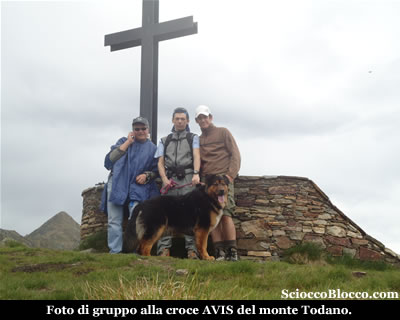

La croce di vetta del **Monte Todano** è stata posata dall'AVIS e al suo interno contiene la scatola metallica con il libro di vetta.

Mentre continua a sgocciolare scattiamo la classica foto di vetta in gruppo.

La vista si apre giù sul versante opposto(nord-est), tra i
numerosi alpeggi dell'alta **Valle
Intrasca** che noi abbiamo percorso e descritto
in una nostra recensione.

Improvvisamente il cielo si apre e torna un po di sole, il **lago** **Maggiore** si riprende la scena con colori più vivaci, mentre **Verbania** se ne sta adagiata sulla sua riva.

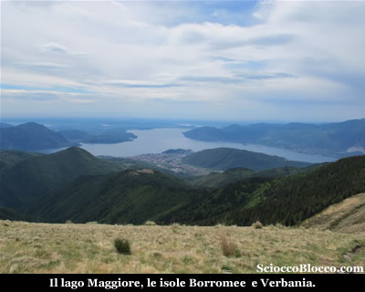

Dopo aver vagato con lo sguardo sulle cime e le valli circostanti, riprendiamo il cammino scendendo verso sinistra rispetto al nostro arrivo, in direzione della evidente **Cappelletta del Pian Cavallone** che raggiungiamo in breve.

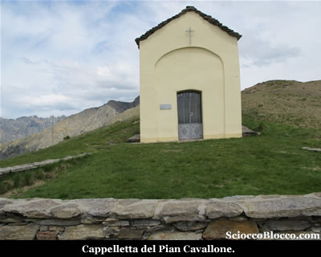

Quindi in pochi minuti piegando a sinistra raggiungiamo il **Rifugio Pian Cavallone**(1528m)(1.40h/2.00h).

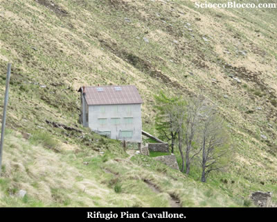

Dove finalmente ci concediamo il meritato pranzo, ad un tiepido sole con vista **lago**.

Il **rifugio del Pian Cavallone** di proprietà
del CAI Intra costruito
nel 1882 e gestito dalla Cooperativa Valgrande è la meta più classica dell'escusionismo verbanese per la sua facile accessibilità da molti paesi della **Valle Intrasca** come **Miazzina**, **Intragna**, **Caprezzo** e anche da **Cicogna** ma con un po più di sforzo.

Testimone di questo è una foto posta su di un pannello
all'ingresso del rifugio, che ritrae centinaia di persone
che ricoprono totalmente la montagna in un escursione popolare
di inizio '900.

Il rifugio ben curato offre circa 30 posti letto, un paio
di ampie sale da pranzo, la luce elettrica a mezzo di pannello
solare e ottima cucina.

Può essere scelto come meta per merende e facile
gita o come punto di partenza per escursioni più
impegnative alle vette circostanti.

Resta aperto ogni fine settimana da aprile a ottobre e tutti
i giorni dall'ultima settimana di luglio alla fine di agosto,
apre su prenotazione e solo per gruppi in ogni periodo dell'anno.

Rifocillati e riposati, partiamo per il ritorno.

Il sentiero scende qualche decina di metri sotto il Rifugio, dove incontriamo un cartello semicancellato in cui tuttavia ritroviamo il numero "10" proprio come quello visto poco dopo la partenza.

La traccia in traverso a mezza costa sotto il versante sud-ovest del **Toden**, perde quota molto lentamente aggirando alcune piccole formazioni rocciose.

Il sole ora è pieno e lo scenario magnifico.

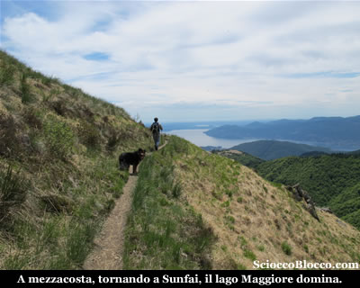

Camminiamo piacevolmente  in leggera discesa, aggirando la vetta salita all'andata.

Per raggiungere l'**alpe Sunfaì**(1247m)(2.30h/3.00h).

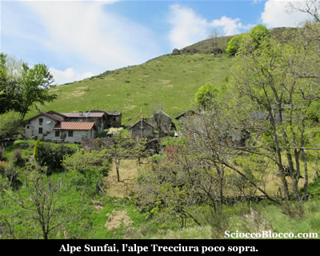

Bell'alpeggio, ancora in ottime condizioni, con baite superbamente ristrutturate.

Poco fuori l'alpeggio, attraversando un rigagnolo qualcuno approfitta di una pozza fresca per riprendersi dalla fatica.

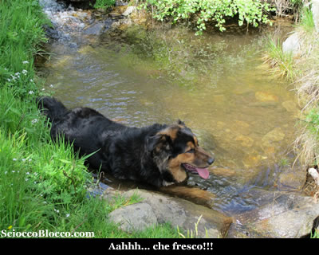

Superate le ultime baite torniamo sull'ampio sentiero percorso all'andata, nei pressi del cartello numero "10" e del monumento all'Uomo Orante della **Valle Intrasca**.

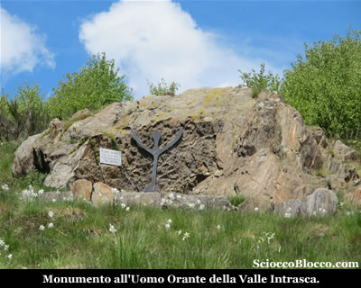

Scendiamo rapidamente e brevemente all'**alpe La Piazza**(1160m)(2.45h/3.15), già attraversata all'andata.

Quindi voltandoci indietro diamo un ultimo sguardo alla vetta del **Toden** faticosamente raggiunta in mattinata.

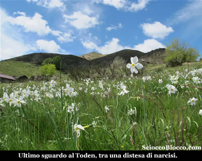

Ripercorrendo l'ampia traccia torniamo in breve all'**alpe Gabbio** e al parcheggio (1130m)(3.00h/3.30h) partenza e arrivo della nostra escursione.

Escursione facile sotto l'aspetto dell'orientamento che svolgendosi tutta all'aperto può essere condotto a vista, ma che richiede un buon allenamento soprattutto per l'ascesa al **Toden** che si svolge su pendenze davvero impegnative, ma che regala panorami unici.

**Grazie
agli escursionisti di giornata Fabrizio, Matteo, Dario e Margot.**

