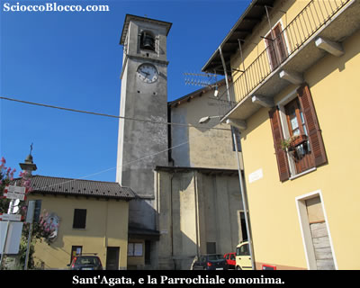
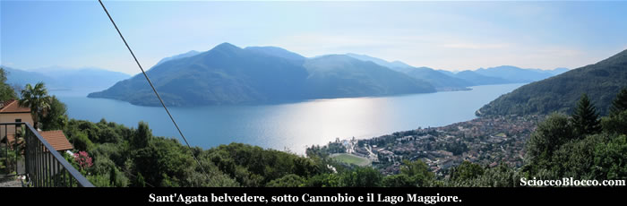
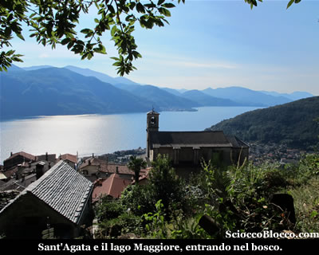
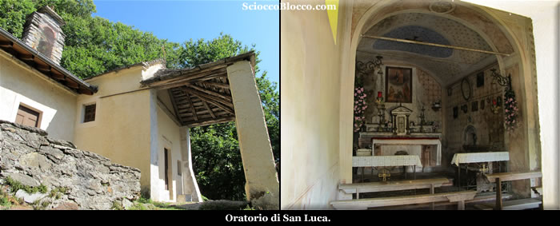
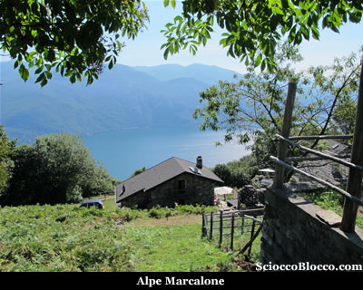
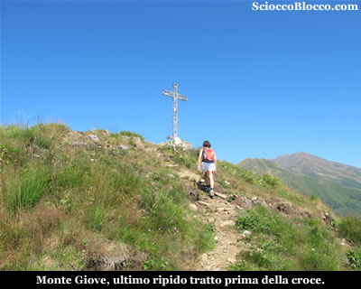
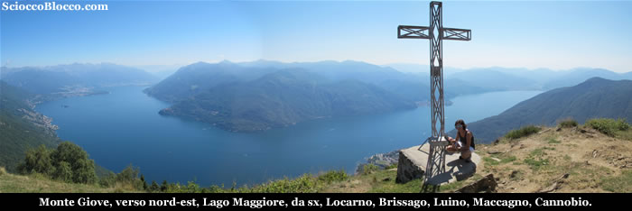
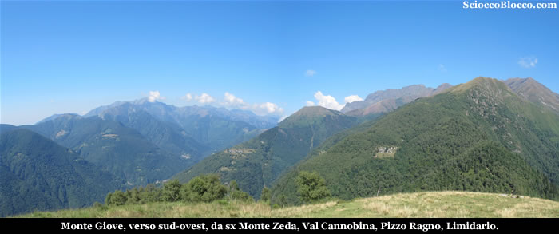
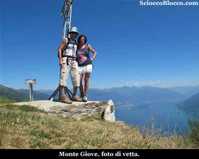

Qui a Sant'Agata(464m), all'ingresso del paese, lasciamo l'auto nel comodo e ampio parcheggio che si trova sulla sinistra, quindi effettuati i preparativi, risaliamo una ripida scalinata e tornati sulla strada asfaltata, in pochi minuti raggiungiamo la piazza con la chiesa parrocchiale intitolata appunto a Sant'Agata.

L’attuale chiesa è sorta su un precedente tempio d’età romanica. Nel 1771 ebbe inizio la costruzione dell’attuale chiesa che è formata di un’unica navata con l’altare maggiore fatto con pregiati marmi in stile barocco; sotto la mensa vi è un antico affresco del XV-XVI sec. raffigurante "L'Imago Pietatis". Ai due lati della navata ci sono 4 altari, due per parte, dedicati nel lato sinistro: alla Beata Vergine del Carmelo e alla patrona Sant’Agata e nel lato destro al Crocefisso e a Sant'Antonio di Padova (FONTE: Wikipedia) .

Sulla sinistra della piazza si trova il belvedere, che annuncia immediatamente lo scenario fantastico che si può godere da questi monti.

Sotto di noi già si allunga il Lago Maggiore e sulla sinistra Cannobio, che si risveglia tra il brulicare dei turisti agostani.

Attraversiamo la piazza e ci addentriamo tra le case passando sotto un porticato sulla destra, notiamo già i classici segnavia bianco-rosso del C.A.I. e una freccia gialla che ci accompagnerà sino alla meta.

Usciti dal piccolo labirinto di viottoli si entra nel bosco, con scorci sul paese e il lago davvero mirabili.

Inizia ora un lungo traverso verso sinistra, che si addentra nel bosco dominato dai castagni, il sentiero ben marcato e in alcuni tratti rudemente gradonato ci porta all'Oratorio di San Luca(664m)(30'/35').

Il piccolo edificio di culto è chiuso, ma dalle grate ai lati della porta possiamo ammirare il suo interno.

Proseguiamo a salire in traverso verso sinistra, in breve superiamo ciò che resta delle baite ormai cadute dell'Alpe Scesel e in pochi minuti arriviamo ad un bivio con cartelli indicatori.

Seguiamo il sentiero di destra, con chiare indicazioni per la nostra meta, in breve attraversato il bosco sbuchiamo sulla strada sterrata, che da Socragno sale fin sotto la vetta del Monte Giove.

La seguiamo per qualche metro, poi imbocchiamo di nuovo il sentiero che si stacca sulla sinistra.

Salendo nel bosco giungiamo rapidamente all'Alpe Marcalone(839m)(1h/1.15h).

Bel punto panoramico dove si trova l'Agriturismo  “da Attilio”, e alcune baite finemente ristrutturate.

Attraversiamo l'Alpe passando tra le baite e i proprietari intenti a gustarsi il fresco e il panorama.

Sopra l'alpeggio riprendiamo la strada sterrata.

Sempre nel bosco, seguiamo ora a tratti la strada, a tratti il sentiero che sale più direttamente il monte.

Un tratto di sentiero molto ripido all'interno dell'abetaia, ci fa guadagnare rapidamente e faticosamente quota, per sbucare nuovamente sulla gippabile.

Seguiamo ora la strada che sale sempre più ripidamente dapprima verso destra con lungo traverso, quindi dopo un tornante dove vi è la deviazione per Rombiago (che noi ignoriamo) , si impenna verso sinistra.

In breve superato un tornate verso destra, imbocchiamo alla nostra sinistra il sentiero con cartello indicatore per la vetta.

Ormai fuori dal bosco, la traccia molto evidente sale zigzagando verso la croce che appare sopra di noi.

In pochi minuti raggiungiamo la vetta del Monte Giove(1298m)(2.00h/2.30h).

Lo scenario è magnifico, sotto di noi si apre il Lago Maggiore in tutta la sua bellezza.

In una panoramica verso nord-est, da  sinistra a destra le città , Locarno, Ascona, Brissago e le sue isole, Luino, Maccagno e sotto di noi Cannobio,  i monti Trosa, Vogorno, Gambarogno, Tamaro e Lema.

Voltandoci dalla parte opposta.

Verso sud-ovest da sinistra la Val Cannobina, Pizzo Marona, Monte Zeda, Pizzo Ragno, Limidario o Gridone.

Finalmente in tanta bellezza ci concediamo il meritato pranzo, perdendo lo sguardo tra il blu del lago e l'azzurro del cielo.

E' sempre difficile lasciare cime dal panorama così appagante, ma prima o poi bisogna scendere...

Dopo aver lasciato un pensiero nel libro di vetta custodito in una cassetta ai piedi della croce, scattiamo la classica foto ricordo.

Il ritorno avviene per lo stesso percorso di andata, senza mancare però la tappa per una bella birra fresca all'agriturismo, prima di tornare a Sant'Agata(464m)(3.30h/4.00h).

Bellissima escursione che richiede un minimo di allenamento, consigliabile nelle stagioni di mezzo che regalano più spesso giornate terse.

Grazie
agli escursionisti di giornata Federica e Dario.

