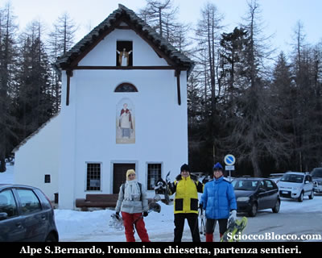
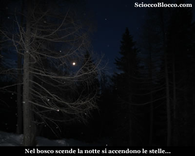
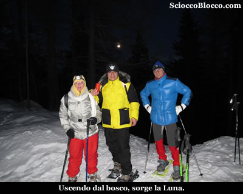
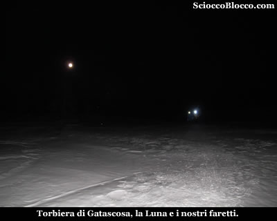
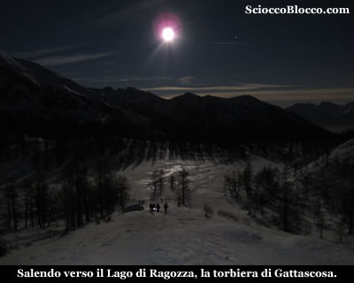
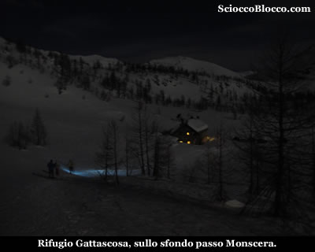
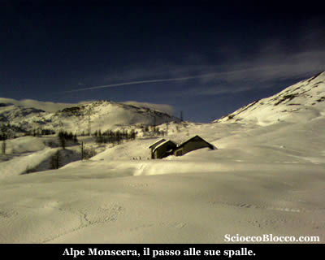
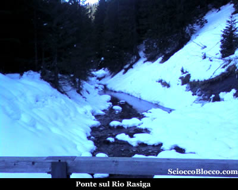

Qui
all'Alpe San Bernardo (1628m),
parcheggiamo la macchina lungo la strada a ritroso, perchè il parcheggio è già completo di auto, e anche sulla strada molte sono già parcheggiate con alcuni escursionisti intenti a preparasi. Ok è sabato sera, è previsto bel tempo, c'è la luna piena, ma c'è più gente che in centro!! Ci prepariamo e scattiamo la prima foto davanti alla bella chiesetta dedicata appunto a San
Bernardo.

La
bellissima giornata volge ormai al tramonto, non c'è una nuvola,
la neve è abbondante, prepariamo gli zaini e senza
indossare le ciaspole imbocchiamo la strada di fronte a
noi ricoperta di neve ghiacciata.

Al bivio dopo pochi metri andiamo a sinistra e poco dopo
nei pressi del parcheggio estivo, calziamo le ciaspole, e seguiamo le tracce di
predecessori che si inoltrano nel bosco dove vi sono anche
cartelli indicatori codice
(D0) dai colori bianco-rosso del CAI, per il Lago di Ragozza
e il Rifugio Gattascosa.

Certo in queste condizioni difficile trovare tutti i segnali,
ma le tracce degli sci alpinisti sono inconfondibili, almeno per ora che c'è ancora un po di luce...

All'interno
di un bosco sale
dolcemente quella
che d'estate è un ampia mulattiera , dopo circa 10min
arriviamo ad un bivio, anche se in questa stagione è
praticamente invisibile, noi seguiamo le tracce che salgono
ora un poco più ripide sulla destra, perchè
quella sulla sinistra ci porterebbe in pochi minuti al piccolo Lago d'Arza (1742m).

Deviazione che comunque ci farebbe perdere poco tempo.

Saliamo ora un poco più decisamente sempre all'interno
di un bosco dominato dai larici, al margine di un solco
tra la neve che nasconde un piccolo ruscello.

La luce cala rapidamente e in pochi minuti nel bosco siamo già nella quasi totale oscurità.

La salita è regolare, in una radura ci concediamo una pausa, mentre la luna sorge alle nostre spalle.

Questa escursione ce la sogniamo da tempo, nottata limpida, luna splendente, finalmente si realizza.

Riprendiamo, ora la
salita si fa in qualche tratto più impegnativa, quando
il sentiero spiana, sbuchiamo dalla vegetazione in una larga
radura.

E' questa
la Torbiera
di Gattascosa (1831m)
(45/50min).

La
Torbiera è solcata da numerosi rigagnoli e dal ruscello
che abbiamo già costeggiato più in basso,
che ad un osservazione attenta possono essere ben notati
anche in queste condizioni di innevamento.

La vista, nonostante il buio, grazie alla luna piena, è notevole le cime della Val
Bognanco ci circondano, il Pizzo Pioltone domina il centro della scena.

Allo scoperto senza il riparo del bosco, ora il vento si fa sentire.

Attraversiamo il pianoro, la traccia sempre molto evidente
si impenna, in fondo alla radura sulla sinistra, tra un
rado bosco di larici.

La fatica inizia a farsi sentire la pendenza è notevole,
ma per fortuna non troppo prolungata, mentre il vento ora si fa sferzante,  approdiamo al Lago
di Ragozza (1958m)
(1.10h/1.20h).

Il lago completamente coperto dalla neve, è pressochè invisibile se no se ne conosce l'esistenza.

Sopra
di noi la Cima di Verosso,
le cui pareti franose hanno occluso l'uscita del lago, trasformando
il bacino sottostante in torbiera.

Se in primavera questo posto è fantastico per i suoi
colori vivaci, in  autunno invece regala scorci dalle tinte tenui ma ugualmente emozionanti,
ora in inverno la pace regna sotto una coltre di neve.

Seguiamo la traccia che sale al margine del lago e ci appare
il Rifugio Gattascosa (1993m)
(1.40h/1.50h) che raggiungiamo in pochi minuti.

Il Rifugio Gattascosa dispone di 25 posti letto è gestito e può
essere un ottimo punto d'appoggio sia per mangiare nelle
gite di un giorno, sia per pernottare qualche giorno usandolo
come punto di partenza per il trekking dei laghi della Val
Bognanco.

Caratteristico il modo di accatastare la legna tagliata
in piccoli pezzi a forma di panettone che ricorda le vecchie
carbonaie, ora ricoperte di neve.

Dentro
c'è il pienone delle grandi occasioni, per fortuna troviamo ancora un tavolino dove ci accomodiamo e diamo inizio alla meritata cena.

La tentazione di restare a dormire è grande, ma l'impegni ci richiamano a valle, fatte quattro chiacchiere con i gentili e disponibili nuovi gestori del rifugio, ci prepariamo per il ritorno.

Fuori ci attende una piacevole sorpresa, il vento è cessato e con lui il freddo pungente, la nottata è straordinariamente limpida e la luna ormai alta, risplende nel cielo illuminando tutto.

Uscendo dal rifugio, seguiamo l'ampia traccia che  in piano segue verso sinistra, così da tornare dal lato opposto della valle, per completare l'anello ideale del sentiero.

Ammiriamo ancora il profilo del Pizzo
Pioltone che ci sovrasta.
Siamo ora su quella che in estate è la gippabile
che dall'Alpe San Bernardo sale sul versante opposto
della valle, e che passando per l'Alpe Monscera giunge al rifugio.

Camminiamo all'aperto tra piacevoli sali scendi, e superato un piccolo dosso procediamo tra tracce di sci
alpinisti verso l'Alpe
Monscera (1971m) (2.00h/2.10h) che raggiungiamo
aggirandola sulla sinistra.

Continuiamo
a scendere seguendo tracce molto evidenti, rientriamo tra
i larici fino a raggiungere quello che d'estate è
un guado su un torrente che scende dal lago di Agro (2.45h/3.00h).

Ora sempre nel bosco più fitto, scendiamo su quella
che in estate è una larga mulattiera, qua e la sfioriamo
baite di varie dimensioni.

La traccia, che segue ormai un evidente strada tra il bosco,
scende ripida in tornanti, sino a raggiungere l'Alpe Arza (1754m) (2.40h/2.50h).

Qui                       all'Alpe Arza è situato il nuovissimo Rifugio                       "Il Dosso",                       gestito con 6 stanze e 16 posti letto, facilmente raggiungibile                       a piedi da San Bernardo, ma anche in auto, in estate, con permesso rilasciato                       dal comune.

La traccia,  ormai un evidente strada nel bosco,
scende ripida in tornanti sino al ponte sul Rio
Rasiga (2.50.0h/3.10h).

Superato
il ponte seguiamo la strada innevata che in costante salita
ci riconduce all'Alpe San
Bernardo e alla macchina dopo (3.15h/3.45h).

Escursione
fantastica, grazie alla nottata tersa e alla luna piena, consigliata a chi
ha un minimo di allenamento e che conosce i sentieri durante
la stagione estiva, perchè la neve rende tutto molto
diverso e più difficile l'orientamento.

Grazie
agli escursionisti di giornata Danila, Fabrizio, Stefano e Dario.

